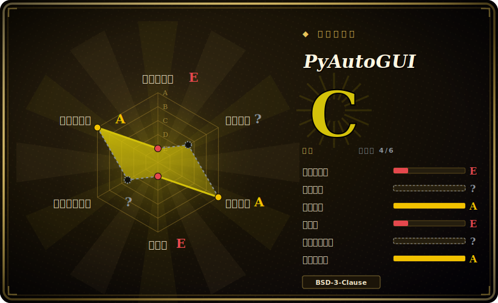

# PyAutoGUI

一个跨平台的 Python 模块，用程序驱动鼠标和键盘并读取屏幕——移动/点击、输入/快捷键、截图，以及在屏幕上做图像匹配定位，全部通过一套极小的同步 API 完成。

## 何时使用

你要用 Python 写一个快速自动化脚本，去驱动一个没有 API、没有 CLI、也没有脚本接口的桌面程序——某个老旧 ERP 客户端、某个厂商工具、一个游戏，或者某个只认 GUI 的安装器。你不想去学一套重型 RPA 平台或某个平台专属的无障碍框架，你只想说「移到这里、点击、输入这段、按回车」，并且在 Windows、macOS、Linux 上表现一致。你 `pip install pyautogui`，十几行就能跑起 `pyautogui.click(200, 220)`、`pyautogui.write('hello', interval=0.25)`、`pyautogui.hotkey('ctrl', 'c')`。当你不知道某个按钮坐标时，`locateOnScreen('button.png')` 会对截图做模板匹配，把可点击的区域交给你。

当你想要一个*可见的*、模仿真人的机器人时，你也会选它——按键发给当前获得焦点的窗口，就像真人在敲键盘——用来给 UI 做冒烟测试、脚本化重复录入，或搭一个演示。`pytweening` 的缓动函数甚至能让光标走出像人一样的弧线，内置的 `alert`/`confirm`/`prompt` 消息框还能让脚本停下来等输入。

## 何时不用

- **无显示器的服务器 / CI。** PyAutoGUI 驱动的是真实屏幕和获焦窗口。没有显示服务（X11/Wayland/Windows 桌面会话）就没法自动化；它不是无头工具。
- **稳健、无人值守的生产 RPA。** 基于坐标和像素匹配的自动化很脆：换主题、DPI/缩放不同、改分辨率、窗口移位都会让它静默失效。要做耐用的企业级 RPA，你想要的是无障碍树驱动（UI Automation、AT-SPI）或商业 RPA 套件，而不是屏幕抓取。
- **Web 自动化。** 对浏览器而言，Selenium/Playwright/Puppeteer 直接驱动 DOM，远比在渲染页面上点像素可靠。
- **多显示器 / 后台作业。** 它面向主显示器和前台窗口，会接管真实光标和键盘，所以脚本运行期间这台机器干不了别的。第二显示器行为依赖操作系统，按文档说法不可靠。
- **你需要元素级内省。** 它读不到控件文本、列不出控件、查不到状态——它只看像素。若需要这些，请搭配 `pywinauto`（Windows）或平台无障碍 API。
- **对维护敏感的押注。** 开发基本进入吃老本状态（最后 push 于 2024-08，见健康度）——写脚本够用，但若你要在未来若干年里对着新系统版本长期维护它，请掂量。

## 横向对比

| 替代品 | 是否收录 | 我们的评价 | 取舍 |
|---|---|---|---|
| pywinauto | 未收录 | 当前页用于它的主场景；如果更看重“仅 Windows，驱动 UI Automation / Win32 无障碍树”，再选 pywinauto。 | 仅 Windows，驱动 UI Automation / Win32 无障碍树——元素感知，比点像素稳健得多，但不跨平台、API 更陡。 |
| AutoHotkey | 未收录 | 当前页用于它的主场景；如果更看重“仅 Windows 的脚本语言，专为热键/宏与 GUI 自动化打造”，再选 AutoHotkey。 | 仅 Windows 的脚本语言，专为热键/宏与 GUI 自动化打造；非常成熟，但是自家语言、没有原生跨平台/Python 路线。 |
| SikuliX | 未收录 | 当前页用于它的主场景；如果更看重“基于 Java 的图像识别自动化（OCR + 模板匹配）”，再选 SikuliX。 | 基于 Java 的图像识别自动化（OCR + 模板匹配）；和 PyAutoGUI 一样跨平台，但更重（JVM）、偏 IDE 中心。 |
| Selenium / Playwright | 未收录 | 当前页用于它的主场景；如果更看重“DOM 级浏览器自动化”，再选 Selenium / Playwright。 | DOM 级浏览器自动化——当目标是网页而非原生桌面程序时的正确工具。 |
| pynput | 未收录 | 当前页用于它的主场景；如果更看重“更底层的跨平台输入控制/监听（含全局热键监听）”，再选 pynput。 | 更底层的跨平台输入控制/监听（含全局热键监听）；没有截图/图像定位，范围比 PyAutoGUI 小。 |

## 技术栈

- **语言：** Python（支持 Python 3；文档提及旧的 Python 2）。
- **各操作系统后端：** Windows 走 Win32（无额外依赖）；macOS 走 `pyobjc-core`/`pyobjc`（Quartz）；Linux 走 `python3-xlib`（X11）。
- **配套库（同作者）：** `pyscreeze`（截图 + `locateOnScreen` 图像匹配）、`pymsgbox`（alert/confirm/prompt 对话框）、`pytweening`（缓动函数）、`mouseinfo`。
- **图像处理：** 截图及图像相关功能用 Pillow；可选 OpenCV 加速/放宽图像匹配。[未验证]

## 依赖

- **必须有图形会话**——真实显示器加一个获焦窗口；这是硬性运行时要求。
- **Linux：** `python3-xlib`（X11）。对 Wayland 的支持有限/间接。[未验证]
- **macOS：** 先 `pyobjc-core` 再 `pyobjc`（按 README，安装顺序有讲究）；系统会弹出「辅助功能」授权请求。
- **Windows：** 除 wheel 外无额外依赖。
- **Pillow** 用于截图；Linux 上可能需要系统图像库以支持 PNG/JPEG。

## 运维难度

**搭起来低，维持运行中等。** 安装就是 `pip install pyautogui` 加上各系统的图像/权限设置。没有服务、没有数据存储、没东西要部署——它是个你直接调用的库。真正的成本在*脚本维护*：因为自动化锚定坐标和像素，它对分辨率、DPI/缩放、系统主题、窗口位置都很敏感，所以脚本会漂移、需要重调。运行它还意味着要为机器人专门留一个登录的桌面会话（或一个 VM/虚拟显示），因为它会霸占真实光标和键盘。若想要一点韧性，请自己搭一层薄抽象（命名区域、带 confidence 的 `locateOnScreen`、重试）。

## 健康度与可持续性

- **维护（2026-06）。** 最后 push 于 2024-08（截至撰写约停滞 2 年）；项目读起来是**稳定但吃老本**，而非废弃——API 已成熟、核心问题已解决，但新开发极少。未归档。约 583 个 open issue，与一个流行库的维护预算偏薄相符。[推断]
- **治理 / bus factor。** `User` 所有（Al Sweigart），实际上是单一维护者（在 PyAutoGUI 及其 `pyscreeze`/`pymsgbox`/`pytweening` 兄弟项目里，作者都是遥遥领先的头号贡献者）。单人项目却高 star，是个 **bus-factor 风险**——方向和寿命系于一个人是否还有兴趣。[推断]
- **年龄 × Lindy。** 约 12 年（2014-07 创建）且仍被广泛安装 ⇒ 对*库本身*的存续与 API 稳定性是**强 Lindy** 先验，尽管活跃开发已放缓。老而吃老本胜过新而被炒，但要核实它在你当前系统上还能用。[推断]
- **采用度。** 很高——是 Python 里简单桌面自动化的事实标准（star/fork 庞大，教程和脚本里随处可见）。BSD-3-Clause 宽松许可，未发现 relicense 历史。[推断]
- **风险标记。** 吃老本式维护 + 单一维护者 + 对系统演进（Wayland、macOS 权限/安全变化）敏感是真正的风险；未发现 CVE 或 relicense 问题。[未验证]

## 存疑（未验证）

- [未验证] 截至 2026-06 约 12.6k star / 583 open issue / 最后 push 2024-08——star 和 issue 数易变且对时间敏感，依赖前请重新核实。
- [未验证] 把 OpenCV 当作 `locateOnScreen` 的可选加速/放宽手段，来自文档/生态，未对当前代码核实。
- [未验证] 现代 Linux 上对 Wayland 的支持有限/间接，行为取决于合成器，这里未核实。
- [推断]「稳定但吃老本」是从 push 时间 + 成熟的单人维护库推断，而非来自官方项目状态声明。
- [推断] 单一维护者 / bus-factor 判断由贡献者列表推断，而非治理文档。
