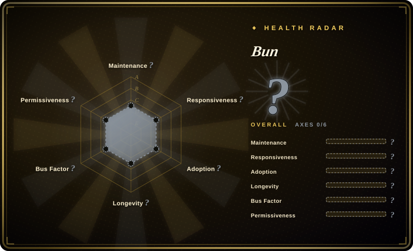

# Bun

An incredibly fast all-in-one toolkit for JavaScript and TypeScript apps — runtime, bundler, test runner, and package manager in a single binary.

## When to use

You're choosing a JavaScript or TypeScript runtime and tooling stack and speed and integration matter. You pick Bun over Node.js because you're frustrated with the sprawl of Node.js tooling: one tool for the runtime, another for bundling, another for testing, and yet another for package management. You want a single, fast binary that handles everything — `bun run` for execution, `bun test` for testing, `bun build` for bundling, and `bun install` for dependency management — all significantly faster than their Node.js equivalents. You pick Bun over Deno because you value the JavaScriptCore engine's fast startup times and lower memory footprint, and you want an all-in-one toolkit rather than Deno's security-focused, permission-gated model. You also value the JavaScriptCore engine's fast startup times and lower memory footprint compared to V8-based alternatives.

## When NOT to use

- If you rely on native Node.js addons or complex C++ bindings, use Node.js instead of Bun, because Bun aims for Node.js compatibility but some native modules and `node-gyp` dependencies may not work without modification.
- If you need mature ecosystem tooling with deep npm compatibility, use Node.js or Deno instead of Bun, because Bun is younger and some npm packages with post-install scripts or deep Node.js internals may behave unexpectedly.
- If you require a fully governed open-source license, use Deno or Node.js instead of Bun, because Bun is released under a custom license (NOASSERTION), not a standard OSI-approved license like MIT or Apache-2.0.
- If you are already deeply invested in Node.js tooling with CI/CD, Docker images, and team expertise all Node-native, use Node.js instead of Bun, because the migration cost may outweigh the performance gains.
- If you need WebAssembly-first runtime support, use Deno instead of Bun, because Deno has stronger WebAssembly integration and first-class Wasm module support.

## Comparison

| Alternative | In index | Our verdict | Tradeoff |
| --- | --- | --- | --- |
| Node.js | 未收录 | The incumbent JS/TS runtime with the largest ecosystem. | Node.js has the deepest ecosystem and broadest hosting support; Bun is faster but younger and less proven. |
| [Deno](deno.md) | ✅ | Modern JS/TS runtime with secure defaults and built-in toolchain. | Deno is more mature and has a standard OSI license; Bun is faster and bundles more tools, but its license is ambiguous. |
| [Tauri](tauri.md) | ✅ | Not a runtime comparison, but both are Rust-based dev tools. | Tauri builds desktop apps; Bun runs JS/TS. Complementary, not competing. |
| pnpm / Yarn | 未收录 | Dedicated package managers with mature workspaces. | pnpm and Yarn have deep workspace and monorepo features; Bun's package manager is fast but may lack some advanced features. |

## Tech stack

- **Rust** — core runtime and bundler implementation
- **JavaScriptCore (JSC)** — JavaScript engine powering Bun, known for fast startup
- **TypeScript** — first-class language support (transpiled internally)
- **Zig** — parts of the low-level system implementation
- **SQLite** — embedded for package management metadata

## Dependencies

- Bun binary (single executable, no external runtime needed)
- macOS, Linux, or Windows (x64/ARM64)
- For npm compatibility: existing `package.json` and `node_modules` can be used
- No backend or database server required for typical usage

## Ops difficulty

**Low.** Bun is a single binary installed via shell script, npm, or package manager. There is no server to maintain. The operational burden is in keeping the binary updated and verifying npm compatibility for your specific dependency tree. For CI/CD, replacing `node` with `bun` is usually straightforward, but test for edge cases in native modules.

## Health & viability
- **Maintenance**: Grade A — 13/13 active weeks in trailing 13; last commit 0 days ago.
- **Responsiveness**: Grade A — median first-response time 0.2 hours across 44 qualifying issues/PRs.
- **Adoption**: Cannot be scored — unknown.
- **Longevity**: Grade A — 1906 days old.
- **Governance**: Grade A — top-3 contributor share 73.0% (?).
- **Risk / License**: Cannot be scored — unknown.
## Caveats (unverified)

- [未验证] Bun's exact license terms are ambiguous; it is not tagged with a standard SPDX license and may have usage restrictions for commercial or embedded deployments.
- [推断] Native Node.js addon compatibility is improving but may still break with complex `node-gyp` dependencies.
- [未验证] The exact number of production deployments and enterprise users has not been verified from primary sources.
- [推断] Oven's venture funding and business model may influence the open-source roadmap; monitor for commercial-tier features or relicensing.
