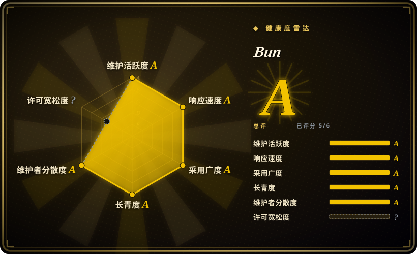

# Bun

一款极速一体化的 JavaScript 与 TypeScript 工具集——将运行时、打包器、测试运行器和包管理器集成在单个二进制文件中。

## 何时使用

你正在选择 JavaScript 或 TypeScript 运行时与工具链，而速度和集成度是决定性因素。你选 Bun 而不是 Node.js，因为厌倦了 Node.js 工具链的臃肿：一个运行时、一个打包器、一个测试框架、再加上一个包管理器。你想要一个单一、极速的二进制文件来搞定一切——`bun run` 直接执行 TypeScript，`bun test` 做内置测试，`bun build` 打包，`bun install` 管理依赖——全部比 Node.js 的等价工具快得多。你选 Bun 而不是 Deno，因为你看重 JavaScriptCore 引擎相比 V8 更快的启动时间和更低的内存占用，且你想要一体化的工具集，而非 Deno 以安全权限为核心的模式。

## 何时不用

- 如果你依赖原生 Node.js 插件或复杂的 C++ 绑定，请使用 Node.js 而不是 Bun，因为 Bun 目标是兼容 Node.js，但某些原生模块和 `node-gyp` 依赖可能无法直接运行。
- 如果你需要成熟的生态工具链和深度 npm 兼容性，请使用 Node.js 或 Deno 而不是 Bun，因为 Bun 较年轻，某些带 post-install 脚本或深入 Node.js 内部的 npm 包可能出现异常。
- 如果你要求完全受管的开源许可证，请使用 Deno 或 Node.js 而不是 Bun，因为 Bun 采用自定义许可证（NOASSERTION），并非标准的 MIT 或 Apache-2.0 等 OSI 认证许可证。
- 如果你已在 Node.js 工具链上深度投入，CI/CD、Docker 镜像和团队经验全是 Node 原生，请使用 Node.js 而不是 Bun，因为迁移成本可能超过性能收益。
- 如果你需要以 WebAssembly 为优先的运行时支持，请使用 Deno 而不是 Bun，因为 Deno 在 WebAssembly 集成和原生模块支持上更强。

## 横向对比

| 替代品 | 是否收录 | 我们的评价 | 取舍 |
| --- | --- | --- | --- |
| Node.js | 未收录 | 拥有最庞大生态的既有 JS/TS 运行时。 | Node.js 生态最深、托管支持最广；Bun 更快但较年轻、尚未充分验证。 |
| [Deno](deno.zh.md) | ✅ | 具备安全默认设置和内置工具链的现代 JS/TS 运行时。 | Deno 更成熟，采用标准 OSI 许可证；Bun 更快、工具更集成，但许可证模糊。 |
| [Tauri](tauri.zh.md) | ✅ | 非运行时对比，但两者都是基于 Rust 的开发工具。 | Tauri 构建桌面应用，Bun 运行 JS/TS。互补而非竞争。 |
| pnpm / Yarn | 未收录 | 拥有成熟工作区功能的专用包管理器。 | pnpm 和 Yarn 在工作区与 monorepo 上功能深厚；Bun 的包管理器很快，但可能缺少一些高级特性。 |

## 技术栈

- **Rust** — 核心运行时与打包器实现
- **JavaScriptCore（JSC）** — 驱动 Bun 的 JavaScript 引擎，以启动快著称
- **TypeScript** — 原生语言支持（内部转译）
- **Zig** — 部分底层系统实现
- **SQLite** — 嵌入用于包管理元数据

## 依赖

- Bun 二进制文件（单个可执行文件，无需外部运行时）
- macOS、Linux 或 Windows（x64/ARM64）
- 如需 npm 兼容：现有 `package.json` 与 `node_modules` 可直接使用
- 典型使用场景无需后端或数据库服务器

## 运维难度

**低。** Bun 是单个二进制文件，可通过 shell 脚本、npm 或系统包管理器安装。无需维护服务器。运维负担主要在于保持二进制更新，并验证你的依赖树在 npm 兼容性上是否有边缘情况。CI/CD 中将 `node` 替换为 `bun` 通常很直接，但需针对原生模块做边缘测试。

## 健康度与可持续性

- **维护活跃度**：活跃——截至 2026-07 每日推送，发布频繁，issue 响应积极（6,817 个 open issues）。[推断]
- **治理与 bus factor**：由 `oven-sh` 组织持有，Jarred Sumner 为核心负责人，贡献者团队正在扩大。Bus factor 在改善，但仍集中在小核心团队。
- **背书与 longevity**：由 Oven 公司支持，已获风险投资。商业模式与长期路线图尚不完全透明。[未验证]
- **采用与生态**：约 93.5k stars、约 4,742 forks，2021 年创建（5 年历史）。已有追求更快构建时间的团队将其用于生产。
- **风险信号**：许可证为 NOASSERTION（非标准 OSI 许可证），给商业再分发带来法律不确定性。风险投资模式可能导致未来出现 open-core 功能隔离或变更许可证。[推断]

## 存疑（未验证）

- [未验证] Bun 的准确许可证条款尚模糊；未标注标准 SPDX 许可证，商用或嵌入式部署可能存在使用限制。
- [推断] 原生 Node.js 插件兼容性正在改善，但复杂的 `node-gyp` 依赖仍可能不兼容。
- [未验证] 生产部署与企业用户的准确数量尚未从一手来源核实。
- [推断] Oven 的风险投资与商业模式可能影响开源路线图；需关注是否出现商业层级功能或重新许可。
