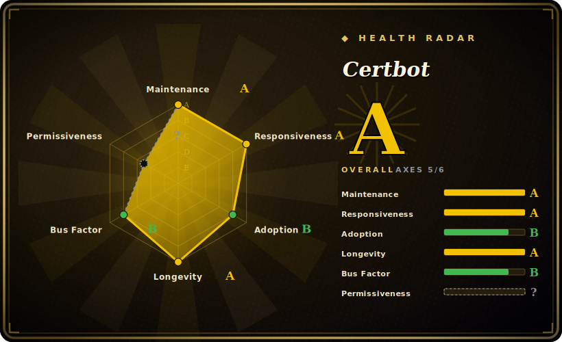

# Certbot

The EFF/Let's Encrypt ACME client that obtains and auto-renews free, browser-trusted TLS certificates, with plugins that wire the certs straight into nginx/Apache.

## When to use

You're a sysadmin standing up HTTPS for a handful of public web servers — a couple of nginx vhosts, an Apache box, maybe a bare TCP service that just needs a cert on disk. You don't want to buy certificates, you don't want them expiring at 2 a.m. on a holiday, and you don't want to hand-edit `ssl_certificate` lines every 90 days. You install Certbot, run `certbot --nginx` (or `--apache`), answer a couple of prompts, and it talks ACME to Let's Encrypt, proves you control the domain via an HTTP-01 or DNS-01 challenge, writes the cert/key under `/etc/letsencrypt/live/...`, and rewrites your server config to point at them. It also drops a systemd timer (or cron entry) so `certbot renew` runs twice a day and silently renews anything inside its 30-day window — so the cert that was a manual chore becomes a fire-and-forget piece of the host.

You reach for it specifically when you want the *reference* ACME client — the one EFF maintains, the one every tutorial assumes — with first-class web-server integration and a large set of DNS plugins (Route 53, Cloudflare, Google, etc.) for wildcard certs that need DNS-01. If your hosts already run Python and you value the official, batteries-included path over a minimal shell script, Certbot is the default.

## When NOT to use

- **You want minimal footprint.** Certbot is a heavyweight Python client with its own venv/dependency tree. If you just need a cert on a constrained box, a tiny single-file client — [acme.sh](#comparison) (pure shell) or [lego](#comparison) (single Go binary) — is far lighter and has no Python runtime to drag along.
- **Your reverse proxy already does ACME.** Caddy issues and renews certs automatically out of the box, and Traefik has built-in ACME; if you're fronting everything with one of those, a separate Certbot is redundant. [推断]
- **You need an internal/private CA.** Certbot speaks ACME to public CAs (Let's Encrypt by default). For internal PKI / private CA issuance you want step-ca/smallstep or your CA's own tooling — Let's Encrypt won't issue for private or non-public-DNS names.
- **You'll hit Let's Encrypt rate limits.** Mass issuance (many subdomains, frequent re-issue, CI churn) runs into per-domain/per-account weekly limits; plan certs (and the staging environment for testing) accordingly — this is a Let's Encrypt constraint, not a Certbot bug. [未验证]
- **You dislike the plugin coupling.** The `--nginx`/`--apache` installers parse and rewrite your server config; on unusual or templated configs they can misedit or fail, and many operators prefer `certonly` (just fetch the cert) plus their own config management instead.

## Comparison

| Alternative | In index | Our verdict | Tradeoff |
|---|---|---|---|
| acme.sh | 未收录 | Use this page for its stated niche; choose acme.sh when you need pure-shell ACME client, zero language runtime, tiny footprint, huge DNS-API list. | Pure-shell ACME client, zero language runtime, tiny footprint, huge DNS-API list; less "official," no config-rewriting nginx/apache installer — you wire the cert in yourself. |
| lego | 未收录 | Use this page for its stated niche; choose lego when you need single static Go binary, ACME client + Go library, broad DNS provider support. | Single static Go binary, ACME client + Go library, broad DNS provider support; great for embedding/automation, but no web-server config installer. |
| Caddy (automatic HTTPS) | 未收录 | Use this page for its stated niche; choose Caddy (automatic HTTPS) when you need a web server that *is* the ACME client. | A web server that *is* the ACME client — issues/renews transparently with no separate tool; replaces Certbot only if you also adopt Caddy as your server. |
| dehydrated | 未收录 | Use this page for its stated niche; choose dehydrated when you need minimal Bash ACME client (formerly letsencrypt. | Minimal Bash ACME client (formerly letsencrypt.sh); hook-driven, lightweight, but more DIY and a smaller ecosystem than Certbot. |

## Tech stack

- **Language:** Python — distributed as a CLI plus a set of plugin packages.
- **Protocol:** ACME (RFC 8555) against Let's Encrypt by default; supports HTTP-01, DNS-01, and TLS-ALPN-01 challenges.
- **Plugins:** authenticator/installer plugins for nginx and Apache, a `webroot`/`standalone` authenticator, and a family of `certbot-dns-*` plugins (Route 53, Cloudflare, Google, DigitalOcean, …) for DNS-01.
- **On-disk layout:** certs/keys/account state under `/etc/letsencrypt`; renewal config per-cert so `certbot renew` is stateless to invoke.

## Dependencies

- **Runtime:** a Python interpreter and Certbot's dependency tree (cryptography, requests, the ACME library, etc.) — heavier than the single-binary alternatives. The exact minimum Python version tracks the project's current support policy and shifts over time. [未验证]
- **A web server (for the installer plugins):** nginx or Apache if you use `--nginx`/`--apache`; otherwise none — `certonly` just writes cert files.
- **Network + a public CA:** outbound access to the ACME directory (Let's Encrypt) and a domain whose control you can prove via HTTP-01 (port 80 reachable) or DNS-01 (DNS API credentials).
- **Install paths:** OS packages (most distros), the official `snap` (EFF's recommended path), `pip`, and Docker images.

## Ops difficulty

**Low** for the common case. Install, run `certbot --nginx`, and the renewal timer is set up for you; day-to-day maintenance is essentially nothing — renewal is automatic and idempotent. Difficulty rises when you leave the happy path: DNS-01/wildcard certs need provider API credentials and the right `certbot-dns-*` plugin; HTTP-01 needs port 80 reachable through firewalls/load balancers; the nginx/apache installer can mis-parse non-standard configs (many shops use `certonly` + their own templating to avoid that); and renewal *hooks* (reload the server, distribute certs to other nodes) are yours to write and test. Across a fleet you'll want config management to deploy Certbot and its renewal hooks consistently rather than hand-tuning each host.

## Health & viability

- **Maintenance (2026-06).** Last pushed 2026-06; v5.6.0 shipped 2026-05 on a steady monthly-ish minor cadence — **active**, not coasting. Not archived. [推断]
- **Governance / bus factor.** Owned by an **Organization** and developed in the open by EFF, now under ISRG (Let's Encrypt's nonprofit) stewardship — **nonprofit, team/foundation-backed governance, low bus-factor**. This is the reference client for the CA that issues most of the web's free certs, so it has institutional reasons to stay maintained. [推断]
- **Backing & Lindy.** Created 2014-11 (~12 years) and **still actively shipping** ⇒ a **strong Lindy** signal: a long-lived, battle-proven client, not a hyped newcomer. The nonprofit backing (EFF/ISRG) further lowers abandonment risk versus a single-vendor commercial tool. [推断]
- **License.** Apache-2.0 (read from the LICENSE file; GitHub reports `NOASSERTION` only because the bundled nginx parser carries MIT) — a permissive, foundation-friendly license with **no relicense risk** of the SSPL/AGPL kind. [推断]
- **Adoption.** Near-universal: Certbot is the default ACME client in countless tutorials and distro packages, with broad real-world deployment across the Let's Encrypt ecosystem. [未验证]

## Caveats (unverified)

- [未验证] ~33.1k GitHub stars and v5.6.0 (released 2026-05-11) as of 2026-06 — star counts and version numbers are date-sensitive; treat as indicative.
- [推断] GitHub's license API returns `NOASSERTION`; the actual project license is Apache-2.0 per the LICENSE file (the `NOASSERTION` is because the bundled nginx parser is MIT). Verified by reading the file, but flagged because the API badge disagrees.
- [未验证] Let's Encrypt rate limits (per-domain/per-account, weekly issuance) are a CA-side policy that changes over time — check current limits before bulk issuance; not a Certbot-imposed limit.
- [未验证] Minimum supported Python version tracks Certbot's current support policy and moves over time; not asserting a specific number.
- [推断] "Caddy/Traefik make it redundant" and "the nginx/apache installer can mis-edit configs" are operational inferences from how those tools work, not measured claims about a specific config.
