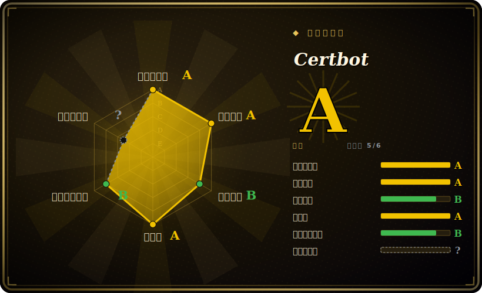

# Certbot

EFF/Let's Encrypt 的 ACME 客户端，负责申请并自动续期免费、浏览器信任的 TLS 证书，配套插件能把证书直接接进 nginx/Apache。

## 何时使用

你是系统管理员，要给几台公网 Web 服务器上 HTTPS——几个 nginx vhost、一台 Apache，也许还有一个只需要把证书放到磁盘上的裸 TCP 服务。你不想买证书，不想让证书在某个假期凌晨 2 点过期，也不想每 90 天手改一遍 `ssl_certificate` 那几行。你装上 Certbot，跑 `certbot --nginx`（或 `--apache`），回答几个提示，它就用 ACME 跟 Let's Encrypt 对话，通过 HTTP-01 或 DNS-01 挑战证明你对域名的控制权，把证书/私钥写到 `/etc/letsencrypt/live/...` 下，再改写你的服务器配置指向它们。它还会装一个 systemd timer（或 cron 项），让 `certbot renew` 每天跑两次，对落入 30 天窗口的证书静默续期——于是那个本来要手动操心的证书，变成了主机上一块装好就不用管的部件。

你专门选它，是因为想要那个*参考实现*的 ACME 客户端——EFF 维护的那个、每篇教程默认假设的那个——它对 Web 服务器有一流的集成，还带一大批 DNS 插件（Route 53、Cloudflare、Google 等）来处理需要 DNS-01 的通配符证书。如果你的主机本来就跑 Python，又看重官方、开箱即全的路径而非一个极简 shell 脚本，那 Certbot 就是默认选择。

## 何时不用

- **你想要最小体积。** Certbot 是个重量级 Python 客户端，自带 venv/依赖树。如果你只是要在一台资源受限的机器上拿张证书，单文件小客户端——[acme.sh](#横向对比)（纯 shell）或 [lego](#横向对比)（单个 Go 二进制）——轻得多，也不用拖一套 Python 运行时。
- **你的反向代理已经会做 ACME。** Caddy 开箱即自动签发并续期证书，Traefik 也内建 ACME；如果你前面已经用其中之一兜底，再单独跑一个 Certbot 就是冗余。[推断]
- **你需要内部/私有 CA。** Certbot 对公网 CA（默认 Let's Encrypt）说 ACME。要做内部 PKI / 私有 CA 签发，你应该用 step-ca/smallstep 或你自己 CA 的工具——Let's Encrypt 不会给私有或非公网 DNS 名字签发。
- **你会撞上 Let's Encrypt 速率限制。** 大量签发（很多子域名、频繁重签、CI 抖动）会撞到按域名/按账户的每周限额；据此规划证书（以及用 staging 环境测试）——这是 Let's Encrypt 的约束，不是 Certbot 的 bug。[未验证]
- **你不喜欢这种插件耦合。** `--nginx`/`--apache` 安装器会解析并改写你的服务器配置；遇到非常规或模板化的配置，它可能改错或失败，很多运维更愿意用 `certonly`（只取证书）加上自己的配置管理。

## 横向对比

| 替代品 | 是否收录 | 取舍 |
|---|---|---|
| acme.sh | 未收录 | 纯 shell 的 ACME 客户端，零语言运行时，体积极小，DNS-API 列表庞大；不那么“官方”，没有改写 nginx/apache 配置的安装器——证书得你自己接进去。 |
| lego | 未收录 | 单个静态 Go 二进制，既是 ACME 客户端又是 Go 库，DNS provider 支持广；适合嵌入/自动化，但没有 Web 服务器配置安装器。 |
| Caddy（自动 HTTPS） | 未收录 | 一个本身*就是* ACME 客户端的 Web 服务器——透明签发/续期，不需要单独工具；只有当你同时把 Caddy 当服务器用时它才替代 Certbot。 |
| dehydrated | 未收录 | 极简的 Bash ACME 客户端（前身 letsencrypt.sh）；钩子驱动、轻量，但更偏 DIY，生态比 Certbot 小。 |

## 技术栈

- **语言：** Python——以一个 CLI 加一组插件包的形式分发。
- **协议：** ACME（RFC 8555），默认对 Let's Encrypt；支持 HTTP-01、DNS-01 和 TLS-ALPN-01 挑战。
- **插件：** nginx 和 Apache 的 authenticator/installer 插件，`webroot`/`standalone` authenticator，以及一族 `certbot-dns-*` 插件（Route 53、Cloudflare、Google、DigitalOcean……）用于 DNS-01。
- **磁盘布局：** 证书/私钥/账户状态放在 `/etc/letsencrypt` 下；续期配置按证书各存一份，所以 `certbot renew` 调用起来是无状态的。

## 依赖

- **运行时：** 一个 Python 解释器加上 Certbot 的依赖树（cryptography、requests、ACME 库等）——比单二进制替代品更重。最低 Python 版本跟随项目当前的支持策略，且随时间变化。[未验证]
- **一个 Web 服务器（用安装器插件时）：** 用 `--nginx`/`--apache` 时需要 nginx 或 Apache；否则不需要——`certonly` 只写证书文件。
- **网络 + 一个公网 CA：** 能出网访问 ACME directory（Let's Encrypt），以及一个你能通过 HTTP-01（80 端口可达）或 DNS-01（DNS API 凭证）证明控制权的域名。
- **安装路径：** 操作系统包（多数发行版）、官方 `snap`（EFF 推荐路径）、`pip`，以及 Docker 镜像。

## 运维难度

**低**——对常见场景而言。装好、跑 `certbot --nginx`，续期 timer 就替你装好了；日常维护基本为零——续期自动且幂等。一旦离开顺路径难度就上来：DNS-01/通配符证书需要 provider API 凭证和对应的 `certbot-dns-*` 插件；HTTP-01 需要 80 端口能穿过防火墙/负载均衡到达；nginx/apache 安装器可能解析错非标准配置（很多团队用 `certonly` + 自己的模板化来规避）；续期*钩子*（reload 服务器、把证书分发到其它节点）要你自己写、自己测。在机群规模上，你会想用配置管理来一致地部署 Certbot 和它的续期钩子，而不是逐台手调。

## 健康度与可持续性

- **维护（2026-06）。** 最后 push 于 2026-06；v5.6.0 于 2026-05 发布，保持大致每月一次的小版本节奏——处于**活跃**而非吃老本。未归档。[推断]
- **治理 / bus factor。** 归属一个 **Organization**，由 EFF 公开开发，现由 ISRG（Let's Encrypt 的非营利机构）托管——**非营利、团队/基金会背书的治理，bus-factor 低**。它是签发了网上大部分免费证书的那个 CA 的参考客户端，因此有制度性的理由保持维护。[推断]
- **背书与 Lindy。** 2014-11 创建（约 12 年）且**仍在活跃发布**⇒ **强 Lindy** 信号：一个久经实战、长寿的客户端，而非被炒作的新秀。非营利背书（EFF/ISRG）相比单一厂商的商业工具进一步降低了弃坑风险。[推断]
- **许可。** Apache-2.0（读 LICENSE 文件确认；GitHub 报 `NOASSERTION` 只是因为内置的 nginx parser 带 MIT）——宽松、对基金会友好的许可，**无 SSPL/AGPL 那类 relicense 风险**。[推断]
- **采用度。** 近乎普及：Certbot 是无数教程和发行版包里的默认 ACME 客户端，在 Let's Encrypt 生态里有广泛的真实部署。[未验证]

## 存疑（未验证）

- [未验证] 截至 2026-06 约 33.1k GitHub star、v5.6.0（2026-05-11 发布）——star 数和版本号对时间敏感，仅供参考。
- [推断] GitHub 的 license API 返回 `NOASSERTION`；按 LICENSE 文件项目实际许可是 Apache-2.0（`NOASSERTION` 是因为内置的 nginx parser 为 MIT）。已读文件确认，但因 API 徽章不一致而标记。
- [未验证] Let's Encrypt 的速率限制（按域名/按账户的每周签发量）是 CA 侧策略，随时间变化——批量签发前请查当前限额；这不是 Certbot 施加的限制。
- [未验证] 最低支持的 Python 版本跟随 Certbot 当前的支持策略，随时间移动，这里不断言具体数字。
- [推断] “Caddy/Traefik 使其冗余”和“nginx/apache 安装器可能改错配置”是基于这些工具工作方式的运维推断，而非对某个具体配置的实测结论。
