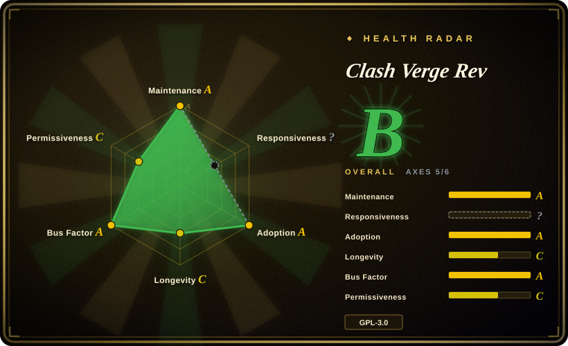

# Clash Verge Rev

A modern cross-platform GUI proxy client based on Tauri, running on Windows, macOS, and Linux with the built-in mihomo (Clash Meta) kernel.

## When to use

You're a developer or power user who needs a flexible, rule-based proxy client on your desktop. You manage multiple proxy subscriptions and want a clean GUI to switch between them, edit rules, and monitor traffic. You need system-level proxy integration (system proxy and TUN mode) and want to run the mihomo kernel without command-line configuration. You value a native-feeling desktop app built with Rust/Tauri over an Electron-based alternative.

## When NOT to use

- **Mobile-only users** — There is no iOS or Android version; this is a desktop-only application.
- **Simple one-proxy setups** — If you only need a single proxy and never switch rules, a minimal CLI client is lighter.
- **Enterprise MDM environments** — GPL-3.0 copyleft may conflict with corporate software distribution policies; verify compliance. [未验证]
- **Users unfamiliar with proxy concepts** — The app assumes knowledge of Clash rules, proxy groups, and subscription URLs; beginners may be overwhelmed.

## Comparison

| Alternative | In index | Our verdict | Tradeoff |
| --- | --- | --- | --- |
| Clash for Windows | 未收录 | The original Windows Clash GUI (archived). | The original Clash for Windows project is archived; Clash Verge Rev is the active continuation with a modern Tauri stack. |
| ClashX / ClashX Pro | 未收录 | macOS-native Clash clients. | ClashX is macOS-specific; Clash Verge Rev is cross-platform and actively maintained. |
| Shadowrocket / Surge | 未收录 | Commercial proxy clients. | Shadowrocket (iOS) and Surge (macOS/iOS) are paid, closed-source apps with broader platform support. |
| sing-box | 未收录 | Next-gen proxy platform with a GUI. | sing-box is more protocol-flexible but Clash Verge Rev has deeper Clash ecosystem compatibility. |
| Proxifier | 未收录 | Commercial per-app proxy routing. | Proxifier is a paid tool for routing specific apps; Clash Verge Rev is a system-level proxy client with rule-based routing. |

## Tech stack

- **TypeScript** — frontend UI logic
- **Rust** — Tauri runtime and system integration
- **Tauri 2** — cross-platform desktop framework
- **mihomo (Clash Meta)** — built-in proxy kernel

## Dependencies

- Windows (x64/x86), Linux (x64/arm64), or macOS 11+ (Intel/Apple Silicon)
- No server infrastructure required; runs entirely on the local machine
- Optional: WebDav for configuration backup and sync

## Ops difficulty

**Low**. It is a desktop application with an installer. The main ongoing tasks are updating the app, updating the built-in kernel, and managing subscription URLs. No server or network infrastructure is required.

## Health & viability

- **Maintenance**: Active — regular pushes as of 2026-07, with a moderate issue volume (420 open issues) and active release cadence (Stable, Alpha, AutoBuild channels). [推断]
- **Governance**: Owned by the clash-verge-rev organization; appears to be a community-driven continuation of the original Clash Verge project. The bus factor is a concern if the core maintainers step away. [推断]
- **Backing**: No corporate backing visible; community-driven with a Chinese-language primary community. [未验证]
- **Adoption**: High star count (129k) and significant fork volume (9k+) for a desktop proxy client. The project has been active since late 2023, giving it ~2.5 years of track record. [推断]
- **Risk flags**: The original Clash project (and Clash for Windows) was archived due to regulatory pressures in China; this fork exists in a politically sensitive domain. The GPL-3.0 license may limit corporate distribution. The project is a continuation fork, not the original, which carries succession risk. [未验证]

## Caveats (unverified)

- [未验证] The original Clash project and its Windows GUI were archived; the long-term stability of this continuation fork depends on ongoing community support.
- [未验证] The regulatory environment around proxy tools in certain jurisdictions may affect project availability and updates.
- [未验证] The GPL-3.0 license terms may conflict with enterprise software distribution policies; verify before corporate deployment.
