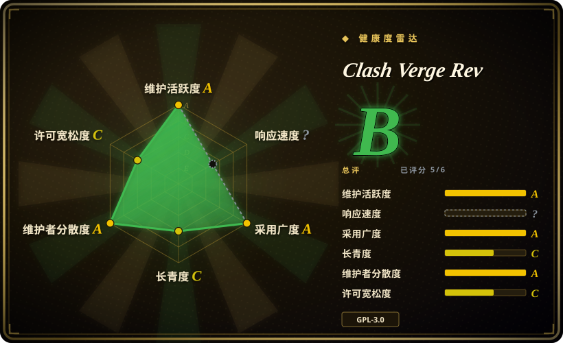

# Clash Verge Rev

一款基于 Tauri 的现代化跨平台 GUI 代理客户端，运行在 Windows、macOS 和 Linux 上，内置 mihomo（Clash Meta）内核。

## 何时使用

你是一位开发者或高级用户，需要在桌面端使用灵活、基于规则的代理客户端。你管理多个代理订阅，想要一个干净的 GUI 来切换订阅、编辑规则并监控流量。你需要系统级代理集成（系统代理与 TUN 模式），并希望无需命令行配置即可运行 mihomo 内核。你偏爱基于 Rust/Tauri 的桌面原生应用，而非基于 Electron 的替代方案。

## 何时不用

- **纯移动端用户**——没有 iOS 或 Android 版本；这是一款仅限桌面端的应用。
- **简单单代理场景**——如果你只需要一个代理且从不切换规则，最小化 CLI 客户端更轻量。
- **企业 MDM 环境**——GPL-3.0 copyleft 可能与企业软件分发政策冲突；请核实合规性。[未验证]
- **不熟悉代理概念的用户**——该应用假设用户已了解 Clash 规则、代理组和订阅 URL；新手可能会感到困惑。

## 横向对比

| 替代品 | 是否收录 | 我们的评价 | 取舍 |
| --- | --- | --- | --- |
| Clash for Windows | 未收录 | 原版 Windows Clash GUI（已归档）。 | 原版 Clash for Windows 已归档；Clash Verge Rev 是采用现代 Tauri 技术栈的活跃延续。 |
| ClashX / ClashX Pro | 未收录 | macOS 原生 Clash 客户端。 | ClashX 仅限 macOS；Clash Verge Rev 跨平台且 actively maintained。 |
| Shadowrocket / Surge | 未收录 | 商业代理客户端。 | Shadowrocket（iOS）和 Surge（macOS/iOS）是付费闭源应用，平台覆盖更广。 |
| sing-box | 未收录 | 下一代代理平台，带 GUI。 | sing-box 协议更灵活，但 Clash Verge Rev 对 Clash 生态的兼容性更深。 |
| Proxifier | 未收录 | 商业按应用代理路由。 | Proxifier 是用于为特定应用路由的付费工具；Clash Verge Rev 是系统级代理客户端，支持基于规则的路由。 |

## 技术栈

- **TypeScript**——前端 UI 逻辑
- **Rust**——Tauri 运行时与系统集成
- **Tauri 2**——跨平台桌面框架
- **mihomo（Clash Meta）**——内置代理内核

## 依赖

- Windows（x64/x86）、Linux（x64/arm64）或 macOS 11+（Intel/Apple Silicon）
- 无需服务器基础设施；完全在本地运行
- 可选：WebDav 用于配置备份与同步

## 运维难度

**低**。这是一款带安装包的桌面应用。主要持续任务是更新应用、更新内置内核、以及管理订阅 URL。无需服务器或网络基础设施。

## 健康度与可持续性

- **维护**：活跃——截至 2026-07 定期推送，issue 量适中（420 个 open issue），发布节奏积极（Stable、Alpha、AutoBuild 通道）。[推断]
- **治理**：由 clash-verge-rev 组织所有；看起来是原版 Clash Verge 项目的社区驱动延续。若核心维护者退出，bus factor 令人担忧。[推断]
- **背书**：未见企业背书；社区驱动，主要社区以中文为主。[未验证]
- **采用**：star 数高（129k），fork 量可观（9k+），对桌面代理客户端而言表现突出。项目自 2023 年末起活跃，已有约 2.5 年记录。[推断]
- **风险旗标**：原版 Clash 项目（及 Clash for Windows）因中国监管压力被归档；该分叉存在于政治敏感领域。GPL-3.0 许可可能限制企业分发。项目是延续分叉而非原版，存在继承风险。[未验证]

## 存疑（未验证）

- [未验证] 原版 Clash 项目及其 Windows GUI 已被归档；该延续分叉的长期稳定性取决于持续的社区支持。
- [未验证] 某些司法管辖区对代理工具的监管环境可能影响项目的可用性与更新。
- [未验证] GPL-3.0 许可条款可能与企业软件分发政策冲突；企业部署前请核实。
