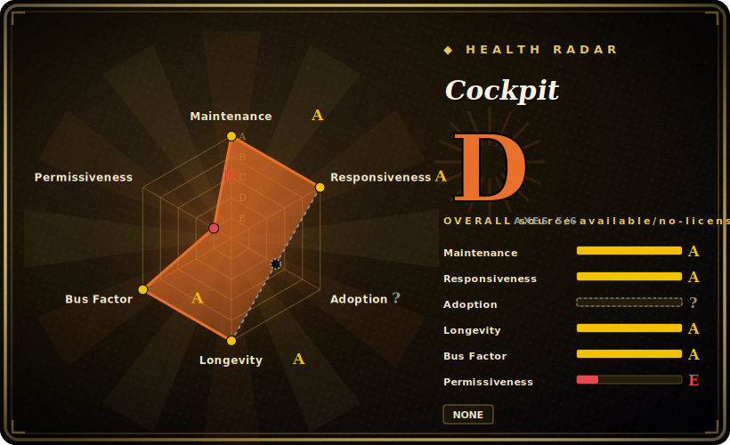

# Cockpit

A web-based graphical admin interface for Linux servers — log in through a browser and manage services, storage, networking, containers, accounts and logs from a real `systemd` session, with no agent or persistent daemon to babysit.

## When to use

You're a sysadmin (or a developer who just inherited an Ubuntu/Fedora/RHEL box) and you need to do real maintenance — restart a stuck service, see why the disk filled up, add a user, check the journal after a crash, attach a new block device — but you don't want to memorize a dozen CLI incantations or hand the keys to a heavyweight config-management stack. You install one package, open `https://server:9090`, and log in with the machine's own Linux credentials. Cockpit drops you into a live session: it shells out to `systemd`, `NetworkManager`, `udisks`, `podman` and the journal on your behalf, so what you see is the actual OS state, not a cached model. Change something in the UI and it changes on the box; change it on the command line and the UI reflects it — there's no separate database to drift out of sync.

It shines when you have a handful of servers and want a low-ceremony pane of glass, or when you're onboarding someone who's comfortable with Linux concepts but not yet fluent at the shell. From one Cockpit you can add other machines over SSH and switch between them, and because it's just a browser front-end over standard system APIs, you can uninstall it tomorrow and lose nothing — your servers were never reconfigured to depend on it.

## When NOT to use

- **Fleet-scale orchestration.** Cockpit is per-host administration with optional manual SSH hopping between boxes; it is not a fleet controller. For tens or hundreds of nodes you want Ansible, Salt, Puppet, or a Kubernetes control plane — declarative, version-controlled, repeatable. Clicking through Cockpit on each host does not scale and leaves no audit trail.
- **You need infrastructure-as-code / reproducibility.** UI-driven changes aren't captured in git. If your standard is "every change is a reviewed commit," a point-and-click admin panel works against you.
- **Non-Linux or non-systemd hosts.** Cockpit targets modern Linux with `systemd`; it is not for Windows Server, macOS, or legacy SysV-init boxes. [推断] BSDs are out of scope.
- **You want a hosted control panel for web hosting / multi-tenant billing.** That's the cPanel / Plesk / Webmin lane (vhosts, mail, DNS, reseller accounts). Cockpit is OS administration, not a hosting business panel.
- **Exposing it raw to the public internet.** It's a privileged root-capable surface bound to port 9090; running it unfirewalled with password auth is a liability. Treat it as an internal/VPN tool.
- **Headless automation.** There's no first-class declarative API for scripting bulk changes; the interface is the human UI. Reach for the underlying CLIs/APIs instead.

## Comparison

| Alternative | In index | Our verdict | Tradeoff |
|---|---|---|---|
| Webmin | 未收录 | Use this page for its stated niche; choose Webmin when you need older, broader Perl-based control panel covering many services (mail, DNS, Apache, BIND) on multiple. | Older, broader Perl-based control panel covering many services (mail, DNS, Apache, BIND) on multiple init systems; heavier and less "live session" — Cockpit is leaner, systemd-native, and reflects real-time OS state. |
| cPanel / Plesk | 未收录 | Use this page for its stated niche; choose cPanel / Plesk when you need commercial web-hosting control panels (vhosts, mail, billing, reseller accounts). | Commercial web-hosting control panels (vhosts, mail, billing, reseller accounts); different problem — managed hosting, not bare OS administration. Proprietary and paid. |
| Ansible / Salt / Puppet | 未收录 | Use this page for its stated niche; choose Ansible / Salt / Puppet when you need declarative, agentless (Ansible) or agent-based config management for fleets with version control an. | Declarative, agentless (Ansible) or agent-based config management for fleets with version control and idempotency; the right tool at scale, but no live interactive UI for ad-hoc one-host triage. |
| Portainer | 未收录 | Use this page for its stated niche; choose Portainer when you need web UI focused specifically on Docker/Kubernetes container management. | Web UI focused specifically on Docker/Kubernetes container management; Cockpit's container view (Podman) is one tab among many, not the whole product. |
| Grafana + Prometheus | 未收录 | Use this page for its stated niche; choose Grafana + Prometheus when you need observability dashboards for metrics/alerting across a fleet. | Observability dashboards for metrics/alerting across a fleet; read-mostly monitoring, whereas Cockpit is hands-on administration of a single host. |
| [DevToys](devtoys.md) | ✅ | Use this page for its stated niche; choose DevToys when you need a developer's offline format/encode/convert toolbox on the desktop. | A developer's offline format/encode/convert toolbox on the desktop — unrelated problem; listed only because it shares this category, not a substitute. |

## Tech stack

- **Frontend:** JavaScript / TypeScript single-page UI (React, PatternFly design system), served by Cockpit's own web server.
- **Web server / session:** `cockpit-ws` (C) terminates HTTPS and authenticates; `cockpit-bridge` runs inside the user's Linux session and speaks D-Bus / runs commands on their behalf.
- **System integration:** talks to `systemd`, `NetworkManager`, `udisks2`/`storaged`, `podman`, `firewalld`, the `journal`, PAM/`sssd` for auth — mostly over D-Bus.
- **Backend glue:** C for the privileged bridge/ws core; Python for several APIs and tests; per-page UI modules are largely JS/TS.
- **Packaging:** native distro packages (`cockpit`, plus optional `cockpit-podman`, `cockpit-machines`, `cockpit-storaged`, etc.); also a Flatpak "Cockpit Client" for connecting out to remote hosts.

## Dependencies

- **OS:** a modern Linux distribution with `systemd` (Fedora, RHEL/CentOS Stream, Debian, Ubuntu, Arch, openSUSE and others ship it). [推断] No Windows/macOS support.
- **Runtime:** `systemd`, D-Bus, a PAM stack for login; `NetworkManager` for the networking page, `udisks2` for storage, `podman` for containers, `libvirt` (via `cockpit-machines`) for VMs — each optional add-on page pulls its own backend.
- **Client:** any modern web browser; no client install required (the Flatpak client is optional, for SSH-based remote connection).
- **Network:** listens on TCP 9090 (HTTPS) by default; SSH for managing additional remote machines.
- **Install:** `apt/dnf/pacman install cockpit` then `systemctl enable --now cockpit.socket` — it's socket-activated, so it consumes no resources until someone connects.

## Ops difficulty

**Low.** Installation is one package plus enabling a socket; it's socket-activated so there's no always-on daemon to tune, and it self-updates with the distro. There is essentially no state to back up — Cockpit stores almost nothing of its own and reads live OS state on demand, so removing it is clean. The main operational care is **security exposure**, not maintenance burden: it's a root-capable web surface on 9090, so you must keep it behind a firewall/VPN, front it with a real TLS certificate (it generates a self-signed one by default), and consider stronger auth than passwords. Difficulty rises only when you add many optional pages whose backends (`libvirt`, `podman`, `udisks`) each have their own quirks.

## Health & viability

- **Maintenance (2026-06):** **active and steady** — rolling integer releases (latest `364`, 2026-06-23) shipped on a frequent cadence; last pushed 2026-06. This is a continuously-released project, not a coasting one. [推断]
- **Governance & bus factor:** `Organization`-owned under `cockpit-project`, effectively **Red Hat-backed** — a vendor with a long Linux-tooling track record and a multi-person team, so low bus-factor risk (org governance, not a solo maintainer). [推断]
- **Age & Lindy (~12yr, created 2013-11):** **old and still active** — a strong Lindy verdict. A decade-plus of continuous releases plus distro-default shipping (Fedora/RHEL/Debian/Ubuntu) is about as safe a longevity bet as this category offers.
- **Adoption/ecosystem:** ships in the default repos of major distros and integrates with standard system APIs (`systemd`/D-Bus/`podman`/`libvirt`); broad real-world deployment. ~14k stars understates reach since it's distributed via packages, not GitHub. [推断]
- **Risk flags:** none structural; the live concern is operational security exposure (root-capable surface on port 9090), not project viability.

## Caveats (unverified)

- [未验证] Latest release is `364`, published 2026-06-23 (per GitHub release metadata); Cockpit uses a rolling integer-version scheme rather than semver, so "364" is a build number, not a stability tier.
- [未验证] Stargazer count ~14.4k as of 2026-06 — GitHub stars are unreliable and date-sensitive; treat as indicative only.
- [未验证] The repo is multi-licensed (LGPL-2.1-or-later for the core, plus GPL-3.0-or-later, BSD-3-Clause, CC-BY-SA-3.0, MIT for various parts, per the README and the `LICENSES/` directory); the frontmatter cites the predominant core license only — check `LICENSES/` for a specific file's terms.
- [未验证] Exact language percentages (JS ~33%, Python ~33%, C ~18%, TS ~9%) are GitHub's linguist estimate and shift over time.
- [推断] Optional add-on pages (machines/podman/storaged) are shipped as separate packages with their own backend dependencies; the precise package split varies by distribution.
- [推断] Cockpit targets systemd-based Linux only; BSD/macOS/Windows and SysV-init systems are out of scope — verify against the project's "running" docs for a given distro.
