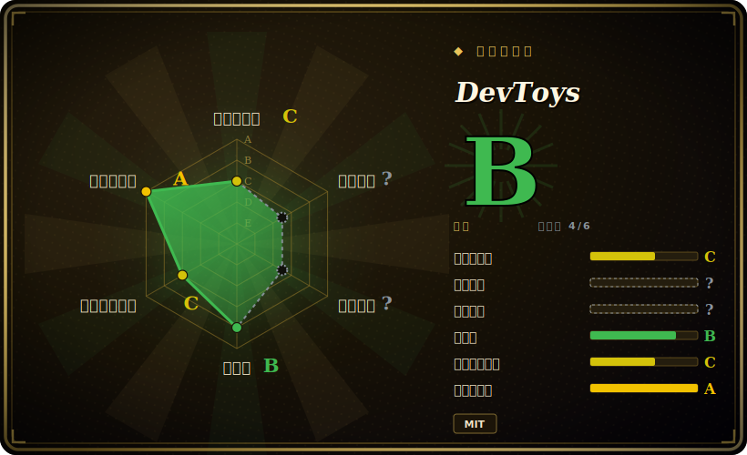

# DevToys

一个离线、跨平台的桌面「瑞士军刀」，把约 30 个开发小工具（转换器、编解码、格式化、生成器、测试器）收进一个原生 GUI——外加一个独立 CLI 供自动化使用。

## 何时使用

你是个开发者，每天要二十次地给 token 做 Base64 解码、给一坨 JSON 美化排版、对比两段字符串、生成 UUID、做 JSON↔YAML 转换、或给文件算哈希——而你已经厌倦了把可能敏感的载荷粘进随便某个「在线 json 格式化」网站，因为你并不信任它们靠广告变现的商业模式。DevToys 作为普通桌面应用安装（Windows、macOS 或 Linux），秒开，所有变换都在本地完成、不发任何网络请求，于是一个 JWT 或配置里的密钥永远不会离开你的机器。你得到的是一个可搜索的窗口、约 30 个工具，而不是三十个浏览器标签页；还有一个「智能检测」功能，会从你粘贴的内容猜出你想用哪个工具。

当你想在自动化里复用这些便利时它也合适：DevToys 附带一个独立的 CLI 应用，把这些工具暴露给脚本和 CI，而且 GUI 和 CLI 都可扩展——你可以引入社区工具，或把自己的工具写成一个以 NuGet 分发的扩展。于是个人草稿本和流水线步骤可以共用同一套工具实现。

## 何时不用

- **你常驻终端，想要单个二进制而非桌面应用。** DevToys 以 GUI 为先；CLI 是独立配套。若要纯浏览器/CLI 的文本变换管线，[CyberChef](cyberchef.zh.md)（浏览器、可串联的「recipe」）或裸用 `jq`/`xxd`/`openssl` 更轻量。
- **你需要把多步变换串成可复现的 recipe。** DevToys 的工具基本是一次性的单工具界面；CyberChef 的整个模型就是把许多操作组合成一条可保存、可分享的管线。DevToys（截至 v2）不提供等价的 recipe 编排图。[推断]
- **你需要服务端/无头基础设施或远程管理。** 这是一个本地开发工具箱，不是服务。主机管理用 [Cockpit](cockpit.zh.md)；指标采集用 [Telegraf](telegraf.zh.md)。
- **你依赖一个冻结的、长期稳定的发行版。** 当前的跨平台 2.x 线以 **prerelease**（预发布）形式发布；GitHub 上最后一个非预发布正式版是更老的、仅 Windows 的 1.0.13.0(2023)。若你的组织禁止使用预发布软件，这是个实打实的门槛。[未验证] 发布渠道策略未来可能变化。
- **你需要一个 DevToys 没有、又无法用扩展补上的工具。** 内置工具集是固定的（约 30 个）；超出范围就得找现成扩展或自己写，并承担其维护/信任成本。
- **要嵌进浏览器 / 用 JS 脚本化调用。** DevToys 是 .NET 桌面应用，无法像 CyberChef（纯客户端 JS）那样嵌入网页。

## 横向对比

| 替代品 | 是否收录 | 我们的评价 | 取舍 |
|---|---|---|---|
| [CyberChef](cyberchef.zh.md) | ✅ | 当前页用于它的主场景；如果更看重“浏览器内运行，可串联的「recipe」管线，且密码学/取证深度更强”，再选 CyberChef。 | 浏览器内运行，可串联的「recipe」管线，且密码学/取证深度更强；有浏览器即可用。DevToys 是原生桌面应用，带 OS 集成、CLI 配套、默认离线安装，但工具多为一次性（无 recipe 编排图）。 |
| [Cockpit](cockpit.zh.md) | ✅ | 当前页用于它的主场景；如果更看重“面向 Linux 主机的 Web 服务器管理界面（服务、日志、存储）”，再选 Cockpit。 | 面向 Linux 主机的 Web 服务器管理界面（服务、日志、存储）；定位不同——远程主机管理 vs 本地开发字符串处理。 |
| [Telegraf](telegraf.zh.md) | ✅ | 当前页用于它的主场景；如果更看重“面向可观测性管线的指标/事件采集 agent”，再选 Telegraf。 | 面向可观测性管线的指标/事件采集 agent；不是交互式开发工具箱。 |
| It-Tools | 未收录 | 当前页用于它的主场景；如果更看重“可自托管的 Web 应用，工具杂烩与 DevToys 高度相似”，再选 It-Tools。 | 可自托管的 Web 应用，工具杂烩与 DevToys 高度相似；任意浏览器 / Docker 即可跑。DevToys 是原生桌面 + 离线 + CLI;It-Tools 是 HTTP 上零安装。 |
| DevUtils(macOS) | 未收录 | 当前页用于它的主场景；如果更看重“打磨精良的仅 macOS 原生等价物（付费）”，再选 DevUtils(macOS)。 | 打磨精良的仅 macOS 原生等价物（付费）;DevToys 免费、MIT、跨平台。 |
| `jq` / `xxd` / `openssl`(CLI) | 未收录 | 当前页用于它的主场景；如果更看重“可脚本化的 Unix 原语，无 GUI”，再选 jq / xxd / openssl(CLI)。 | 可脚本化的 Unix 原语，无 GUI；更适合管线，不适合「我就想瞄一眼这玩意」。 |

## 技术栈

- **语言：** C#（占仓库约 73%），基于 .NET;UI 资源为 HTML/SCSS/TypeScript（Blazor Hybrid 前端）。构建/打包用 PowerShell。（占比依 GitHub 语言统计，2026-06）
- **UI:** Windows 上为 WinUI,macOS/Linux 上由跨平台外壳渲染 Blazor Hybrid(WebView)UI;Fluent/Mica 设计语言。（具体跨平台宿主框架本轮未从源码再确认——见存疑）
- **形态：** 一个 GUI 应用与一个独立 CLI 应用，共用同一套工具/扩展模型。
- **可扩展性：** 工具即插件；社区与官方扩展以 NuGet 包分发，在应用内发现。

## 依赖

- **运行时：** 对用户而言无——DevToys 按各操作系统提供自包含桌面安装包（Windows / macOS / Linux）。运行内置工具不需要数据库、不需要服务端、不需要联网。
- **安装：** 各 OS 原生安装器 / 包管理器（如 Windows 上的 Microsoft Store / winget，以及 macOS/Linux 的包）；当前渠道见项目 releases 与官网（具体包管理器 ID 本轮未再核实——见存疑）。
- **从源码构建：** .NET SDK 工具链（C#），外加 Blazor UI 的 JS/TS 资源管线。
- **扩展：** 可选；由用户自行以 NuGet 包引入。

## 运维难度

**低。** 对终端用户而言就是一个桌面安装包，没有任何服务要跑、无配置、不暴露网络——基本就是「装上即用」，卸载也干净。唯一持续的负担是：若你想用跨平台线，就得跟进 2.x 的预发布构建；以及审查你添加的任何第三方扩展（扩展是来自 NuGet 的任意代码，继承这份信任/维护成本）。没有部署、扩容或备份这套事，因为根本没有服务端。

## 健康度与可持续性

- **维护（2026-06）：** **活跃但卡在预发布状态**——仓库 push 于 2026-02；跨平台 2.x 线只以 **prerelease**（预发布）形式发布（最新 v2.0.9.0，2026-01），而最后一个*稳定*的 GitHub 正式版是仅 Windows 的 1.0.13.0（2023）。在开发，但当前没有稳定 tag。[未验证]
- **治理与 bus factor:** `Organization` 名下（`DevToys-app`），约 31k star——社区/组织项目，背后没有大厂商；是小维护团队而非单人。[推断]
- **年龄与 Lindy（约 5 年，2021-09 创建）：** **中等年龄且活跃**——历史足以过基础 Lindy 门槛，但 2.x 尚未稳定收尾这点拉回了判定：概念已被验证，当前线尚未冻结。
- **风险标记：** 若你的组织禁止预发布软件，跨平台线是个实打实的门槛；第三方扩展是来自 NuGet 的任意代码（信任/维护成本）。MIT，无 relicense/open-core 历史。

## 存疑（未验证）

- [未验证] 最新版本为 v2.0.9.0，发布于 2026-01-08，标记为 **prerelease**;GitHub 上最近的非预发布正式版是 v1.0.13.0（2023-07-25，仅 Windows 的 1.x）。仓库 `pushedAt` 为 2026-02-25，说明仍在开发中——但在依赖前应确认「稳定 2.0」的状态。
- [未验证] 截至 2026-06 star 约 31.7k——GitHub star 不可靠且对时间敏感，仅供参考。
- [推断] 内置工具数「约 30」来自项目自己对 2.0 的「30 个工具」表述；具体目录随版本变动——依赖某个具体工具前请在你安装的构建里核实其存在。
- [推断] 跨平台 UI 在别处被描述为 WinUI(Windows)+ Blazor Hybrid WebView 外壳；确切的跨平台宿主框架（Uno Platform 还是自研）本轮未从源码再确认。
- [未验证] 安装方式（winget / Store / brew / Linux 包）及 CLI 的确切命令面本轮未穷尽核实；请查官网/releases。
- [推断] DevToys 缺少 CyberChef 式的 recipe 串联，这一判断基于其单工具 UI 模型；未对当前完整功能集穷尽核实。
