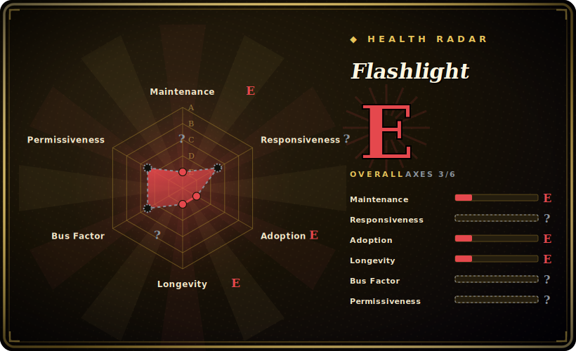

# Flashlight

An "unofficial Spotlight API" for older macOS — a plugin system that injects into Spotlight so you can type `weather`, `define`, currency conversions, etc. and get custom results inline. This `w0lfschild` repo is one fork in a chain descending from nate-parrott's original.

## When to use

You're a macOS power user still running an **older OS (roughly 10.10–10.15)** and you want Spotlight to do more than launch apps and search files — answer "weather", do `pi * 2`, define a word, convert currency, or run a small Python plugin you wrote — without installing a separate launcher like Alfred. You're comfortable disabling System Integrity Protection, you install MacForge/MacEnhance (the SIMBL-style injector), drop in Flashlight, and pick plugins from its installer; queries you type into the *native* Spotlight bar now route through your plugins and render results inline.

Realistically, in 2026 this is a **retro / legacy-machine** use case: a vintage Mac, a locked-old-OS environment, or studying how Spotlight plugin injection worked. On a current macOS it does not apply. [推断]

## When NOT to use

- **You're on modern macOS (Big Sur / 11 and later).** The maintainer stopped because Big Sur reworked Spotlight and stability had already degraded around 10.15.5+. It targets 10.10–10.15 and is effectively dead beyond that. [未验证]
- **You won't disable SIP.** Installation requires disabling System Integrity Protection and uses code injection into a system process — a real security and stability tradeoff most users should not accept on a daily-driver machine.
- **You want a maintained launcher.** For a current, supported quick-launcher use Alfred, Raycast, or LaunchBar — all actively developed and not dependent on injecting into Spotlight.
- **Production / managed / security-sensitive machines.** Disabling SIP + third-party injection into Spotlight is disqualifying anywhere security posture matters.
- **You need upstream support or fixes.** This fork has no releases and no commits since 2020; nothing is coming.

## Comparison

| Alternative | In index | Tradeoff |
|---|---|---|
| Alfred | 未收录 | Mature commercial macOS launcher with a huge workflow ecosystem; actively maintained, no SIP-disable/injection, but its own app (not the native Spotlight bar) and paid Powerpack for advanced features. |
| Raycast | 未收录 | Modern, actively developed launcher with extensions store and team features; replaces Spotlight UX rather than injecting into it. |
| LaunchBar | 未收录 | Long-standing keyboard launcher; mature and supported, separate app, not a Spotlight plugin layer. |
| nate-parrott/Flashlight (original) | 未收录 | The upstream this descends from; also unmaintained — the fork chain (w0lfschild and others) exists precisely because the original stalled. |
| macOS Spotlight (built-in) | 未收录 | No install, supported, but the limited stock query/answer surface is exactly what Flashlight tried to extend. |

## Tech stack

- **Plugin language:** Python — plugins are small Python scripts/bundles that take a parsed query and return results.
- **Injection layer:** a SIMBL/MacForge-style agent injects the Flashlight code into the Spotlight process to intercept and augment queries; the app/agent components are GPL while the rest is MIT (see LICENSE). [未验证]
- **App:** `Flashlight.app` (Objective-C/Swift-era macOS app) plus the SIMBL agent for the injection.

## Dependencies

- **OS:** macOS ~10.10–10.15, with **SIP disabled**. Does not run on modern macOS.
- **Injection framework:** MacForge / MacEnhance (formerly SIMBL) must be installed to load the agent into Spotlight.
- **Runtime:** a Python interpreter for the plugins (the macOS-bundled Python of that era).
- **No services/datastore** — it's a local desktop extension, no backend.

## Ops difficulty

**High (relative to its tiny payoff today).** Getting it working means disabling SIP, installing a code-injection framework, and matching a narrow band of old macOS versions — and even then stability was poor in the project's final supported releases. There is no maintenance path: no releases, no upstream fixes, and each macOS point release historically risked breaking the injection. For anything but a frozen legacy machine, the operational and security cost dwarfs the benefit.

## Health & viability

- **Maintenance (2026-06).** **Abandoned.** No GitHub releases; last push 2020-11. The maintainer publicly stopped due to Big Sur's Spotlight changes. Not flagged "archived" on GitHub, but functionally dead. [推断]
- **Governance / bus factor.** Owner is a **User** account (w0lfschild); this is itself a fork in a succession of community maintainers (original by nate-parrott, then several forks). Effectively no current owner — worst-case bus factor. [推断]
- **Age & Lindy.** Created 2016; ~10 years old but **abandoned for ~6 of them** ⇒ Lindy **fails** — age without ongoing activity is not a durability signal, it's a tombstone. The underlying OS-injection approach has also been obsoleted by macOS itself. [推断]
- **Adoption.** ~1.1k stars reflect historical interest in the original idea, not current usage; the modern audience has moved to Alfred/Raycast. [未验证]
- **Risk flags.** Requires disabling SIP and injecting into a system process (security risk); mixed / component-level licensing (MIT for most, GPL-2.0 for the app + SIMBL agent) (GitHub reports `NOASSERTION`, the repo's LICENSE clarifies app/agent = GPL, rest = MIT); tied to deprecated macOS internals. [推断]

## Caveats (unverified)

- [未验证] GitHub license shows `NOASSERTION`; the repo LICENSE states the project is MIT **except** `Flashlight.app` and the SIMBL Agent (GPL). The `license` field here encodes that mixed / component-level arrangement (MIT for most, GPL-2.0 for the app + SIMBL agent), not a single SPDX id.
- [未验证] Supported macOS range (~10.10–10.15) and the Big Sur-breakage reason come from the README/maintainer notes; not independently re-verified against each OS version.
- [推断] "Abandoned" is inferred from no releases + last push 2020-11 + the maintainer's stated discontinuation — GitHub does not mark it archived.
- [未验证] Plugin language (Python), the MacForge/MacEnhance injection requirement, and SIP-disable steps are taken from the README/install docs and not tested on a live machine here.
- [推断] ~1.1k stars as of 2026-06; star counts are date-sensitive and reflect historical, not current, interest.
