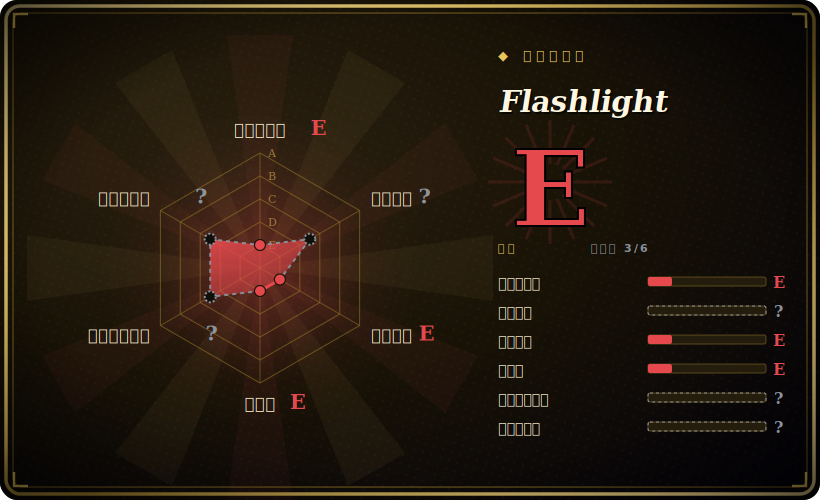

# Flashlight

给老版 macOS 用的「非官方 Spotlight API」——一套注入 Spotlight 的插件系统，让你输入 `weather`、`define`、货币换算等就能在原生 Spotlight 里直接看到自定义结果。这个 `w0lfschild` 仓库是源自 nate-parrott 原项目的一连串分叉中的一个。

## 何时使用

你是 macOS 重度用户，仍在跑**较老的系统（大致 10.10–10.15）**，希望 Spotlight 不止能启动应用、搜文件——还能回答「weather」、算 `pi * 2`、查词、换汇，或跑一个你自己写的小 Python 插件——又不想另装 Alfred 那样的启动器。你能接受关闭 System Integrity Protection，装上 MacForge/MacEnhance（SIMBL 式注入器），放入 Flashlight，从它的安装器里挑插件；你敲进*原生* Spotlight 栏的查询如今会经过你的插件并把结果就地渲染出来。

现实地说，在 2026 年这是一个**怀旧 / 遗留机器**的用例：一台老 Mac、一个锁死旧系统的环境，或研究 Spotlight 插件注入当年是怎么做的。在当前 macOS 上它并不适用。[推断]

## 何时不用

- **你在用现代 macOS（Big Sur / 11 及以后）。** 维护者之所以停手，是因为 Big Sur 重做了 Spotlight，且在 10.15.5+ 时稳定性已经下滑。它面向 10.10–10.15，超出即基本已死。[未验证]
- **你不愿关闭 SIP。** 安装要求关闭 System Integrity Protection，并向系统进程注入代码——这是真实的安全与稳定性取舍，大多数人不该在日常主力机上接受。
- **你想要一个被维护的启动器。** 要当下受支持的快速启动器，请用 Alfred、Raycast 或 LaunchBar——都在积极开发，且不依赖往 Spotlight 里注入。
- **生产 / 受管 / 安全敏感的机器。** 关闭 SIP ＋第三方注入 Spotlight，在任何看重安全态势的地方都是一票否决。
- **你需要上游支持或修复。** 这个分叉没有 release，自 2020 起也没有提交；什么都不会来了。

## 横向对比

| 替代品 | 是否收录 | 我们的评价 | 取舍 |
|---|---|---|---|
| Alfred | 未收录 | 当前页用于它的主场景；如果更看重“成熟的商业 macOS 启动器，工作流生态庞大”，再选 Alfred。 | 成熟的商业 macOS 启动器，工作流生态庞大；积极维护、无需关 SIP/注入，但它是独立应用（不是原生 Spotlight 栏），高级功能需付费 Powerpack。 |
| Raycast | 未收录 | 当前页用于它的主场景；如果更看重“现代、积极开发的启动器，带扩展商店与团队功能”，再选 Raycast。 | 现代、积极开发的启动器，带扩展商店与团队功能；它替换 Spotlight 的交互，而非注入其中。 |
| LaunchBar | 未收录 | 当前页用于它的主场景；如果更看重“历史悠久的键盘启动器”，再选 LaunchBar。 | 历史悠久的键盘启动器；成熟且受支持，是独立应用，不是 Spotlight 插件层。 |
| nate-parrott/Flashlight（原版） | 未收录 | 当前页用于它的主场景；如果更看重“本仓库的上游”，再选 nate-parrott/Flashlight（原版）。 | 本仓库的上游；同样无人维护——分叉链（w0lfschild 等）之所以存在，正是因为原版停滞了。 |
| macOS Spotlight（内置） | 未收录 | 当前页用于它的主场景；如果更看重“无需安装、受支持，但其有限的内置查询/应答面正是 Flashlight 想扩展的东西”，再选 macOS Spotlight（内置）。 | 无需安装、受支持，但其有限的内置查询/应答面正是 Flashlight 想扩展的东西。 |

## 技术栈

- **插件语言：** Python——插件是接收解析后查询并返回结果的小 Python 脚本/bundle。
- **注入层：** 一个 SIMBL/MacForge 式 agent 把 Flashlight 代码注入 Spotlight 进程，以拦截并增强查询；app/agent 组件是 GPL，其余是 MIT（见 LICENSE）。[未验证]
- **应用：** `Flashlight.app`（那个年代的 Objective-C/Swift macOS 应用）加上做注入的 SIMBL agent。

## 依赖

- **系统：** macOS 约 10.10–10.15，且需**关闭 SIP**。在现代 macOS 上不可运行。
- **注入框架：** 必须安装 MacForge / MacEnhance（前身 SIMBL）来把 agent 加载进 Spotlight。
- **运行时：** 插件需要一个 Python 解释器（那个年代 macOS 自带的 Python）。
- **无服务/数据存储**——它是本地桌面扩展，没有后端。

## 运维难度

**高（相对其今天微薄的回报而言）。** 要让它跑起来意味着关闭 SIP、装一个代码注入框架、并匹配一段很窄的老 macOS 版本——即便如此，在项目最后支持的版本里稳定性也很差。它没有任何维护路径：没有 release、没有上游修复，历史上每个 macOS 小版本都可能弄坏注入。除了一台冻结的遗留机器，其运维与安全成本都远超收益。

## 健康度与可持续性

- **维护（2026-06）。** **已废弃。** 没有 GitHub release；最后 push 在 2020-11。维护者因 Big Sur 的 Spotlight 改动公开停手。GitHub 上未标「archived」，但功能上已死。[推断]
- **治理 / bus factor。** owner 是 **User** 账号（w0lfschild）；它本身就是一连串社区维护者接力中的一个分叉（原版 nate-parrott，之后数个分叉）。实际上已无当前 owner——最坏的 bus factor。[推断]
- **年龄与 Lindy。** 2016 年创建，约 10 岁但**其中约 6 年处于废弃**⇒ Lindy **不成立**——没有持续活跃的年龄不是耐久信号，而是一块墓碑。其底层的系统注入路子也已被 macOS 本身淘汰。[推断]
- **采用度。** 约 1.1k star 反映的是当年对这个点子的兴趣，而非当前使用；现代受众已转向 Alfred/Raycast。[未验证]
- **风险标记。** 需要关闭 SIP 并注入系统进程（安全风险）；混合/组件级许可（大部分为 MIT，app 与 SIMBL agent 为 GPL-2.0）（GitHub 报 `NOASSERTION`，仓库 LICENSE 澄清 app/agent = GPL、其余 = MIT）；绑定已弃用的 macOS 内部机制。[推断]

## 存疑（未验证）

- [未验证] GitHub 许可显示 `NOASSERTION`；仓库 LICENSE 写明项目为 MIT，**但** `Flashlight.app` 与 SIMBL Agent 例外（GPL）。这里的 `license` 字段编码的是这种混合/组件级安排（大部分为 MIT，app 与 SIMBL agent 为 GPL-2.0），而非单一 SPDX id。
- [未验证] 支持的 macOS 范围（约 10.10–10.15）与 Big Sur 弄坏它的原因来自 README/维护者说明；未对每个系统版本独立复核。
- [推断]「已废弃」是从无 release ＋最后 push 2020-11 ＋维护者明示停手推断——GitHub 并未将其标为 archived。
- [未验证] 插件语言（Python）、MacForge/MacEnhance 注入要求与关闭 SIP 的步骤取自 README/安装文档，未在真机上测试。
- [推断] 截至 2026-06 约 1.1k star；star 数对时间敏感，反映的是历史而非当前兴趣。
