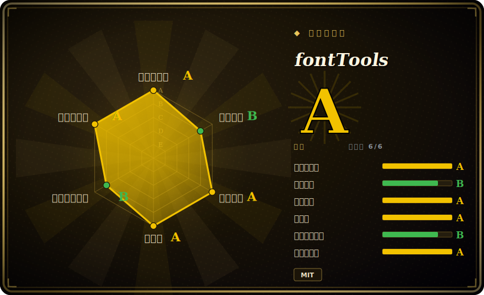

# fontTools

一个 Python 库（外加一组命令行工具），用来读取、写入、操纵字体文件——TrueType/OpenType、WOFF/WOFF2、AFM 等等——是开源字体工具栈事实上的基石。

## 何时使用

你在搭一条字体流水线：也许你是给某位字体设计师做工程的人，要把 UFO/字形源转成可发布的 `.otf`/`.ttf`/`.woff2`；也许你是前端平台团队，需要把 webfont **子集化**到页面真正用到的那些字形，让下载从几百 KB 降到几 KB。你不想手撕二进制的 `sfnt`/`glyf`/`GPOS` 表，也不信任一个临时脚本能在不破坏表结构的前提下完整 round-trip 一个字体。你 `pip install fonttools`，然后要么调库——`TTFont("in.ttf")` 给你一个可遍历的对象模型，每张表都能读、改、存——要么用自带 CLI：`ttx` 把字体 dump 成可编辑 XML 再编译回来，`pyftsubset` 把字体裁到指定字形集，用 `fontTools.ttLib` 合并、把可变字体 instance 成静态切片、或修元数据。其他字体工具（以及大多数 webfont 构建步骤）都建在它之上。

只要任务是*程序化的字体外科手术*，你就会选它：为 Web 做子集、格式转换、检视/修补表、把可变字体 instance 成静态、或喂给更大的构建系统（它是 matplotlib 的依赖，也是许多设计师工具链和 webfont 服务的依赖）。[未验证]

## 何时不用

- **你想*设计*字形或画轮廓。** fontTools 操纵字体*文件与表*，它不是字体编辑器。要绘制/编辑请用 Glyphs、FontForge 或 RoboFont——fontTools 是它们背后/周边的引擎，不是画布。
- **你需要完整的文本 shaping / 渲染。** 把文本＋字体变成定位好的字形（复杂文种、连字、双向）是 HarfBuzz 的活；fontTools 读 GSUB/GPOS 表，但不做 shaping 或栅格化。
- **你只想用 GUI/CLI 做一次性子集、永不脚本化。** 那也行，但这种情况下一个封装工具可能比库 API 更省事。
- **硬实时或内存吃紧的嵌入式场景。** 它是纯 Python 对象模型，会把表加载进内存；受限运行时下的字体处理应该用 C 库（FreeType、HarfBuzz）那一层。
- **你指望每张冷门表都被完整支持、round-trip 完美。** 覆盖很广但格式浩瀚；异种或厂商私有表可能被原样透传而非建模——请核实你依赖的那张具体表。[未验证]

## 横向对比

| 替代品 | 是否收录 | 我们的评价 | 取舍 |
|---|---|---|---|
| FontForge | 未收录 | 当前页用于它的主场景；如果更看重“完整的 GUI/可脚本字体编辑器（设计＋生产）”，再选 FontForge。 | 完整的 GUI/可脚本字体编辑器（设计＋生产）；功能面宽得多但更重、基于 C，工作流（编辑器）与一个干净的 Python 库不同。 |
| HarfBuzz | 未收录 | 当前页用于它的主场景；如果更看重“文本 shaping 引擎（文本→定位字形）”，再选 HarfBuzz。 | 文本 shaping 引擎（文本→定位字形）；互补而非替代——fontTools 改字体，HarfBuzz 用字体来 shaping。 |
| FreeType | 未收录 | 当前页用于它的主场景；如果更看重“C 写的栅格器/加载器，用于运行时渲染字形”，再选 FreeType。 | C 写的栅格器/加载器，用于运行时渲染字形；关乎画像素，而非编辑字体文件。 |
| Glyphs / RoboFont | 未收录 | 当前页用于它的主场景；如果更看重“商业 macOS 字体设计应用”，再选 Glyphs / RoboFont。 | 商业 macOS 字体设计应用；用于绘制字型，导出时往往*在底层用* fontTools。 |
| `woff2`/`sfnt2woff` 等 CLI | 未收录 | 当前页用于它的主场景；如果更看重“单一用途的格式转换器”，再选 woff2/sfnt2woff 等 CLI。 | 单一用途的格式转换器；fontTools 覆盖同样的转换，外加完整的表操作与子集化。 |

## 技术栈

- **语言：** Python（纯 Python 核心；特定特性有可选的 C 加速与原生依赖）。
- **模型：** 基于 `sfnt` 格式之上的 `TTFont` 对象模型——`cmap`、`glyf`、`GPOS`/`GSUB`、`name`、`head` 等每张表各有类；经 `ttx` 做 XML round-trip。
- **CLI：** `ttx`（字体 ↔ XML）、`pyftsubset`（子集）、`pyftmerge`（合并）、`fonttools` 入口暴露各子命令（可变字体 instancer 等）。
- **格式：** TrueType/OpenType（`.ttf`/`.otf`）、WOFF/WOFF2、AFM、T1/CFF 等。

## 依赖

- **运行时：** Python；基础库是纯 Python，**不需要任何外部服务**。可选 extras 会拉入原生依赖——如 WOFF2（`brotli`）、unicode 数据、更快的 XML（`lxml`）、graphite、绘图，通过 `pip install fonttools[woff,unicode,...]` 安装。[未验证]
- **服务/基础设施：** 无——它是进程内的库/CLI，没有数据存储或守护进程。
- **构建：** 标准 Python 打包；可选原生 extras 需要各自的构建前置。

## 运维难度

**低。** `pip install fonttools`（要 WOFF2 就加 `[woff]` 这类 extras）即可——没有服务、没有数据存储、没有守护进程。它在进程内运行，或作为构建里的一个 CLI 步骤。唯一真实的摩擦是为你处理的格式挑对可选 extras（WOFF2 需要 brotli），以及做深度表手术时字体格式本身固有的复杂度——那是领域难度，不是运维难度。

## 健康度与可持续性

- **维护（2026-06）。** 非常活跃：v4.63.0 于 2026-05 发布，最后 push 在 2026-06，按稳定的高频小版本节奏发布。未归档——明显在维护，不是吃老本。[推断]
- **治理 / bus factor。** 隶属 `fonttools` **GitHub 组织**，贡献者历史悠长，由 Behdad Esfahbod 和 Cosimo Lupo（anthrotype）领衔，外加数百名贡献者——多维护者，不是单点失效；bus factor 比大多数字体工具健康。[推断]
- **年龄与 Lindy。** 2013 年上 GitHub，但其代码血统（Just van Rossum 的 TTX/fontTools）还要更早数年；在此 13+ 年且**仍在活跃发布**⇒ **强 Lindy** 信号——它是既定标准，而非新秀。[推断]
- **采用度。** 基础性：matplotlib 的依赖，开源字体/webfont 工具链的脊梁；真实使用广泛。约 400+ 个 open issue 与大面积＋活跃 triage 相符，单看并非红旗。[未验证]
- **风险标记。** 无明显项；宽松 MIT、未发现 relicense 历史、维护者多元。主要保留意见是格式广度（并非每张异种表都被深度建模），而非项目健康。[推断]

## 存疑（未验证）

- [未验证] 截至 2026-06 约 5.1k GitHub star、约 400 个 open issue；star/issue 数对时间敏感，仅供参考。
- [未验证] v4.63.0 标注 2026-05；发布节奏与确切版本随时间变动——请对照当前发布页核实。
- [未验证] 可选 extras 集合（WOFF2 的 brotli、lxml、unicodedata2 等）及各自所 gate 的特性取自打包元数据/README，可能变化；请查当前 `pyproject` 的 extras。
- [推断]「字体工具栈的基石」及具体下游依赖者（matplotlib、设计师工具链）是从生态知识推断；确切的当前依赖集合这里未逐一列出。
- [推断] 异种/厂商私有表的逐表覆盖与 round-trip 保真度是从格式广度做出的推断，而非对某张具体表的实测结论。
