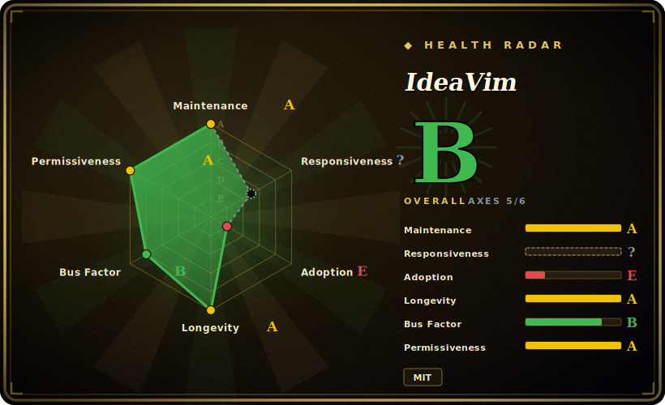

# IdeaVim

A Vim emulation plugin for JetBrains IDEs (IntelliJ IDEA, PyCharm, GoLand, WebStorm, Rider, etc.) — Vim motions, modes, registers, macros, and a `.ideavimrc` inside the IDE, maintained by JetBrains itself.

## When to use

You're a developer whose fingers are wired for Vim — `hjkl`, `ciw`, `dd`, visual-block, `.` repeat, macros — but your team's real work lives in IntelliJ/PyCharm/GoLand for the refactoring, debugging, and language intelligence you won't give up. Running actual Vim or Neovim in a terminal means losing the IDE; using the IDE's stock keymap means losing your muscle memory. You install IdeaVim from the plugin marketplace, drop a `.ideavimrc` in your home dir (much of your `.vimrc` syntax carries over), and now the editor pane behaves like Vim — modes, operators, registers, marks, macros — while `:action` and the IdeaVim ecosystem plugins (ideavim-sneak, vim-surround, NERDTree-style mappings) let you bind IDE actions to Vim-style keys. You get Vim editing *and* IntelliJ's semantic refactors/debugger in one tool.

You reach for it specifically when the IDE is non-negotiable (large JVM/Kotlin/Go codebase, heavy refactoring, integrated debugger) but you refuse to type like a non-Vim user. It is the canonical, JetBrains-blessed way to do that.

## When NOT to use

- **You're not in a JetBrains IDE.** It only works inside IntelliJ-platform IDEs. For VS Code use the VSCodeVim/Neovim extensions; for a terminal use real Vim/Neovim. Wrong host = wrong tool.
- **You want 100% Vim/Neovim fidelity or your full plugin ecosystem.** It's an *emulation* of a large subset, not Vim itself — some obscure commands, edge-case behaviors, and the entire native Vimscript/Lua plugin universe aren't there (IdeaVim has its own smaller extension set). Power users hit gaps. [未验证]
- **You want Neovim's Lua config / LSP / treesitter inside the IDE.** IdeaVim reads a `.ideavimrc`, not your Neovim Lua config; the IDE provides the language intelligence, not Neovim's stack.
- **Minimal/keyboard-light editing.** If you don't already think in Vim, adding a modal layer over the IDE is friction, not speed — learn it deliberately or skip it.

## Comparison

| Alternative | In index | Our verdict | Tradeoff |
|---|---|---|---|
| VSCodeVim | 未收录 | Use this page for its stated niche; choose VSCodeVim when you need vim emulation for VS Code. | Vim emulation for VS Code; same idea on a different host — choose by which IDE you actually use, not by the plugin. |
| vscode-neovim | 未收录 | Use this page for its stated niche; choose vscode-neovim when you need embeds a *real* Neovim instance inside VS Code for higher fidelity + your Neovim config. | Embeds a *real* Neovim instance inside VS Code for higher fidelity + your Neovim config; heavier and VS Code-only, no JetBrains equivalent of this depth. |
| Real Vim / Neovim | 未收录 | Use this page for its stated niche; choose Real Vim / Neovim when you need the genuine article with full plugin ecosystem and Lua/LSP. | The genuine article with full plugin ecosystem and Lua/LSP; but you lose JetBrains' integrated refactoring/debugger/indexing. |
| JetBrains stock keymap | 未收录 | Use this page for its stated niche; choose JetBrains stock keymap when you need no emulation layer, fully supported. | No emulation layer, fully supported; but no Vim modes/motions — defeats the purpose for a Vim user. |

## Tech stack

- **Language:** Kotlin (JetBrains' language; the plugin runs on the IntelliJ Platform / JVM).
- **Host:** the IntelliJ Platform plugin API — it hooks the editor component of any IntelliJ-based IDE.
- **Config:** a `.ideavimrc` file using Vim-style commands/mappings, plus `:action` to invoke IDE actions and a set of IdeaVim extension plugins.
- **Distribution:** the JetBrains Marketplace (and bundled/installable in IntelliJ-platform IDEs).

## Dependencies

- **Runtime:** a JetBrains IntelliJ-platform IDE (IntelliJ IDEA, PyCharm, GoLand, WebStorm, Rider, CLion, etc.) of a compatible version — the IDE *is* the platform it plugs into.
- **No external services / datastore** — it's an in-IDE plugin; config is a local file.
- **Optional:** companion IdeaVim extension plugins (surround, sneak, etc.) installed alongside.

## Ops difficulty

**Very low.** Install from the plugin marketplace, optionally write a `.ideavimrc`, toggle it on. There's nothing to deploy or operate — it lives entirely inside the IDE you already run. The only "difficulty" is configuration taste (porting `.vimrc` habits, mapping IDE actions) and occasionally an IDE-version compatibility bump, which JetBrains tracks closely since they ship it.

## Health & viability

- **Maintenance (2026-06).** Very active — last push 2026-06, frequent commits, led by a small JetBrains team (AlexPl292 and others) with thousands of commits. Distributed via Marketplace rather than GitHub Releases, so "no releases" on GitHub is expected, not a staleness signal. Not archived. [推断]
- **Governance / backing.** Owned and maintained by **JetBrains** (an Organization, the IDE vendor itself) — first-party, well-funded stewardship with a direct incentive to keep it working across IDE releases. Among the strongest backing profiles for an IDE plugin. [推断]
- **Age & Lindy.** Created 2011; ~15 years old and **still actively shipping** ⇒ a **strong Lindy** signal — it has tracked the IntelliJ Platform across many major versions and remains the default Vim layer for JetBrains. [推断]
- **Adoption.** ~10k stars and standard inclusion in most JetBrains-Vim user setups indicate broad, established adoption; a healthy extension ecosystem exists around it. [未验证]
- **Risk flags.** Few — permissive MIT, first-party vendor backing. The structural ceiling is inherent: it's an *emulation* tied to the IntelliJ Platform, so fidelity gaps and platform-version coupling are the real (and bounded) risks, not project abandonment. [推断]

## Caveats (unverified)

- [未验证] ~10.2k GitHub stars as of 2026-06; star counts are date-sensitive and indicative only.
- [未验证] "No GitHub releases" reflects Marketplace-based distribution; the actual release/version cadence lives on the JetBrains Marketplace and IDE compatibility ranges, not enumerated here.
- [未验证] The exact set of supported Vim features vs. gaps (and the IdeaVim extension catalog) shifts version-to-version; verify the specific command/plugin you depend on against current docs.
- [推断] "First-party, well-funded" is inferred from JetBrains ownership; specific staffing/funding allocated to IdeaVim is not stated.
- [推断] Compatibility with any given IDE version is governed by the plugin's declared platform range and changes over time; not asserting a specific matrix here.
