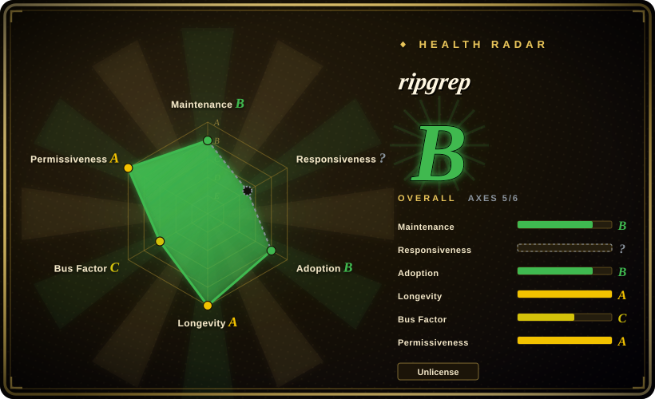

# ripgrep

A line-oriented search tool that recursively searches directories for a regex pattern while automatically respecting gitignore rules and skipping hidden files and binary files by default.

## When to use

You're a developer who searches large codebases daily and wants a tool that is fast, smart, and respects your project's structure by default. You are tired of `grep -r` returning noise from `.git`, `node_modules`, and build artifacts. You want something that works identically on Windows, macOS, and Linux with prebuilt binaries for every release. You need Unicode-aware regex search, optional multiline matching, and the ability to search specific file types. You want a tool that is so fast you can run it interactively without waiting.

## When NOT to use

- **If you need to search across lines with complex multiline patterns** — ripgrep is line-oriented by design. While it has a multiline mode (`-U`), it is not as natural for complex cross-line matching as `pcregrep` or `ack`.
- **If you need to search within binary files** — ripgrep skips binary files by default. Use `grep` or `strings` if you need to search inside compiled binaries or images.
- **If you are on a system where you cannot install a new binary** — ripgrep is not universally preinstalled like `grep`. On minimal containers or restricted systems, `grep` may be your only option.
- **If you need a tool that is part of POSIX** — `grep` is POSIX-standard and guaranteed to be on every Unix system. ripgrep is a modern replacement but not a portable standard.
- **If you need to search compressed files** — ripgrep does not search inside `.gz`, `.zip`, or `.tar` archives by default. Use `zgrep` or `ag` with appropriate plugins for that.

## Comparison

| Alternative | In index | Our verdict | Tradeoff |
| --- | --- | --- | --- |
| grep | 未收录 | The standard POSIX search utility, available everywhere. | grep is universal and standard but slower and noisier; ripgrep is faster, smarter, and respects gitignore by default. |
| The Silver Searcher (ag) | 未收录 | Fast grep replacement with gitignore support, written in C. | ag is mature and fast; ripgrep is generally faster, has better Unicode support, and more active maintenance. |
| ack | 未收录 | Perl-based search tool optimized for programmers. | ack is slower and requires Perl; ripgrep is faster, Rust-native, and has broader platform support. |
| git grep | 未收录 | Search within tracked files using git's own index. | git grep is fast for tracked files but only works inside Git repos; ripgrep works anywhere and searches untracked files too. |

## Tech stack

- **Rust** — primary implementation language for performance and safety
- **regex crate** — Rust's standard regex engine with SIMD optimizations
- **Memory-mapped I/O** — for efficient file reading on supported platforms

## Dependencies

- A supported platform (Windows, macOS, Linux; x86_64, ARM64, and others)
- No runtime dependencies — self-contained static binary
- Optional: PCRE2 support for advanced regex features (requires PCRE2 library if compiled with it)

## Ops difficulty

**None**. ripgrep is a single static binary. Install via package manager, download from releases, or `cargo install`. No configuration, no daemon, no maintenance.

## Health & viability

- **Maintenance**: Active and stable — regular releases, well-managed issue tracker. The author (BurntSushi) is highly responsive and disciplined about scope.
- **Governance**: Primarily maintained by Andrew Gallant (BurntSushi), a respected Rust community member. This is a single-maintainer project with a long track record of reliability.
- **Backing**: No corporate backing — this is a personal open-source project. The maintainer has sustained it for years through community goodwill and occasional sponsorship.
- **Adoption**: Extremely widespread — installed by default in many developer environments, recommended by major frameworks, and used in CI pipelines worldwide. 66k stars, 2.6k forks.
- **Longevity**: ~10 years old (created 2016). Continuously maintained with no gaps. Strong Lindy signal — a single-maintainer project that has outlasted many well-funded alternatives.
- **Risk flags**: Dual-licensed under MIT or Unlicense — both are permissive and safe. The single-maintainer bus factor is a concern, but the codebase is mature and the maintainer has demonstrated long-term commitment. No relicense risk.

## Caveats (unverified)

- [未验证] The exact performance comparison against grep and ag depends on the specific query, filesystem, and hardware; benchmarks vary.
- [未验证] The PCRE2 support is an optional compile-time feature; the prebuilt binaries may or may not include it depending on the release.
