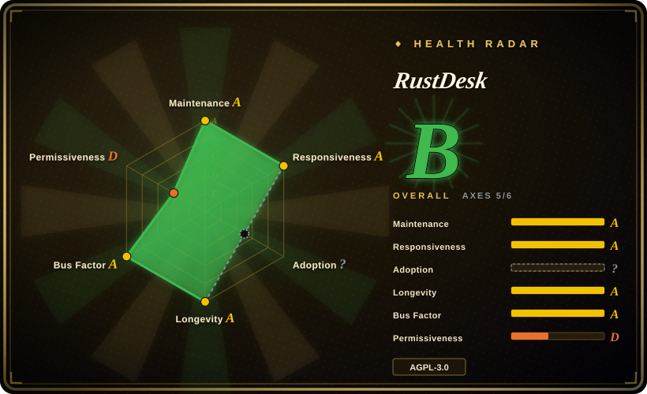

# RustDesk

An open-source remote desktop application designed for self-hosting, as an alternative to TeamViewer and AnyDesk — built in Rust with a Flutter UI, supporting P2P connections and a self-hosted relay server.

## When to use

You're a developer or sysadmin who needs remote access to your own machines — a home server, a workstation in the office, or a family member's PC — and you don't want to pay commercial remote-desktop subscriptions or route your screen data through a third-party cloud. You install RustDesk on both ends, optionally spin up a small relay server on a VPS, and connect directly with end-to-end encryption. It runs on Windows, macOS, Linux, Android, and iOS, supports file transfer, clipboard sync, and multiple monitors, and the Flutter UI gives it a native feel on each platform. You own the infrastructure, you control the keys, and the AGPL-3.0 license means the code is fully auditable.

## When NOT to use

- **You need enterprise-grade support, SLA, or compliance certification.** RustDesk is a community-driven project with no formal support contract; for regulated environments or 24/7 mission-critical access, commercial tools (TeamViewer, AnyDesk enterprise) offer guaranteed response times and compliance documentation.
- **You want a fully cloud-managed zero-config solution.** RustDesk's strength is self-hosting; the public relay service exists but is not the primary value proposition. If you want to install and forget without managing a server, a commercial SaaS remote-desktop product is simpler.
- **AGPL-3.0 is incompatible with your use case.** The license is AGPL-3.0, which may restrict how you integrate, distribute, or modify the software in proprietary contexts. Review license implications with legal counsel before embedding or white-labeling.
- **You need advanced session recording, audit logging, or granular RBAC.** RustDesk provides basic access control and password protection; for full session recording, detailed audit trails, and role-based access control, enterprise remote-access platforms are stronger.
- **You need seamless Wayland support on Linux.** RustDesk's Linux support has historically been stronger on X11; Wayland support is evolving but may have limitations or require specific compositor compatibility. [推断]
- **You need high-performance remote gaming or video editing.** While RustDesk is efficient, it is not optimized for low-latency gaming or high-frame-rate video editing remoting; dedicated streaming solutions (Moonlight, Parsec) are better for that niche.

## Comparison

| Alternative | In index | Our verdict | Tradeoff |
| --- | --- | --- | --- |
| TeamViewer | 未收录 | Use this page for its stated niche; choose TeamViewer when you need a commercial, cloud-managed remote-desktop with enterprise support and cross-platform reliability. | Commercial, cloud-managed remote desktop with enterprise support, session recording, and compliance; requires paid subscription and routes data through their cloud. |
| AnyDesk | 未收录 | Use this page for its stated niche; choose AnyDesk when you want a lightweight, fast proprietary remote desktop with a free tier for personal use. | Lightweight proprietary remote desktop with a free personal tier; fast and simple but closed-source and cloud-dependent. |
| Chrome Remote Desktop | 未收录 | Use this page for its stated niche; choose Chrome Remote Desktop when you want a free, browser-based remote desktop tied to your Google account. | Free, browser-based remote desktop tied to Google account; very simple but requires Google ecosystem and offers no self-hosting. |
| TightVNC / TigerVNC | 未收录 | Use this page for its stated niche; choose TightVNC when you need a traditional VNC server for LAN-based remote access without encryption by default. | Traditional VNC for LAN access; simple and protocol-standard but lacks modern encryption, NAT traversal, and mobile clients without extra setup. |
| Sunshine + Moonlight | 未收录 | Use this page for its stated niche; choose Sunshine + Moonlight when you need low-latency game streaming or high-frame-rate remote desktop. | Open-source game-streaming host (Sunshine) and client (Moonlight) optimized for low latency and high FPS; narrower use case than general remote desktop. |

## Tech stack

- **Language:** Rust (core engine and networking) with a Flutter/Dart cross-platform UI layer for desktop and mobile.
- **Networking:** P2P with NAT traversal (using hole-punching) and fallback to a relay server when direct connection fails; encrypted with TLS 1.3. [未验证]
- **UI:** Flutter provides a single codebase for Windows, macOS, Linux, Android, and iOS with platform-native rendering.
- **Media:** Custom video codec pipeline for screen capture and remote display; handles multiple monitors and resolutions.
- **Build:** Rust compiles to native binaries; Flutter bundles the UI assets. Flatpak and other distribution formats are supported.

## Dependencies

- **Client hardware:** A device with a screen and network connection running Windows, macOS, Linux, Android, or iOS. The client app is a native binary installed locally.
- **Server / relay (optional):** For direct P2P, no server is required. For relay fallback or always-on access, you need a small VPS or server to run the `rustdesk-server` relay and ID/registry services. Minimal specs: ~1 CPU, 512 MB RAM, modest bandwidth. [未验证]
- **Network:** Both sides need internet access (or LAN access for direct P2P). The relay server needs a public IP and open ports (TCP/UDP). Firewalls and NAT must allow the connection path.
- **No external database:** The relay server does not require a database; it is a lightweight stateful daemon.

## Ops difficulty

**Low** for direct P2P personal use: install the client on both machines, exchange the ID and password, and connect. **Medium** for self-hosted relay: you need to deploy the `rustdesk-server` binary (or Docker container) on a VPS, open the required ports, and configure DNS/SSL if you want a branded relay. The main operational concerns are:
- **Security:** You must manage the relay server's access, keep it patched, and rotate keys/passwords. The default setup uses simple password protection; for production, consider additional hardening (fail2ban, VPN overlay, key-based auth).
- **NAT/firewall traversal:** Some corporate networks block P2P traffic, forcing all connections through the relay — which then becomes a bandwidth bottleneck.
- **Updates:** The client and relay must stay version-compatible; mismatched versions can cause connection failures.

## Health & viability

- **Maintenance (2026-07).** Last pushed 2026-07-01 with a very active commit history; the project is not archived and receives frequent releases and security updates. [推断]
- **Governance / bus factor.** The repo is owned by a single user (`rustdesk`) who is the primary maintainer; this creates a **moderate bus-factor risk**. However, the project has a large contributor base (~17.8k forks) and an active community, so a fork could continue if the original maintainer stepped back. [推断]
- **Age & Lindy verdict.** ~5.5 years old (created 2020-09) and still very active ⇒ a **moderate-to-strong Lindy** signal for a remote-desktop tool; it has proven staying power and a growing self-hosting community. [推断]
- **Adoption & ecosystem.** ~117.4k stars and widely used as a TeamViewer alternative in the self-hosting and privacy communities. The cross-platform Flutter UI and P2P architecture are distinctive strengths. [未验证]
- **Risk flags.** AGPL-3.0 license is a decisive filter for commercial use and integration. There is no evidence of relicense history, but the single-maintainer ownership and lack of a formal foundation means governance could shift. The project carries a caution about misuse (unauthorized access) in its README. [推断]

## Caveats (unverified)

- [未验证] ~117.4k GitHub stars as of 2026-07-01; star counts are approximate and time-sensitive.
- [未验证] The relay server resource requirements and exact port numbers are inferred from typical self-hosting guides; verify the current `rustdesk-server` docs for production deployment.
- [未验证] TLS 1.3 and encryption details are summarized from the project description; confirm the current encryption protocol and key management for your security review.
- [未验证] Wayland support status and specific compositor compatibility are evolving; test on your target Linux distribution before deploying.
- [推断] Session recording, audit logging, and RBAC are not core features; if compliance requires these, you will need to supplement RustDesk with additional tooling.
- [推断] P2P hole-punching success rate varies by network topology (symmetric NAT, corporate firewalls); plan for relay fallback in restrictive environments.
