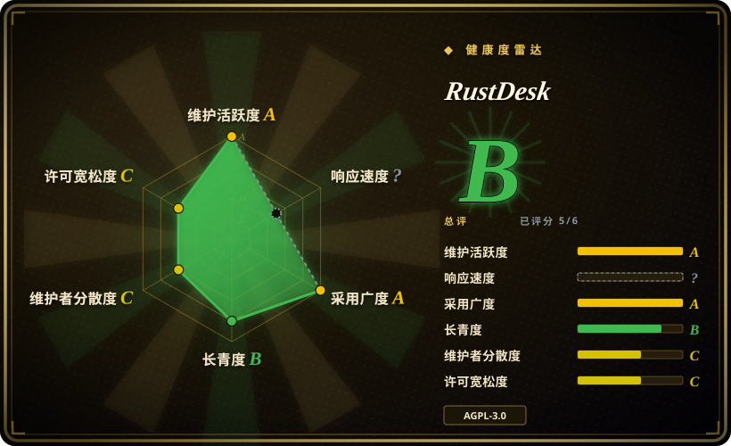

# RustDesk

一款开源远程桌面应用，专为自托管设计，作为 TeamViewer 和 AnyDesk 的替代方案——用 Rust 构建，Flutter UI，支持 P2P 连接和自建中继服务器。

## 何时使用

你是开发者或系统管理员，需要远程访问自己的机器——家里服务器、办公室工作站、或家人的 PC——不想付商业远程桌面订阅费，也不想把屏幕数据经过第三方云端。你在两端装上 RustDesk，可选地在一台 VPS 上搭一个小中继服务器，然后端到端加密直连。它支持 Windows、macOS、Linux、Android 和 iOS，支持文件传输、剪贴板同步和多显示器，Flutter UI 在每个平台都有原生感。你拥有基础设施，你掌控密钥，AGPL-3.0 许可意味着代码完全可审计。

## 何时不用

- **你需要企业级支持、SLA 或合规认证。** RustDesk 是社区驱动项目，没有正式支持合同；对于受监管环境或 7×24 关键任务访问，商业工具（TeamViewer、AnyDesk 企业版）提供有保障的响应时间和合规文档。
- **你想要完全云端托管、零配置的解决方案。** RustDesk 的优势是自托管；公共中继服务存在，但不是主要卖点。如果你想装完就忘、不用管服务器，商业 SaaS 远程桌面产品更简单。
- **AGPL-3.0 与你们的用例不兼容。** 许可为 AGPL-3.0，可能限制你在专有场景下的集成、分发或修改。嵌入或白标前请与法务确认许可影响。
- **你需要高级会话录制、审计日志或细粒度 RBAC。** RustDesk 提供基础访问控制和密码保护；要完整会话录制、详细审计轨迹和基于角色的访问控制，企业远程访问平台更强。
- **你需要 Linux 上无缝的 Wayland 支持。** RustDesk 的 Linux 支持历史上在 X11 上更强；Wayland 支持正在演进，但可能有局限或需要特定合成器兼容。[推断]
- **你需要高性能远程游戏或视频剪辑。** 虽然 RustDesk 效率不错，但它并未针对低延迟游戏或高帧率视频剪辑远程化优化；专用流式解决方案（Moonlight、Parsec）更适合这个细分场景。

## 横向对比

| 替代品 | 是否收录 | 我们的评价 | 取舍 |
|---|---|---|---|
| TeamViewer | 未收录 | 当前页用于它的主场景；如果更看重「商业、云端托管的远程桌面，带企业支持和跨平台可靠性」，再选 TeamViewer。 | 商业云端托管远程桌面，带企业支持、会话录制和合规；需付费订阅，数据经过其云端。 |
| AnyDesk | 未收录 | 当前页用于它的主场景；如果更看重「轻量、快速的专有远程桌面，个人版免费」，再选 AnyDesk。 | 轻量专有远程桌面，个人版免费；快速简单，但闭源且依赖云端。 |
| Chrome Remote Desktop | 未收录 | 当前页用于它的主场景；如果更看重「免费、基于浏览器的远程桌面，绑定 Google 账户」，再选 Chrome Remote Desktop。 | 免费、基于浏览器的远程桌面，绑定 Google 账户；极简单，但需 Google 生态，无自托管。 |
| TightVNC / TigerVNC | 未收录 | 当前页用于它的主场景；如果更看重「传统 VNC 服务器，用于局域网访问，默认无加密」，再选 TightVNC。 | 传统 VNC，用于局域网访问；简单且协议标准，但缺乏现代加密、NAT 穿透和移动端客户端，需额外配置。 |
| Sunshine + Moonlight | 未收录 | 当前页用于它的主场景；如果更看重「低延迟游戏串流或高帧率远程桌面」，再选 Sunshine + Moonlight。 | 开源游戏串流主机（Sunshine）和客户端（Moonlight），针对低延迟高 FPS 优化；用例比通用远程桌面更窄。 |

## 技术栈

- **语言：** Rust（核心引擎与网络层），Flutter/Dart 跨平台 UI 层覆盖桌面端和移动端。
- **网络：** P2P 加 NAT 穿透（打洞），直连失败时回退到中继服务器；通过 TLS 1.3 加密。[未验证]
- **UI：** Flutter 单代码库覆盖 Windows、macOS、Linux、Android 和 iOS，平台原生渲染。
- **媒体：** 自定义视频编解码管线，用于屏幕捕获和远程显示；支持多显示器和分辨率。
- **构建：** Rust 编译为原生二进制；Flutter 打包 UI 资源。支持 Flatpak 等分发格式。

## 依赖

- **客户端硬件：** 带屏幕和网络连接的设备，运行 Windows、macOS、Linux、Android 或 iOS。客户端为本地安装的原生二进制。
- **服务器/中继（可选）：** 纯 P2P 不需要服务器。要回退中继或常驻访问，需要一台小型 VPS 或服务器运行 `rustdesk-server` 中继和 ID/注册服务。最低配置约 1 CPU、512 MB 内存、 modest 带宽。[未验证]
- **网络：** 两端需要互联网访问（或局域网用于直接 P2P）。中继服务器需要公网 IP 和开放端口（TCP/UDP）。防火墙和 NAT 必须允许连接路径。
- **无外部数据库：** 中继服务器不需要数据库；它是一个轻量级有状态守护进程。

## 运维难度

**低**（直接 P2P 个人使用）：两端装客户端，交换 ID 和密码，连接。**中**（自建中继）：需要在 VPS 上部署 `rustdesk-server` 二进制（或 Docker 容器），开放所需端口，若想用品牌中继还要配置 DNS/SSL。主要运维关注点是：
- **安全：** 必须管理中继服务器访问、持续打补丁、轮换密钥/密码。默认配置使用简单密码保护；生产环境请考虑额外加固（fail2ban、VPN 覆盖、基于密钥的认证）。
- **NAT/防火墙穿透：** 某些企业网络会阻断 P2P 流量，迫使所有连接走中继——此时中继成为带宽瓶颈。
- **更新：** 客户端和中继必须保持版本兼容；版本不匹配可能导致连接失败。

## 健康度与可持续性

- **维护（2026-07）。** 最后 push 于 2026-07-01，提交历史非常活跃；项目未归档，频繁发布和安全更新。[推断]
- **治理 / bus factor。** 仓库由单一用户（`rustdesk`）持有，该用户是主要维护者；存在**中等 bus factor 风险**。但项目有庞大的贡献者基础（约 17.8k fork）和活跃社区，若原维护者退出，fork 可能继续。[推断]
- **年龄与 Lindy 判断。** 约 5.5 年（2020-09 创建）且仍非常活跃 ⇒ 对远程桌面工具而言是**中强 Lindy** 信号；它已证明持续力，自托管和隐私社区中越来越受欢迎。[推断]
- **采用度与生态。** 约 117.4k star，在自托管和隐私社区中被广泛用作 TeamViewer 替代。跨平台 Flutter UI 和 P2P 架构是显著优势。[未验证]
- **风险标记。** AGPL-3.0 许可是商业使用和集成的决定性过滤条件。未发现 relicense 历史，但单人维护者持有、缺乏正式基金会意味着治理可能变动。README 中带有关于滥用（未经授权访问）的警示。[推断]

## 存疑（未验证）

- [未验证] 截至 2026-07-01 约 117.4k GitHub star；star 数为近似值且对时间敏感。
- [未验证] 中继服务器资源需求和确切端口号系据典型自托管指南推断；生产部署请核实当前 `rustdesk-server` 文档。
- [未验证] TLS 1.3 和加密细节系据项目描述概括；安全审查前请确认当前加密协议和密钥管理。
- [未验证] Wayland 支持状态及特定合成器兼容性仍在演进；部署前请在目标 Linux 发行版上测试。
- [推断] 会话录制、审计日志和 RBAC 不是核心功能；如果合规要求这些，需要用额外工具补充 RustDesk。
- [推断] P2P 打洞成功率因网络拓扑（对称 NAT、企业防火墙）而异；在受限环境中请计划好中继回退。
