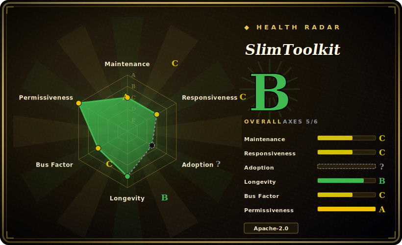

# SlimToolkit

A CLI that inspects a container image, runs it to observe what it actually uses, then produces a minified, hardened image — often many times smaller — without changing your Dockerfile, and can auto-generate Seccomp/AppArmor profiles along the way.

## When to use

You're a platform engineer who inherited a fleet of application images built on `ubuntu:22.04` or a full `python:3.12` base. Each one ships hundreds of megabytes of shell utilities, package managers, and shared libraries the running service never touches — bloating pulls, widening the attack surface, and lighting up your vulnerability scanner with CVEs in packages you don't even call. Rewriting every Dockerfile to a distroless or multi-stage build is the "right" fix, but you have dozens of teams and no appetite to break their builds this quarter. You run `slim build your-image:latest`: SlimToolkit starts the container, exercises it (HTTP probe or your own test commands), watches which files and syscalls are actually used, and emits a `.slim` variant with everything unused stripped — frequently 10–30x smaller — while the entrypoint and behavior stay the same. As a bonus, it can drop a generated Seccomp and AppArmor profile so you can lock the container down without hand-auditing Linux syscalls.

You reach for it when you want the size and attack-surface win *now*, on images you don't own the source of, without forcing every team through a base-image migration first. It's most valuable as a retrofit/optimization pass in front of a registry push, not as the thing that builds the image in the first place.

## When NOT to use

- **Your app loads files dynamically at runtime.** SlimToolkit keeps what it *observed* being used. Anything loaded lazily — a plugin dir hit only under a code path your probe didn't trigger, locale/timezone data, templates, on-demand native libs, `dlopen`'d modules — can be stripped, and the image breaks only in production. The fix-it-at-the-source alternatives (distroless + multi-stage) are more predictable because *you* declare what's in the image.
- **You could just fix the Dockerfile.** If you own the build, a `distroless`/multi-stage base or `--no-install-recommends` discipline solves bloat at the source, deterministically, with no runtime-tracing step to get wrong. Minification-by-observation is a retrofit for images you *can't* easily rebuild.
- **You need to debug the resulting image.** A stripped image has no shell, no package manager, no `ls` — `kubectl exec` / `docker exec` into it is painful. This is the same tradeoff as distroless, but here it's a side effect rather than an explicit choice.
- **You want a vulnerability scanner or SBOM.** SlimToolkit *reduces* attack surface but does not enumerate or report CVEs and does not emit an SBOM — that's Trivy/Grype/Syft's job. Use it alongside a scanner, not instead of one.
- **Your CI can't run privileged containers.** Generating Seccomp profiles runs the target container in privileged mode with `SYS_ADMIN`, and the whole flow needs a real container runtime (Docker daemon) reachable. Locked-down or rootless CI, or build farms without a daemon, make integration nontrivial.
- **Coverage-sensitive correctness.** Because what survives depends on what your probe exercised, the quality of the result is only as good as your test coverage of the container at minify time — under-exercise it and you ship a broken image; this is real per-pipeline integration effort, not a drop-in.

## Comparison

| Alternative | In index | Our verdict | Tradeoff |
|---|---|---|---|
| Distroless (GoogleContainerTools) | 未收录 | Use this page for its stated niche; choose Distroless (GoogleContainerTools) when you need minimal base images you *build on*. | Minimal base images you *build on* — deterministic, no runtime tracing, but you must restructure the Dockerfile (multi-stage) and own the source. SlimToolkit retrofits an already-built image instead. |
| Multi-stage / hand-optimized Dockerfile | 未收录 | Use this page for its stated niche; choose Multi-stage / hand-optimized Dockerfile when you need the source-level fix: smallest, most predictable, fully under your control. | The source-level fix: smallest, most predictable, fully under your control — but requires owning and editing every build. SlimToolkit's pitch is "no Dockerfile change." |
| Trivy / Grype (scanners) | 未收录 | Use this page for its stated niche; choose Trivy / Grype (scanners) when you need find and report CVEs / produce SBOMs. | Find and report CVEs / produce SBOMs; they *measure* attack surface, they don't *shrink* it. Complementary, not a substitute. |
| DockerSlim (predecessor) | 未收录 | Use this page for its stated niche; choose DockerSlim (predecessor) when you need not a separate project. | Not a separate project — DockerSlim was renamed to Slim/SlimToolkit; the same codebase, same `slim build` flow. [推断] |
| Docker `docker build --squash` / layer flattening | 未收录 | Use this page for its stated niche; choose Docker docker build --squash / layer flattening when you need reduces layer count/dup, not the *contents*. | Reduces layer count/dup, not the *contents* — keeps every unused binary. Different mechanism, far smaller win. |

## Tech stack

- **Language:** Go (single CLI binary, `slim`).
- **Mechanism:** dynamic analysis — it starts the target container, observes file access and syscalls during an exercise phase (HTTP probe and/or user-supplied commands), then rebuilds an image containing only the observed-used artifacts.
- **Container runtime integration:** talks to a Docker daemon to pull, run, and rebuild images (uses `go-dockerclient`); supports passing host-config / capabilities to the temporary container.
- **Security profiles:** auto-generates Seccomp and AppArmor profiles from the observed syscall/behavior set.

## Dependencies

- **A container runtime — required.** It needs a reachable Docker daemon (or compatible runtime) to inspect, run, and rebuild images; this is not a pure static analyzer. [推断]
- **Elevated privileges for profile generation.** Seccomp profile generation runs the container in privileged mode and adds the `SYS_ADMIN` capability — per the project's own docs.
- **State volume.** When run inside a container it persists execution state (including generated profiles) to a Docker volume (`slim-state` by default), or you mount your own.
- **Install paths:** prebuilt binaries, a Homebrew formula (`docker-slim`), and container images are published.

## Ops difficulty

**Medium.** As an interactive desktop/CI tool there's no service to run — install the binary and call `slim build <image>`. The real cost is integration and verification: you must give it a representative way to *exercise* the container (probes, test traffic, or `--include-*` allowlists for paths it can't observe) or it strips too much, and then you must validate the minified image actually still works end-to-end before trusting it. Wiring it into CI means giving the runner a Docker daemon and (for Seccomp) privileged execution, plus a regression gate that catches a too-aggressive minification before it reaches production. Low to operate, real effort to integrate safely.

## Health & viability

- **Maintenance (2026-06).** Repo is **not archived** and the default branch shows commits into 2026-03, but those recent commits are largely CI/dependency bumps (dependabot) plus a "tmp disable github actions" commit — and the **last tagged release is v1.40.11 from 2024-02**, a ~2.4-year release gap. Reads as **maintained-but-coasting**: alive, not abandoned, but not shipping feature releases at cadence. [推断]
- **Governance / bus factor.** **CNCF Sandbox** project (confirmed in README) with a `MAINTAINERS.md` listing two maintainers — but creator **Kyle Quest (@kcq)** has ~816 commits, the next human contributor is far behind, and `GOVERNANCE.md` literally says "TBD". So Sandbox status gives ecosystem visibility, **not** a deep, foundation-run governance bench — bus factor is concentrated on one person. [推断]
- **Backing & longevity.** Backed by **Root.io (formerly Slim.AI)** per the README; a commercial vendor's interest is a longevity plus but also ties momentum to that company's priorities. [推断]
- **Age & Lindy.** Created **2015-09** (as DockerSlim) ⇒ ~11 years old and still touched in 2026 — a **strong-ish Lindy** signal: a long-lived, widely-known tool in its niche, tempered by the stalled release cadence above. Use age × still-active together — it passes, but barely on the "active feature work" axis. [推断]
- **Risk flags.** Apache-2.0, no relicense history found. Main flags: single-maintainer concentration, the 2024→2026 release gap, and "GOVERNANCE: TBD" despite CNCF Sandbox status. [推断]

## Caveats (unverified)

- [未验证] ~23.3k GitHub stars and 208 open issues as of 2026-06 — star/issue counts are date-sensitive and unreliable as a health proxy; treat as indicative only.
- [未验证] "10–30x smaller" / "up to 30x" is the project's own README framing; actual reduction is wildly image-dependent (README's own examples range from ~1.8x on already-distroless bases to ~284x on a fat `ubuntu:14.04`). Don't promise a fixed ratio.
- [推断] "Maintained but coasting" is inferred from commit content (mostly dependabot/CI) plus the 2024-02 last release; not a statement that feature development has formally stopped.
- [推断] The exact runtime requirement (Docker daemon specifically vs any OCI runtime) and minimum versions are inferred from README/usage, not pinned here — verify against current docs for your runtime.
- [推断] CNCF "Sandbox" (not Incubating/Graduated) tier and the two-name maintainer list were read from README/MAINTAINERS.md on 2026-06-28; CNCF tiering can change — re-verify on the CNCF landscape if it's load-bearing.
