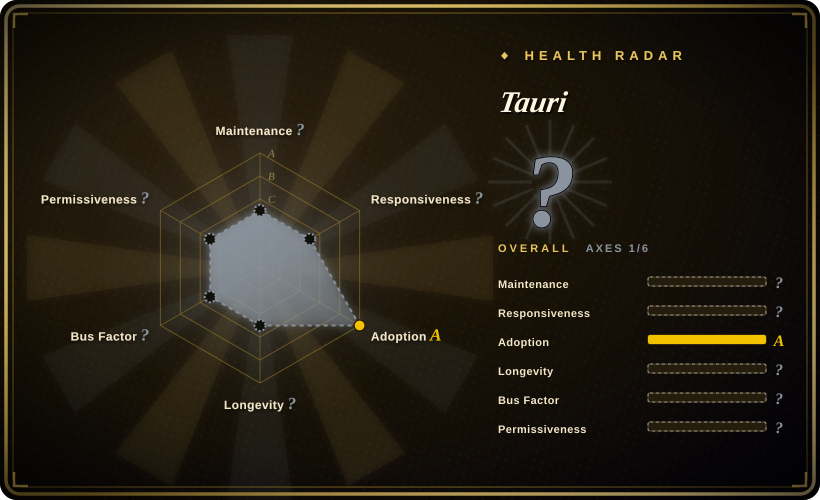

# Tauri

Build smaller, faster, and more secure desktop and mobile applications with a web frontend. A Rust-powered alternative to Electron that uses the OS native webview instead of bundling Chromium.

## When to use

You're a web developer who needs to ship a cross-platform desktop or mobile app but wants to avoid Electron's massive bundle size and memory footprint. Your team already knows HTML, CSS, and JavaScript/TypeScript, and you don't want to learn a new UI framework like Qt or Flutter. You use Tauri to wrap your web frontend in a tiny Rust binary that communicates with the OS via a secure API bridge, producing installers for Windows, macOS, Linux, Android, and iOS from a single codebase. Your users get native-feeling apps with minimal disk and RAM usage, and you get built-in auto-updaters, system tray support, and native notifications.

## When NOT to use

- **Pure native UI requirements** — If you need deeply native widgets (e.g., complex macOS-specific toolbars or Windows UWP integrations), Tauri's webview-based UI will feel like a web app, not a native one.
- **Heavy webview dependencies** — Tauri relies on the OS native webview (WebView2 on Windows, WKWebView on macOS/iOS, WebKitGTK on Linux). Edge cases or webview bugs on older OS versions can be hard to debug.
- **No Rust toolchain willingness** — The backend and build system require Rust; if your team refuses to install or maintain Rust tooling, Tauri is blocked.
- **Complex server-side needs** — Tauri is a client-side framework; it does not replace a backend server. If your app needs heavy server logic, you still need a separate backend.
- **Electron ecosystem lock-in** — If you depend on Electron-specific native modules or deep V8/Chromium APIs, migration to Tauri is non-trivial.

## Comparison

| Alternative | In index | Our verdict | Tradeoff |
| --- | --- | --- | --- |
| Electron | 未收录 | The incumbent desktop web framework. | Electron bundles Chromium, resulting in large binaries and high memory use; Tauri uses the OS webview and is far lighter. |
| Flutter | 未收录 | Google's cross-platform UI framework with native rendering. | Flutter requires learning Dart and its widget system; Tauri reuses web skills but is less native-feeling on desktop. |
| [Clash Verge Rev](clash-verge-rev.md) | ✅ | A Tauri-based GUI proxy client. | Demonstrates production Tauri usage but is a specific app, not a framework choice. |
| Neutralinojs | 未收录 | Lightweight alternative to Electron with smaller footprint. | Smaller than Electron but less mature ecosystem and fewer platform features than Tauri. |
| WPF / Cocoa / GTK | 未收录 | Platform-native UI toolkits. | True native widgets and performance, but each platform requires separate codebases and expertise. |

## Tech stack

- **Rust** — core framework, binary bundling, and OS API bridge
- **JavaScript / TypeScript** — frontend UI (use any web framework: React, Vue, Svelte, vanilla)
- **WebView** — OS-native webview engine (WKWebView, WebView2, WebKitGTK, Android System WebView)
- **WRY** — Tauri's unified Rust webview layer
- **TAO** — Cross-platform window handling library

## Dependencies

- Rust toolchain (rustc, cargo) for building
- A supported OS webview runtime (usually pre-installed on modern OS versions)
- Node.js / npm (for frontend build tooling, though not for the runtime)
- For mobile: Android SDK / Xcode for building Android/iOS apps

## Ops difficulty

**Low**. Tauri is a build-time framework; the resulting app is a self-contained binary that end users install via standard package installers. Developers need to maintain the Rust toolchain and handle platform-specific build steps for mobile targets. The built-in updater and CI GitHub Action streamline distribution. No ongoing server infrastructure is required for the app itself.

## Health & viability

- **Maintenance**: Very active — pushed daily as of 2026-07, with v2 stable and active community support (1,442 open issues). [推断]
- **Governance**: Owned by the `tauri-apps` organization with a dedicated core team and open governance model. Bus factor is reasonable.
- **Backing**: Backed by the Tauri Collective and Open Collective funding; has corporate sponsors and a non-profit foundation structure. [未验证]
- **Adoption**: Strong adoption with 108.5k stars and many production apps (e.g., [Clash Verge Rev](clash-verge-rev.md)). Created in 2019, giving it a 7-year track record with steady growth.
- **Risk flags**: No major relicense history. Dual-licensed MIT/Apache-2.0 is permissive. The v1→v2 migration required code changes, so future major versions may also introduce breaking changes. [推断]

## Caveats (unverified)

- [未验证] The exact governance model and foundation details beyond the Open Collective page have not been verified.
- [推断] Mobile support (iOS/Android) is newer in Tauri v2 and may have more edge cases than the mature desktop targets.
- [未验证] Specific production app download counts and enterprise adoption data are not verified.
