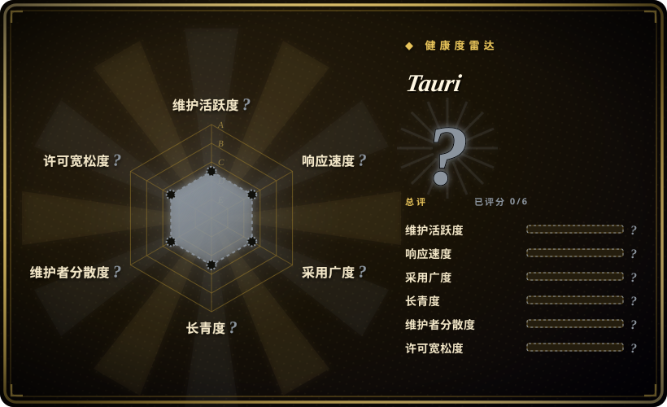

# Tauri

用 Web 前端构建更小、更快、更安全的桌面与移动应用。Rust 驱动的 Electron 替代方案，使用操作系统原生 Webview 而非捆绑 Chromium。

## 何时使用

你正在选择跨平台桌面或移动框架，而包体积、内存占用和开发技能复用是决定性因素。你选 Tauri 而不是 Electron，因为不想给每个用户都塞一份 Chromium，且你的用户在意安装包大小和内存占用。你选 Tauri 而不是 Flutter，因为你的团队已经熟悉 HTML、CSS 和 JavaScript/TypeScript，不想投入时间学习 Dart 和新的 widget 系统。你用 Tauri 把 Web 前端包进一个极小的 Rust 二进制，通过安全 API 桥与操作系统通信，从单一代码库生成 Windows、macOS、Linux、Android 和 iOS 的安装包。你获得内置自动更新、系统托盘和原生通知，而用户则获得轻量、原生体验的应用。

## 何时不用

- 如果你需要深度原生控件（例如复杂的 macOS 专用工具栏或 Windows UWP 集成），请使用 AppKit 或 WPF 而不是 Tauri，因为 Tauri 基于 Webview 的 UI 会像 Web 应用而非原生应用。
- 如果你无法容忍不同平台间操作系统 Webview 的不一致（Windows 上的 WebView2、macOS/iOS 上的 WKWebView、Linux 上的 WebKitGTK），请使用 Electron 而不是 Tauri，因为 Electron 捆绑了受控的 Chromium 版本，在各平台行为一致。
- 如果你的团队拒绝安装或维护 Rust 工具链，请使用 Electron 而不是 Tauri，因为后端和构建系统需要 Rust。
- 如果你的应用需要与客户端共置的复杂服务端逻辑，请使用后端框架（如 FastAPI 或 Express）配合客户端，而不是 Tauri，因为 Tauri 是客户端框架，不是服务器。
- 如果你依赖 Electron 特定的原生模块或深层 V8/Chromium API，请使用 Electron 而不是 Tauri，因为迁移到 Tauri 的 Webview 模型并非易事。

## 横向对比

| 替代品 | 是否收录 | 我们的评价 | 取舍 |
| --- | --- | --- | --- |
| Electron | 未收录 | 桌面 Web 框架的现任者。 | Electron 捆绑 Chromium，导致二进制体积大、内存占用高；Tauri 使用系统 Webview，轻量得多。 |
| Flutter | 未收录 | Google 的跨平台 UI 框架，原生渲染。 | Flutter 需要学习 Dart 及其 widget 系统；Tauri 复用 Web 技能，但桌面端原生感较弱。 |
| [Clash Verge Rev](clash-verge-rev.zh.md) | ✅ | 基于 Tauri 的 GUI 代理客户端。 | 展示了 Tauri 的生产级应用，但它是特定应用，不是框架选择本身。 |
| Neutralinojs | 未收录 | Electron 的轻量替代，体积更小。 | 比 Electron 小，但生态不如 Tauri 成熟，平台功能也更少。 |
| WPF / Cocoa / GTK | 未收录 | 平台原生 UI 工具包。 | 真正的原生控件和性能，但每个平台需要独立的代码库和专业知识。 |

## 技术栈

- **Rust**——核心框架、二进制打包和操作系统 API 桥
- **JavaScript / TypeScript**——前端 UI（可使用任何 Web 框架：React、Vue、Svelte、原生 JS）
- **WebView**——操作系统原生 Webview 引擎（WKWebView、WebView2、WebKitGTK、Android System WebView）
- **WRY**——Tauri 统一的 Rust Webview 层
- **TAO**——跨平台窗口处理库

## 依赖

- Rust 工具链（rustc、cargo）用于构建
- 受支持的操作系统 Webview 运行时（现代操作系统通常已预装）
- Node.js / npm（用于前端构建工具链，非运行时所需）
- 移动端开发：Android SDK / Xcode 用于构建 Android/iOS 应用

## 运维难度

**低**。Tauri 是构建时框架；最终产物是终端用户通过标准安装包安装的自包含二进制。开发者需要维护 Rust 工具链并处理移动端的平台特定构建步骤。内置更新器和 CI GitHub Action 简化了分发。应用本身不需要持续的服务器基础设施。

## 健康度与可持续性

- **响应速度**：Grade A——中位首次响应时间 2.1 小时，基于 28 个 qualifying issues。
- **维护**：非常活跃——截至 2026-07 每日推送，v2 已稳定，社区支持活跃（1,442 个开放 issue）。[推断]
- **治理**：由 `tauri-apps` 组织所有，拥有专门的核心团队和开放治理模式。bus factor 合理。
- **背书**：由 Tauri Collective 和 Open Collective 资助；有企业赞助方和非营利基金会结构。[未验证]
- **采用**：采用度强劲，108.5k star，众多生产级应用（如 [Clash Verge Rev](clash-verge-rev.zh.md)）。2019 年创建，已有 7 年记录并稳步增长。
- **风险旗标**：无重大 relicense 历史。MIT/Apache-2.0 双许可非常宽松。v1→v2 迁移需要代码改动，因此未来主版本可能也会引入破坏性变更。[推断]

## 存疑（未验证）

- [未验证] 除 Open Collective 页面外的具体治理模式和基金会详情尚未核实。
- [推断] Tauri v2 中的移动端支持（iOS/Android）较新，边缘情况可能比成熟的桌面端更多。
- [未验证] 具体生产级应用的下载量和企业采用数据尚未核实。
