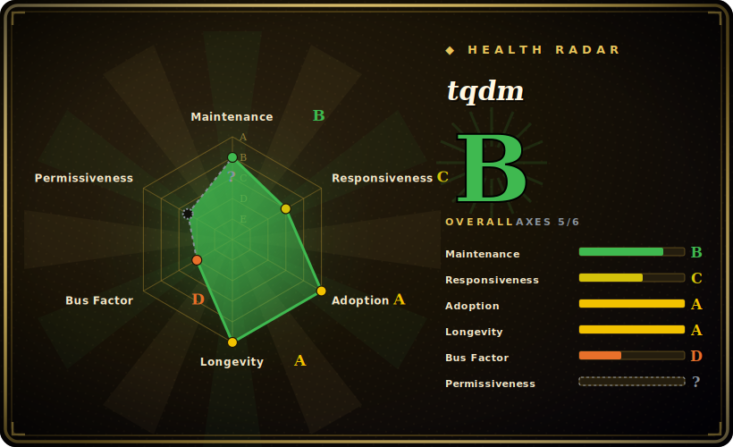

# tqdm

A fast, low-overhead progress-bar library for Python — wrap any iterable (`for x in tqdm(iterable):`) and get a live, self-updating meter with ETA, rate, and percentage in loops, CLI pipes, and notebooks, with near-zero dependencies.

## When to use

You're a data engineer running an overnight batch — a loop over a few million records that calls an external API, cleans each row, and writes it out. The script works, but when you kick it off you have no idea whether it'll finish in ten minutes or six hours, and `print(i)` every thousand iterations floods your terminal with noise. You wrap the loop's iterable in `tqdm(...)` — one import, one function call, no refactor — and now you have a single line that updates in place: `47%|████▋ | 1.4M/3.0M [02:11<02:29, 10.8kit/s]`, with a live ETA and throughput. You can see at a glance whether it's stuck, slowing down, or on track, and the bar costs essentially nothing per iteration (the docs claim ~60ns overhead).

You also reach for it when you want the same progress feedback everywhere without rewriting code: it auto-detects Jupyter/IPython (`tqdm.notebook`), works as a Unix pipe meter (`cat bigfile | tqdm | wc -l`), integrates with pandas (`df.progress_apply(...)` via `tqdm.pandas()`), and has thin wrappers for async, `concurrent.futures`, and logging. Because it's pure-Python with no required third-party dependencies, dropping it into any project — a Lambda, a constrained container, a notebook — is a one-line `pip install` with no dependency tree to vet.

## When NOT to use

- **Ultra-tight, hot inner loops.** The per-iteration cost is tiny but not zero; in a loop doing nanosecond-scale work over billions of iterations, even ~60ns each adds up. Update less often (`miniters`/`mininterval`) or wrap an outer loop instead of the innermost one.
- **You need structured logging or telemetry, not a human-facing bar.** tqdm is a TTY/notebook UX widget; it is not a metrics pipeline. For machine-readable progress, durations, or dashboards, emit structured logs/metrics (and route them to something like [Telegraf](telegraf.md)) — don't scrape a progress bar.
- **You want a rich, multi-panel terminal UI.** tqdm is intentionally minimal. For spinners, multiple concurrent animated bars, tables, and styled output, `rich.progress` and `alive-progress` give fancier UIs — at the cost of a heavier dependency.
- **Concurrent / async progress that must be exact.** Multiprocessing, async, and multi-bar setups work but are fiddly: position management, lock sharing across processes, and refresh ordering are common foot-guns. Single-loop progress is trivial; many-worker aggregate progress takes care.
- **Non-interactive logs (CI, files, journald).** Carriage-return redraws turn into thousands of junk lines in a log file. You can configure it (`file=`, `disable=not sys.stderr.isatty()`), but plain percentage logging is often simpler there.

## Comparison

| Alternative | In index | Our verdict | Tradeoff |
|---|---|---|---|
| rich.progress | 未收录 | Use this page for its stated niche; choose rich.progress when you need part of the `rich` library. | Part of the `rich` library — far fancier (colors, columns, multiple bars, spinners, tables) and great for polished CLIs; heavier dependency and more API surface than tqdm's one-call wrap. |
| alive-progress | 未收录 | Use this page for its stated niche; choose alive-progress when you need animated, visually richer single-bar UX with live spinners. | Animated, visually richer single-bar UX with live spinners; smaller ecosystem and integration set than tqdm (no pandas/notebook/pipe story of the same breadth). |
| progressbar2 | 未收录 | Use this page for its stated niche; choose progressbar2 when you need older, configurable progress-bar library. | Older, configurable progress-bar library; widget-based API is more verbose than `tqdm(iterable)`, smaller modern adoption. |
| plain logging / `print` | 未收录 | Use this page for its stated niche; choose plain logging / print when you need zero dependency and trivially machine-parseable. | Zero dependency and trivially machine-parseable; no ETA/rate/in-place redraw, and noisy for interactive use — the right call for files/CI, the wrong one for a human watching a TTY. |
| [Telegraf](telegraf.md) | ✅ | Use this page for its stated niche; choose Telegraf when you need a metrics collection/routing agent, not a progress bar. | A metrics collection/routing agent, not a progress bar — different job; use it when you need real telemetry rather than a human-facing meter. |

## Tech stack

- **Language:** Pure Python (no compiled extensions), supporting a wide range of Python versions.
- **Output backends:** TTY/ANSI carriage-return redraw on the terminal; a separate `tqdm.notebook` (ipywidgets-based) renderer for Jupyter/IPython; a CLI entry point (`python -m tqdm`) for use as a Unix pipe meter.
- **Integrations:** pandas (`tqdm.pandas()` → `progress_apply`), `concurrent.futures` (`tqdm.contrib.concurrent`), asyncio (`tqdm.asyncio`), `logging` redirection, and `tqdm.contrib` helpers (`tenumerate`, `tzip`, `tmap`).

## Dependencies

- **Runtime:** none required — pure-Python standard-library only for the core bar; `pip install tqdm` pulls no mandatory third-party packages.
- **Optional:** `ipywidgets` for the notebook renderer; `slack-sdk`/`requests`/`discord.py` for the optional `tqdm.contrib.telegram`/`slack`/`discord` notifiers; `pandas` if you use the pandas integration. [未验证]
- **Install paths:** PyPI (`pip`), conda-forge, and it ships in many distro repos; vendored copies are common because it's so small.

## Ops difficulty

**Very low.** There is nothing to deploy or operate — it's a library you import. The only real friction is interactive-output behavior: getting bars to render cleanly under nested loops, multiprocessing, or non-TTY environments (CI, redirected files, certain notebook configs) sometimes takes tuning (`position`, `leave`, `file`, `disable`, `dynamic_ncols`). For 95% of uses it's `from tqdm import tqdm; for x in tqdm(it):` and done.

## Health & viability

- **Maintenance (2026-06).** Repo pushed 2026-06 with a recent release (v4.68.3, 2026-06-17) — **active**, not abandoned. The release cadence is mature/slow (the API has long been stable), which is appropriate for a library this widely depended-on. [推断]
- **Governance / bus factor.** Owned by the `tqdm` **organization** (not a personal account) with a broad contributor base over its lifetime; historically associated with a primary maintainer (Casper da Costa-Luis), so concentration of core knowledge is a mild bus-factor consideration, partly offset by org ownership and many contributors. [推断]
- **Age & Lindy verdict.** Created 2015-06, ~11 years old and **still actively shipping** ⇒ a **strong Lindy** signal — a stable, ubiquitous primitive, not a hyped newcomer; the wrap-an-iterable API has been backward-compatible for years. [推断]
- **Adoption & ecosystem.** Extremely widely adopted — ~31.2k stars and an enormous dependent footprint (it's a transitive dependency of a large share of the Python data/ML ecosystem); docs are thorough and the integration surface (pandas/notebook/CLI/async) is broad. [未验证]
- **License / risk flags.** Mixed MIT + MPL-2.0: MIT (original and other contributions) plus MPL-2.0 (maintainer's contributions) — GitHub reports NOASSERTION because of the mixed file-level licensing. MPL-2.0 carries file-level copyleft obligations — normal dependency use is low-risk, but modifying/redistributing MPL-covered files has obligations. No relicense history or open-core gating found. [推断]

## Caveats (unverified)

- [未验证] ~31.2k GitHub stars and "60ns overhead" are the project's own / point-in-time framings — star counts are date-sensitive and the overhead figure is benchmark-dependent; treat both as indicative only.
- [未验证] Latest release v4.68.3 dated 2026-06-17 per GitHub; exact patch version and date shift release-to-release.
- [未验证] The exact set of supported Python versions changes over releases — check the current `setup.cfg`/`pyproject` classifiers rather than assuming.
- [推断] License is the mixed MPL-2.0 + MIT model described in the repo's LICENCE file; this is summarized as `MPL-2.0 AND MIT` and reported as NOASSERTION by GitHub — confirm against the file if license terms are load-bearing for you.
- [推断] Optional-dependency list (ipywidgets, notifier SDKs, pandas) is inferred from documented features; the precise extras and pins are set by the current packaging metadata.
- [推断] "Strong Lindy" and "active" are judgments from age × recent push/release, not a guarantee of future maintenance.
