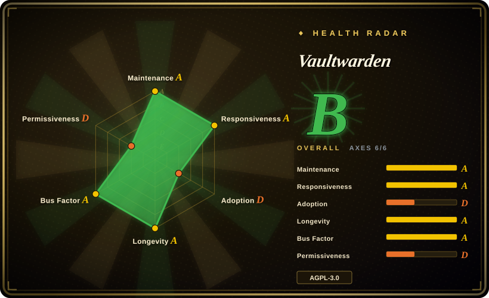

# Vaultwarden

An unofficial Bitwarden-compatible server written in Rust, designed for self-hosted deployment where the official resource-heavy service might not be ideal.

## When to use

You're a privacy-conscious individual or small team who needs a password manager but doesn't want to trust your credentials to a cloud service you don't control. You pick Vaultwarden over the official Bitwarden cloud because you need to run the backend on your own hardware, behind your own firewall, with full control over the data — and the official server's Microsoft SQL Server and .NET stack are too heavy for your homelab or small VPS. You pick it over KeePassXC because you want the convenience of official Bitwarden clients (desktop, mobile, browser extensions) with native sync, a web vault, and mobile apps — not a local-only database file. You pick it over Passbolt because you need a full-featured personal and family password manager, not just a team-focused sharing tool. You install Vaultwarden via Docker or build the Rust binary, point your Bitwarden clients at it, and get nearly the full feature set — personal vaults, organizations, collections, Send, attachments, 2FA (TOTP, FIDO2, YubiKey), and admin password reset — without the heavy infrastructure.

## When NOT to use

- If you need official Bitwarden support, SLA, or compliance certifications, use the official Bitwarden cloud or self-hosted Enterprise plan instead of Vaultwarden, because Vaultwarden is an unofficial, community implementation with no vendor support contract, guaranteed security audit, or enterprise compliance roadmap.
- If you need enterprise features like SSO (SAML 2.0 / OIDC), SCIM, or Event Logging at scale, use the official Bitwarden enterprise plan instead of Vaultwarden, because Vaultwarden implements many organization features but enterprise SSO and advanced directory integration are gaps compared to the official offering.
- If you are not comfortable self-hosting and securing a server, use the official Bitwarden cloud service or 1Password instead of Vaultwarden, because Vaultwarden places the operational burden on you: TLS termination, backups, updates, and securing the host.
- If you need a FIPS-validated or formally audited password vault, use the official Bitwarden or 1Password instead of Vaultwarden, because Vaultwarden is open-source community software with no formal certification, and the security model depends on your own hardening.
- If you want to avoid AGPL-3.0 copyleft, use the official Bitwarden cloud service or KeePassXC instead of Vaultwarden, because the AGPL-3.0 license may raise concerns for some commercial deployments depending on your legal interpretation.

## Comparison

| Alternative | In index | Our verdict | Tradeoff |
|---|---|---|---|
| Official Bitwarden | 未收录 | Use Vaultwarden for lightweight, unofficial self-hosted password management with Bitwarden client compatibility; choose the official Bitwarden for upstream support, SSO, compliance, and a larger team. | Official support, SSO, compliance, and a larger team — but the self-hosted version is heavier (MSSQL, .NET) and the free tier is cloud-only. |
| KeePassXC | 未收录 | Use Vaultwarden for self-hosted server-based password management with official Bitwarden clients; choose KeePassXC when you want an offline, local-first password database with no server at all. | No server to run, but no native sync, no web vault, and no official mobile clients — a different architecture entirely. |
| Passbolt | 未收录 | Use Vaultwarden for full-featured personal and team password management with Bitwarden client compatibility; choose Passbolt when you need an open-source team password manager focused on collaboration and access control. | Purpose-built for team sharing with built-in access controls; less mature client ecosystem than Bitwarden. |
| 1Password / LastPass | 未收录 | Use Vaultwarden for self-hosted, open-source password management with full data control; choose 1Password or LastPass when you want a proprietary cloud password manager with polished UX and enterprise support. | Closed-source, subscription-based, and cloud-dependent; convenience vs. control tradeoff. |

## Tech stack

- **Rust** — primary implementation language, using the Rocket web framework.
- **Database** — SQLite (default), PostgreSQL, or MySQL via Diesel ORM.
- **Web server** — built-in HTTP server via Rocket; typically fronted by a reverse proxy (Nginx, Traefik, Caddy) for TLS.
- **Container images** — official Docker images published to Docker Hub and GitHub Container Registry.

## Dependencies

- **Runtime:** a server (VPS, homelab, or container host) with Docker or a Rust build environment.
- **Reverse proxy:** strongly recommended for TLS termination (Let's Encrypt or own certs).
- **SMTP server:** optional, needed for email-based 2FA, admin password reset, and invitation emails.
- **Backup solution:** you must arrange your own database and attachment backups; Vaultwarden does not include automated backup.
- **Storage:** disk space for the SQLite/PostgreSQL database and file attachments.

## Ops difficulty

**Low to medium.** Running the official Docker image is a single `docker run` or `docker compose` command. The medium difficulty comes from doing it *safely*: configuring TLS, setting up automated backups, keeping the image updated, and hardening the host. There is no built-in high-availability mode, clustering, or automated failover — it's a single-process Rust application. For a personal or small-team deployment, the burden is modest; for a large organization, you'll need to layer your own orchestration.

## Health & viability

- **Responsiveness**: Cannot be scored — no_traffic.
- **Maintenance — actively maintained, single-core-maintainer model.** Pushed 2026-06-05; not archived. The project has a steady release cadence and a large contributor base, but the core maintainer (`dani-garcia`) is the decisive factor. [推断]
- **Governance — user-owned, high bus-factor risk.** Owned by a single GitHub user (`dani-garcia`), not an organization. While there are many contributors, the roadmap and merge decisions rest with one person. This is the classic high-bus-factor open-source model — common, but a risk if the maintainer steps away. [推断]
- **Age & Lindy — ~8 years old, still active.** Created 2018-02, actively maintained since. Eight years of continuous maintenance is a solid Lindy signal for a security tool, provided it stays active. [推断]
- **Adoption & ecosystem — large unofficial install base.** ~63k stars, ~3k forks, widely discussed in self-hosting communities. The unofficial status means adoption is driven by the self-hosting community rather than enterprise sales. [未验证]
- **Risk flags — AGPL-3.0 and unofficial status.** The AGPL-3.0 license is a conscious copyleft choice. The "unofficial" status means it tracks Bitwarden's client API but could fall behind if Bitwarden changes the protocol. No relicense history. [推断]

## Caveats (unverified)

- [未验证] Repo facts as of 2026-07-01 via GitHub API: created 2018-02-17, last push 2026-06-05, not archived, ~63.2k stars, ~3.0k forks, AGPL-3.0, language reported as Rust, owner type User.
- [未验证] The "nearly complete implementation of the Bitwarden Client API" claim and the specific feature list (personal vault, Send, attachments, organizations, 2FA methods, etc.) are from the README; exact parity with the official server is not independently verified.
- [未验证] The Docker image pull counts and ghcr.io stats are from README badges; they may be outdated or approximate.
- [推断] The bus-factor assessment (single maintainer) is based on GitHub contributor graphs and merge history, not a formal governance audit.
- [未验证] Enterprise feature gaps (SSO, SCIM, advanced Event Logging) are inferred from the README feature list and common knowledge of Bitwarden's enterprise tier; verify against your own requirements.
- [推断] Security of the Rust implementation is a community trust assumption; no formal security audit or certification is claimed by the project.
