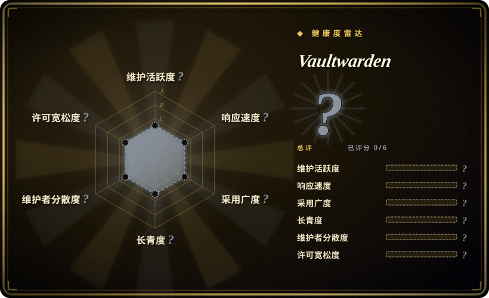

# Vaultwarden

一款用 Rust 编写的非官方 Bitwarden 兼容服务器，专为自托管场景设计——在官方资源占用较重的服务端不太理想时，它是更轻量的替代方案。

## 何时使用

你是一位注重隐私的个人或小型团队，需要密码管理器却不想把凭据交给不可控的云端服务。你选 Vaultwarden 而不选官方 Bitwarden 云端，是因为你需要把后端跑在自己的硬件上、自己的防火墙后，完全掌控数据——而且官方服务端所需的 Microsoft SQL Server 和 .NET 栈对你的家庭服务器或小型 VPS 来说太重。你选它而不选 KeePassXC，是因为你想要使用官方 Bitwarden 客户端（桌面端、移动端、浏览器扩展）的便利，包括原生同步、Web 保险库和移动应用——而非仅一个本地数据库文件。你选它而不选 Passbolt，是因为你需要功能完整的个人和家庭密码管理器，而非仅一个聚焦团队共享的工具。你通过 Docker 或编译 Rust 二进制安装 Vaultwarden，把 Bitwarden 客户端指向它，就能获得几乎完整的功能集——个人保险库、组织、集合、Send、附件、2FA（TOTP、FIDO2、YubiKey）以及管理员密码重置——而无需重型基础设施。

## 何时不用

- 如果你需要官方 Bitwarden 支持、SLA 或合规认证，请用官方 Bitwarden 云端或自托管企业版，而不用 Vaultwarden，因为 Vaultwarden 是非官方社区实现，没有厂商支持合同、保障安全审计或企业合规路线图。
- 如果你需要企业级功能如 SSO（SAML 2.0 / OIDC）、SCIM 或大规模事件日志，请用官方 Bitwarden 企业版，而不用 Vaultwarden，因为 Vaultwarden 虽然实现了许多组织功能，但企业 SSO 和高级目录集成相比官方产品仍有缺口。
- 如果你不愿自托管和保护服务器，请用官方 Bitwarden 云服务或 1Password，而不用 Vaultwarden，因为 Vaultwarden 把运维责任放在你身上：TLS 终止、备份、更新和主机加固。
- 如果你需要 FIPS 验证或正式审计的密码保险库，请用官方 Bitwarden 或 1Password，而不用 Vaultwarden，因为 Vaultwarden 是开源社区软件，没有正式认证，其安全模型取决于你自己的加固。
- 如果你想避开 AGPL-3.0 的 copyleft，请用官方 Bitwarden 云服务或 KeePassXC，而不用 Vaultwarden，因为 AGPL-3.0 对某些商业部署可能带来顾虑，具体取决于你的法律解读。

## 横向对比

| 替代品 | 是否收录 | 我们的评价 | 取舍 |
|---|---|---|---|
| 官方 Bitwarden | 未收录 | 需要轻量、非官方自托管密码管理器且兼容 Bitwarden 客户端时选 Vaultwarden；需要上游支持、SSO、合规和更大团队时，再选官方 Bitwarden。 | 官方支持、SSO、合规、更大团队——但自托管版更重（MSSQL、.NET），且免费层仅限云端。 |
| KeePassXC | 未收录 | 需要自托管、基于服务器的密码管理器且兼容官方 Bitwarden 客户端时选 Vaultwarden；需要完全离线、本地优先的密码数据库且无需任何服务器时，再选 KeePassXC。 | 无需服务器，但没有原生同步、没有 Web 保险库、没有官方移动客户端——架构完全不同。 |
| Passbolt | 未收录 | 需要功能完整的个人和团队密码管理器且兼容 Bitwarden 客户端时选 Vaultwarden；需要开源团队密码管理器且聚焦协作与访问控制时，再选 Passbolt。 | 专为团队共享设计，内置访问控制；客户端生态不如 Bitwarden 成熟。 |
| 1Password / LastPass | 未收录 | 需要自托管、开源密码管理器且完全掌控数据时选 Vaultwarden；需要专有云端密码管理器且体验 polished 和企业支持时，再选 1Password 或 LastPass。 | 闭源、订阅制、依赖云端；便利与可控之间的权衡。 |

## 技术栈

- **Rust** —— 主要实现语言，使用 Rocket Web 框架。
- **数据库** —— SQLite（默认）、PostgreSQL 或 MySQL，通过 Diesel ORM。
- **Web 服务器** —— 由 Rocket 内置 HTTP 服务器；通常前置反向代理（Nginx、Traefik、Caddy）处理 TLS。
- **容器镜像** —— 官方 Docker 镜像发布于 Docker Hub 和 GitHub Container Registry。

## 依赖

- **运行时：** 一台服务器（VPS、家庭服务器或容器主机），安装 Docker 或 Rust 构建环境。
- **反向代理：** 强烈建议用于 TLS 终止（Let's Encrypt 或自有证书）。
- **SMTP 服务器：** 可选，用于邮件 2FA、管理员密码重置和邀请邮件。
- **备份方案：** 你必须自行安排数据库和附件备份；Vaultwarden 不包含自动备份。
- **存储：** 磁盘空间用于 SQLite/PostgreSQL 数据库和文件附件。

## 运维难度

**低到中等。** 运行官方 Docker 镜像只需一条 docker run 或 docker compose 命令。中等难度来自*安全地*运行它：配置 TLS、设置自动备份、保持镜像更新并加固主机。没有内置高可用模式、集群或自动故障转移——它是一个单进程 Rust 应用。对个人或小型团队部署而言负担适中；对大型组织则需要自己叠加编排层。

## 健康度与可持续性

- **响应速度**：Grade A——中位首次响应时间 0.9 小时，基于 42 个 qualifying issues。
- **维护——活跃维护，单核心维护者模式。** 最后推送 2026-06-05；未归档。项目有稳定的发布节奏和庞大的贡献者基础，但核心维护者（dani-garcia）是决定性因素。[推断]
- **治理——用户所有，bus factor 风险较高。** 由单个 GitHub 用户（dani-garcia）所有，而非组织。虽然贡献者众多，但路线图和合并决策集中在一个人身上。这是典型的高 bus factor 开源模式——常见，但维护者若离开即构成风险。[推断]
- **年龄与 Lindy——约 8 年，仍活跃。** 2018-02 创建，持续维护至今。对安全工具而言，8 年的持续维护是扎实的 Lindy 信号——前提是它保持活跃。[推断]
- **采用与生态——庞大的非官方安装基数。** 约 63k star、约 3k fork，在自托管社区广泛讨论。非官方身份意味着采用由自托管社区驱动，而非企业销售。[未验证]
- **风险信号——AGPL-3.0 与非官方身份。** AGPL-3.0 是有意识的 copyleft 选择。非官方身份意味着它跟踪 Bitwarden 的客户端 API，但若 Bitwarden 修改协议可能落后。无重许可历史。[推断]

## 存疑（未验证）

- [未验证] 仓库事实，截至 2026-07-01 经 GitHub API：2018-02-17 创建、最后推送 2026-06-05、未归档、约 63.2k star、约 3.0k fork、AGPL-3.0、语言报告为 Rust、owner 类型为 User。
- [未验证] 「几乎完整实现 Bitwarden 客户端 API」的声明及具体功能列表（个人保险库、Send、附件、组织、2FA 方式等）来自 README；与官方服务端的实际功能对等性未经独立验证。
- [未验证] Docker 镜像拉取数和 ghcr.io 统计来自 README 徽章；可能已过时或仅为近似值。
- [推断] bus factor 评估（单人维护）基于 GitHub 贡献者图表和合并历史，而非正式治理审计。
- [未验证] 企业功能缺口（SSO、SCIM、高级事件日志）是从 README 功能列表和 Bitwarden 企业版的常识推断；请对照自身需求验证。
- [推断] Rust 实现的安全性是社区信任假设；项目未声称进行正式安全审计或认证。
