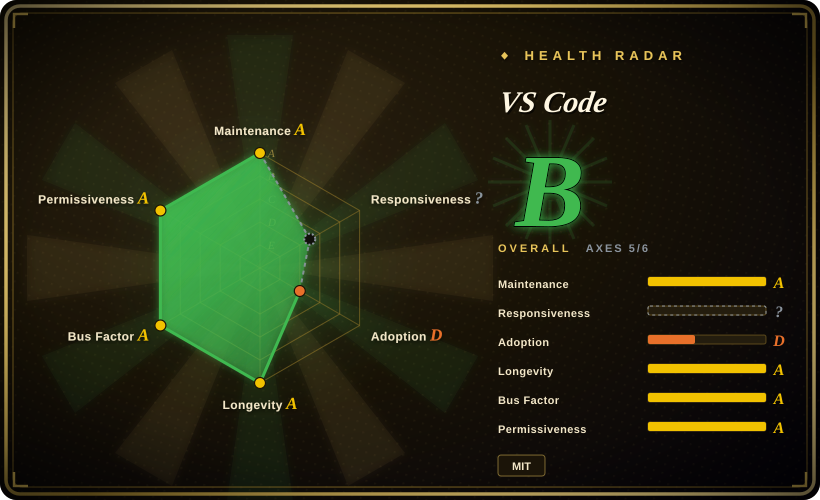

# VS Code

Visual Studio Code — a lightweight but powerful code editor combining the simplicity of an editor with the capabilities of an IDE, built on Electron and extensible through a rich marketplace with tens of thousands of extensions.

## When to use

You're a developer who needs a fast, cross-platform code editor that supports dozens of languages out of the box, with intelligent code completion, debugging, and Git integration. You want an editor that can grow with your needs — from a simple text editor for markdown and config files to a full IDE for TypeScript, Python, or Rust with extensions. You need something that works on macOS, Windows, and Linux with the same shortcuts and settings synced across machines. Choose VS Code over Zed because VS Code has the largest extension marketplace and deepest ecosystem; choose it over IntelliJ IDEA because VS Code is lighter, language-agnostic, and free for all features. The deciding tradeoff is unmatched ecosystem breadth plus cross-platform consistency without the weight of a full IDE.

## When NOT to use

- If you want a fully open-source, unbranded build without telemetry, use VSCodium or the "Code - OSS" build instead of VS Code, because the Microsoft-distributed VS Code includes proprietary telemetry and a proprietary extensions marketplace.
- If you need a terminal-only editor, use Neovim or Vim instead of VS Code, because VS Code is a GUI application and cannot run in a terminal.
- If you need the absolute fastest editor with minimal memory footprint, use Zed or Sublime Text instead of VS Code, because Electron-based apps have higher memory usage and slower startup than native editors.
- If you need a deeply integrated JetBrains-style IDE for heavy JVM or Android work, use IntelliJ IDEA instead of VS Code, because IntelliJ offers deeper language-specific tooling, refactoring, and build system integration than VS Code extensions can provide.
- If you want a fully MIT-licensed distribution with no proprietary extensions, use VSCodium instead of VS Code, because the Microsoft product license applies to the distributed VS Code binary and some popular extensions are proprietary.

## Comparison

| Alternative | In index | Our verdict | Tradeoff |
| --- | --- | --- | --- |
| Zed | 未收录 | High-performance native code editor with multiplayer. | Zed is faster and Rust-native but has a smaller ecosystem; VS Code has the largest extension marketplace. |
| Sublime Text | 未收录 | Fast, lightweight proprietary editor. | Sublime is faster and lighter but proprietary and paid; VS Code is free and open-source. |
| Neovim | 未收录 | Modal terminal editor with modern Lua configuration. | Neovim is terminal-only and has a steep learning curve; VS Code is GUI-first and beginner-friendly. |
| IntelliJ IDEA | 未收录 | Deep language-specific IDE for JVM and Android. | IntelliJ is heavier and JVM-focused; VS Code is lighter and language-agnostic. |
| VSCodium | 未收录 | Fully open-source build of VS Code without Microsoft telemetry. | VSCodium removes telemetry but lacks the Microsoft extensions marketplace and some proprietary features. |

## Tech stack

- **TypeScript** — primary language for the editor core and extensions
- **Electron** — desktop shell and cross-platform runtime
- **Monaco Editor** — the underlying editor component (also used in Azure DevOps and GitHub)
- **Node.js** — extension host runtime

## Dependencies

- A modern desktop OS (macOS, Windows, Linux)
- Sufficient RAM (8GB minimum, 16GB recommended for large projects)
- A graphics stack that supports Electron (most modern desktops)

## Ops difficulty

**None for end users**. VS Code is a consumer desktop application — install and update are handled by the built-in updater or your OS package manager. For organizations, the main concern is managing extensions, settings sync, and telemetry policies.

## Health & viability

- **Responsiveness**: Cannot be scored — no_traffic.
- **Maintenance**: Extremely active — Microsoft pushes monthly iteration plans, publishes roadmaps, and ships updates regularly. 187k stars, 18,939 open issues.
- **Governance**: Owned by Microsoft, one of the world's largest tech companies. The roadmap is public and the project is well-funded.
- **Backing**: Microsoft is a committed vendor with a strong track record of long-term investment in developer tools.
- **Adoption**: One of the most widely adopted code editors in the world. The extension ecosystem is massive.
- **Longevity**: Created in 2015, so ~11 years old with continuous active development. Strong Lindy signal.
- **Risk flags**: Microsoft controls the proprietary distribution and the extensions marketplace. The telemetry in the distributed build is a privacy concern for some users. There have been no relicense concerns, but the open-core model (free editor + paid services) is present.

## Caveats (unverified)

- [未验证] The Microsoft product license attached to the distributed VS Code binary may contain terms beyond the MIT license of the source repository.
- [未验证] Some popular extensions in the marketplace are proprietary or have their own licensing terms.
- [推断] As Microsoft integrates more AI features (Copilot), future VS Code releases may increasingly push toward paid Microsoft services.
