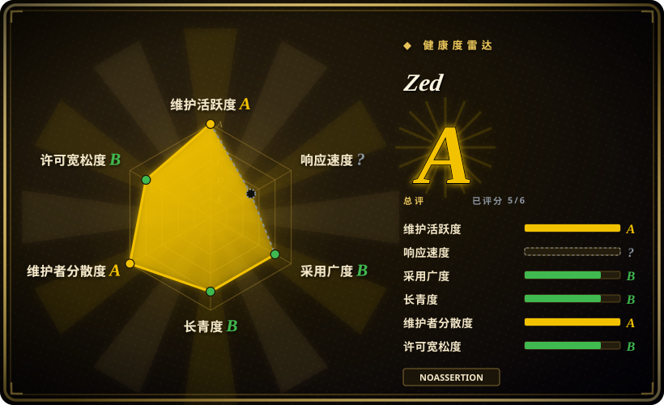

# Zed

由 Atom 和 Tree-sitter 的创作者用 Rust 构建的高性能多人协作代码编辑器，提供原生速度体验与实时协作。

## 何时使用

你正在选择代码编辑器，而原生性能、现代 UX 和团队协作是决定性因素。你选 Zed 而不是 VS Code，因为想要一个原生、GPU 加速的编辑器，能够瞬间启动、在大代码库上保持响应，而不用承受 Electron 的内存膨胀。你选 Zed 而不是 Neovim，因为想要以 GUI 优先的体验，并内置实时协作编辑——看到队友的光标和实时修改——而非通过插件拼凑。你在 macOS、Linux 或 Windows 上工作，想要一致的原生体验，同时具备现代语言服务器支持和 AI 助手集成。

## 何时不用

- 如果你需要拥有 5 万余个扩展的最大扩展市场，请使用 VS Code 而不是 Zed，因为 Zed 的扩展生态还很年轻，远小于 VS Code，许多小众语言支持和工具尚缺。
- 如果你依赖 VS Code 特有的扩展、设置或快捷键，请使用 VS Code 而不是 Zed，因为 Zed 不是直接替代品，你的 `.vscode/settings.json` 和工作流无法直接迁移。
- 如果你需要纯终端编辑器用于远程 SSH 或最小化环境，请使用 Neovim 或 Vim 而不是 Zed，因为 Zed 是 GUI 应用。
- 如果你需要完全开源、无品牌烙印且许可证清晰的标准构建，请使用 VS Code — OSS 或 Neovim 而不是 Zed，因为 Zed 的 GitHub 许可标记为 NOASSERTION，尽管 README 声明 GPL-3.0-or-later，长期许可策略尚不完全清晰。
- 如果你在老旧或低配置机器上工作，GPU 已过时，请使用 VS Code 或 Sublime Text 而不是 Zed，因为 Zed 的 GPU 加速 GPUI 框架需要现代图形栈，老旧集成显卡可能吃力。
- 如果你需要开箱即用的深度 IDE 功能，如内置调试、分析和项目管理，请使用 JetBrains IntelliJ IDEA 而不是 Zed，因为 Zed 是编辑器，不是完整 IDE。

## 横向对比

| 替代品 | 是否收录 | 我们的评价 | 取舍 |
| --- | --- | --- | --- |
| VS Code | ✅ | 最流行的代码编辑器，拥有最大的扩展生态。 | VS Code 的扩展与微软背书无可匹敌，但基于 Electron 且较慢；Zed 原生更快，但更年轻、扩展更少。 |
| Sublime Text | 未收录 | 快速、轻量的专有编辑器，历史悠久。 | Sublime 更快更成熟，但专有且收费；Zed 开源免费，并内置多人协作。 |
| Neovim | 未收录 | 带现代 Lua 插件生态的模态终端编辑器。 | Neovim 仅限终端，高度可定制；Zed 以 GUI 优先，内置协作。 |
| IntelliJ IDEA | 未收录 | 面向 JVM 与 Android 的深度语言专用 IDE。 | IntelliJ 更重、语言更聚焦；Zed 更轻、语言无关，但缺少深度 IDE 功能。 |

## 技术栈

- **Rust**——编辑器核心与 GPUI 框架的主要语言
- **GPUI**——Zed 自研的 GPU 加速 UI 框架（非 Electron）
- **Tree-sitter**——增量解析，用于语法高亮与代码智能（Zed 的创作者也是 Tree-sitter 的创作者）
- **Language Server Protocol (LSP)**——跨语言 IDE 功能支持

## 依赖

- 现代桌面操作系统（macOS、Linux、Windows）
- 支持 GPUI 的 GPU 与图形栈（绝大多数现代桌面）
- 充足内存（最低推荐 8GB）

## 运维难度

**终端用户无运维负担**。Zed 是消费级桌面应用，支持自动更新。对组织而言，主要关注点是管理团队设置、协作权限与扩展治理。

## 健康度与可持续性
- **维护活跃度**：Grade A——最近 13 周中 13 周有提交；最后提交距今 0 天。
- **响应速度**：Grade C——中位首次响应时间 1080.0 小时，基于 0 个 qualifying issues/PRs。
- **采用广度**：Grade B——crates.io 上月下载量 812,610（包名：zed_extension_api）。
- **长青度**：Grade A——仓库已创建 1959 天。
- **治理集中度**：Grade A——前三贡献者占比 18.9%（?）。
- **许可风险**：无法计算——unknown。
## 存疑（未验证）

- [未验证] GPUI 在老旧集成显卡上的确切 GPU 要求尚未在所有平台上测试。
- [未验证] 多人协作功能的网络需求与安全模型尚未经独立审计。
- [推断] 随着产品成熟，Zed Industries 可能会为企业协作引入商业许可或功能层级。
