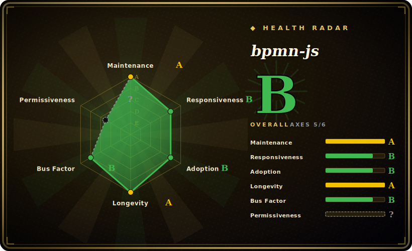

# bpmn-js

A BPMN 2.0 rendering and modeling toolkit for the browser — import BPMN XML, display it as an interactive diagram, and edit it, built by the bpmn.io team at Camunda.

## When to use

You're building a workflow or process-automation product and your users — business analysts, not developers — need to design and review BPMN process diagrams inside your web app. You don't want to ship them a desktop tool or reinvent a diagram editor; you want the official, standards-correct BPMN canvas embedded in your UI. You `npm install bpmn-js`, mount a `BpmnModeler` (or the lighter `BpmnViewer` for read-only display) onto a `
`, feed it BPMN 2.0 XML, and the user gets palette-driven drag-and-drop modeling — tasks, gateways, events, pools — with the diagram serialized back to standard BPMN XML you can persist or hand to a process engine (Camunda or any BPMN-compliant engine). Because it reads and writes canonical BPMN XML via `bpmn-moddle`, the diagrams interoperate with the wider BPMN tooling ecosystem rather than locking you into a proprietary format.

You reach for the **viewer** build when you only need to render existing diagrams (dashboards, audit views, docs), and the **modeler** build when users author or edit them. It's the de-facto open BPMN canvas for the web.

## When NOT to use

- **You don't actually need the BPMN standard.** If you just want generic boxes-and-arrows or a quick text-to-diagram render, bpmn-js is heavy and BPMN-specific — Mermaid or flowchart.js are far lighter for non-standardized flowcharts.
- **You need a process *engine*, not a canvas.** bpmn-js renders and edits diagrams; it does not execute processes. Execution requires a separate BPMN engine (Camunda 7/8, Zeebe, Flowable, etc.).
- **The watermark clause is a problem.** The license requires the bpmn.io watermark/attribution link in rendered diagrams to stay visible and unaltered — this is **not plain MIT**; removing it violates the license. Verify the terms before white-labeling. [推断]
- **You want DMN, forms, or other notations.** bpmn-js is BPMN only; DMN needs `dmn-js`, forms need `form-js` — sibling projects, separate installs.
- **You need it outside a browser DOM.** It is browser/DOM-oriented (built on `diagram-js`); headless/server-side rendering is not its target.

## Comparison

| Alternative | In index | Tradeoff |
|---|---|---|
| [flowchart.js](flowchart-js.md) | ✅ | Tiny text-DSL-to-SVG flowchart renderer; great for simple non-standard flowcharts, but no BPMN semantics, no interactive editing, far smaller scope. |
| [Mermaid](mermaid.md) | 未收录 | Broad text-to-diagram tool (incl. a basic BPMN-ish flow), Markdown-native; not a true BPMN 2.0 modeler and not interactive editing. |
| dmn-js / form-js (bpmn.io) | 未收录 | Sibling libraries for DMN decision tables and forms; same team and architecture, but different notations — complementary, not substitutes. |
| jBPM / Flowable web modelers | 未收录 | Engine-bundled BPMN modelers tied to a specific Java process engine; integrated execution but heavier and less embeddable as a standalone JS canvas. |
| GoJS / mxGraph (draw.io) | 未收录 | General commercial/open diagramming canvases you'd build BPMN on top of yourself; more generic, but you implement BPMN correctness, which bpmn-js gives for free. |

## Tech stack

- **Language:** JavaScript (browser, ES modules; distributed via npm and prebuilt bundles).
- **Core architecture:** built on **diagram-js** (the generic diagram rendering/editing engine, same team) and **bpmn-moddle** (reads/writes BPMN 2.0 XML in the browser).
- **Rendering:** SVG (via `tiny-svg`); utilities `min-dash` / `min-dom`, direct-editing and `ids` helpers — a small, in-house dependency set, no large external framework.
- **Builds:** separate **Viewer** (render-only) and **Modeler** (editable) distributions.

## Dependencies

- **Runtime:** a browser/DOM. Pure client-side library — no backend, datastore, or service required to render/edit.
- **npm deps:** `diagram-js`, `bpmn-moddle`, `diagram-js-direct-editing`, `ids`, `inherits-browser`, `min-dash`, `min-dom`, `tiny-svg` — all maintained by the same org.
- **For execution (not bundled):** a BPMN process engine if you want to actually *run* the modeled processes — that's separate infrastructure you provide.

## Ops difficulty

**Low (as a library).** It's a front-end dependency: install, mount, feed XML. Nothing to deploy or operate server-side; persistence of the BPMN XML is your app's concern. The real complexity is *integration* — wiring custom palette entries, property panels (`bpmn-js-properties-panel`), and validating/round-tripping XML against your target engine's BPMN dialect — plus respecting the watermark/attribution license term in production builds. There is no datastore, clustering, or runtime to maintain for bpmn-js itself.

## Health & viability

- **Maintenance (2026-06).** Last pushed 2026-06; latest tag v18.19.0 on a steady, frequent release cadence (~81 releases). Clearly **active**, not coasting; not archived. [推断]
- **Governance / backing.** Maintained by the **bpmn.io team at Camunda** (an established workflow-automation vendor) — a multi-maintainer org-backed project (nikku, philippfromme, barmac, marstamm…), so bus factor is healthy. Direction follows Camunda's commercial interests, the main governance caveat. [推断]
- **Age & Lindy verdict.** Created 2014-03, ~12 years old and **still actively shipping** — a **strong Lindy** signal; the canonical, long-proven open BPMN web canvas, not a newcomer. [推断]
- **Adoption.** The de-facto standard for embedding BPMN in web apps (~9.6k stars, ~1.5k forks); large ecosystem of plugins (properties panel, lint, color-picker) and sibling notations (dmn-js, form-js). Strong, well-documented. [未验证]
- **Risk flags.** The **custom license** (MIT-like with a mandatory, non-removable bpmn.io watermark/attribution in rendered output) is the headline flag — GitHub reports it as `NOASSERTION`; read `LICENSE` and confirm before white-labeling. Vendor-steered roadmap (Camunda) is secondary. [推断]

## Caveats (unverified)

- [未验证] ~9.6k stars / ~1.5k forks and v18.19.0 as of 2026-06; counts are date-sensitive — indicative only.
- [推断] The license is MIT-derived text with an added clause requiring the bpmn.io watermark/attribution link in rendered diagrams to stay visible and unchanged; GitHub classifies it `NOASSERTION`. I read the `LICENSE` file (Camunda Services GmbH, 2014-present) — but you should confirm the exact obligations for your use, especially white-labeling.
- [推断] "Active / multi-maintainer / healthy bus factor" is inferred from commit recency, release cadence, and the contributor list, not a published governance doc.
- [未验证] The npm dependency list is read from the repo's `package.json` at one point in time and shifts across releases — verify against the version you install.
- [未验证] Camunda backing and the broader bpmn.io ecosystem (dmn-js, form-js, properties-panel) are stated from public project knowledge, not independently audited here.
