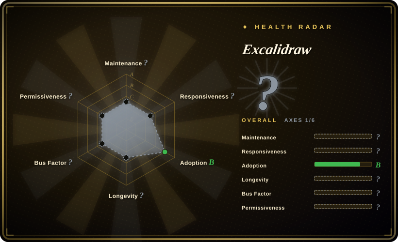

# Excalidraw

A virtual whiteboard for sketching hand-drawn style diagrams — collaborative, end-to-end encrypted, and embeddable as a React component or used standalone on excalidraw.com.

## When to use

You're a product manager or designer who needs to quickly whiteboard an architecture sketch, a user flow, or a wireframe in a meeting and share it with the team. You want the result to look informal and approachable — like a napkin sketch rather than a polished CAD drawing — so stakeholders focus on the idea, not the pixel perfection. You open excalidraw.com, draw rectangles and arrows on an infinite canvas, drop in images, and share the link; the collaboration is end-to-end encrypted and the `.excalidraw` JSON format is open. You also reach for it when you're a React developer building a docs site or an app that needs an embedded whiteboard: the `@excalidraw/excalidraw` npm package gives you a drop-in component with dark mode, shape libraries, i18n, and PNG/SVG/clipboard export.

## When NOT to use

- **You need diagrams as version-controlled plain text.** Excalidraw stores drawings as JSON (or binary PNG/SVG); it is not a text-to-diagram syntax like Mermaid or PlantUML. If diffs and Git history matter, use a diagrams-as-code tool instead.
- **You need pixel-precise or auto-layout diagrams.** The hand-drawn aesthetic is the point; it does not enforce BPMN compliance, UML strictness, or automatic graph layout. For formal modeling, use bpmn-js or PlantUML.
- **You need to generate diagrams programmatically from code.** There is no declarative text syntax to render; producing diagrams from CI pipelines or LLM output requires scripting the JSON format or using a different tool.
- **You need a full design/prototyping tool.** Excalidraw is a whiteboard, not Figma — no component variants, constraints, responsive preview, or design handoff. Use a dedicated design tool for high-fidelity mockups.
- **You must work completely offline without any build step.** The web app requires a browser; while the React component works offline after bundling, the zero-friction path is the hosted app. [推断]
- **You need real-time collaboration at enterprise scale.** The free tier runs on excalidraw.com; heavy team usage may need Excalidraw+ (paid) or self-hosted infrastructure not provided out of the box. [未验证]

## Comparison

| Alternative | In index | Our verdict | Tradeoff |
| --- | --- | --- | --- |
| [Mermaid](mermaid.md) | ✅ | Use this page for its stated niche; choose Mermaid when you need diagrams as plain text, diffable in Git, rendered in Markdown. | Plain-text, diffable diagrams rendered in Markdown and docs; trades visual style for version-control portability. |
| [flowchart.js](flowchart-js.md) | ✅ | Use this page for its stated niche; choose flowchart.js when you need a narrow, lightweight flowchart renderer in the browser. | Narrow JS flowchart renderer only; Mermaid covers more types and has broader host support. |
| draw.io (diagrams.net) | 未收录 | Use this page for its stated niche; choose draw.io when you need a full WYSIWYG canvas with rich shapes and integrations. | Full-featured WYSIWYG canvas editor with Google Drive / OneDrive / GitHub integrations; heavier and more formal than Excalidraw's sketch style. |
| tldraw | 未收录 | Use this page for its stated niche; choose tldraw when you want a newer, more extensible whiteboard library with a stronger dev-focused API. | Newer whiteboard library with strong programmatic API; smaller ecosystem but more flexible for custom apps. |
| Figma | 未收录 | Use this page for its stated niche; choose Figma when you need high-fidelity UI design, prototyping, and design-system management. | Industry-standard design tool for UI/UX; not a sketch whiteboard, requires a paid team plan for full features. |

## Tech stack

- **Language:** TypeScript, compiled to JavaScript; distributed as an npm package (`@excalidraw/excalidraw`) and a CDN-ready bundle.
- **Frontend:** React component built on the HTML5 Canvas API (and an interactive SVG layer for export); uses `rough.js` for the hand-drawn, sketch-like rendering style.
- **Collaboration:** End-to-end encrypted real-time collaboration via WebSockets on the hosted instance; self-hosted or embedded usage omits this.
- **Export:** PNG, SVG, clipboard copy, and `.excalidraw` JSON open format; dark mode and shape libraries are built-in.
- **Styling:** Customizable theme colors and element styles; the "sketchy" look is a core design choice, not an after-effect.

## Dependencies

- **Runtime:** A modern web browser with Canvas support. For embedded use, a React 18+ application.
- **Library deps:** Install via `npm i @excalidraw/excalidraw` or load from CDN; the package bundles its own rendering logic and does not require a separate backend to draw.
- **Collaboration backend:** The hosted app uses a server for WebSocket relay and end-to-end encryption; self-hosted collaboration requires setting up your own signaling server.
- **No database:** The whiteboard state is client-side JSON; persistence is via export, local storage, or your own backend.

## Ops difficulty

**Low** for the common case: use the free hosted app at excalidraw.com, export your drawings, and move on. **Medium** when embedding the React component: you pin the npm package, handle version upgrades (the component API can shift), and bundle it into your build pipeline. **Medium–High** if you want self-hosted real-time collaboration: you must operate a WebSocket relay server, manage encryption keys, and handle NAT/firewall traversal. As a client-side library, the main maintenance burden is staying current with React/TypeScript compatibility and occasional breaking API changes in the npm package. [推断]

## Health & viability

- **Maintenance (2026-07).** Last pushed 2026-07-01 with active commit history; the project is not archived and receives regular updates and community PRs. [推断]
- **Governance / bus factor.** Owned by the `excalidraw` GitHub organization (multi-maintainer), with a core team that has guided it since 2020. The presence of a paid commercial tier (Excalidraw+) suggests sustained backing. [推断]
- **Age & Lindy verdict.** ~5.5 years old (created 2020-01) and still very active ⇒ a **moderate-to-strong Lindy** signal for a front-end tool; it has become the de-facto standard for sketch-style whiteboarding in the open-source world. [推断]
- **Adoption & ecosystem.** Very large adoption (~126.5k stars) and used as an embeddable component in many docs sites, issue trackers, and products. The npm package is widely consumed. [未验证]
- **Risk flags.** MIT license with no known relicense history; the open-core concern is mild — the free editor is fully functional, and Excalidraw+ adds team/collaboration conveniences rather than gating core features. [推断]

## Caveats (unverified)

- [未验证] ~126.5k GitHub stars as of 2026-07-01; star counts are approximate and time-sensitive.
- [未验证] The exact npm package API version and React compatibility requirements shift release-to-release; verify the current `@excalidraw/excalidraw` docs before embedding.
- [未验证] End-to-end encryption details for the hosted collaboration are summarized from the project README; confirm the current encryption model and key handling for sensitive use cases.
- [未验证] Self-hosted collaboration server requirements are inferred from the repo architecture; the official docs should be consulted for production deployment guidance.
- [未验证] Styling customization and theme color details are summarized from the project description; confirm the current theming API for your version.
- [推断] The "sketchy" rendering style is core to the product and cannot be disabled for a clean vector look; if you need crisp line art, evaluate other tools.
- [推断] Large canvas performance with thousands of elements may degrade in browser memory; test with your expected diagram complexity before committing.
