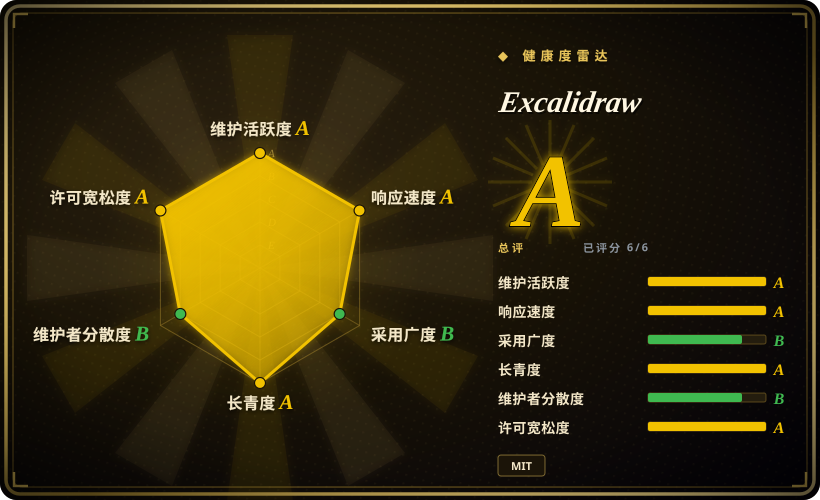

# Excalidraw

一个手绘风格的虚拟白板——支持协作、端到端加密，可作为 React 组件嵌入，也可直接在 excalidraw.com 上使用。

## 何时使用

你是产品经理或设计师，需要在会议中快速白板画出架构草图、用户流程或线框图，并与团队分享。你希望结果看起来非正式、平易近人——像餐巾纸草图而非精致的 CAD 图纸——这样干系人关注想法本身，而非像素级完美。你打开 excalidraw.com，在无限画布上画矩形和箭头，拖入图片，然后分享链接；协作是端到端加密的，`.excalidraw` JSON 格式也是开放的。当你是 React 开发者、需要在文档站或应用里嵌入白板时，你也会选它：`@excalidraw/excalidraw` npm 包提供了一个即插即用的组件，自带暗黑模式、图形库、国际化以及 PNG／SVG／剪贴板导出。

## 何时不用

- **你需要可进版本库的纯文本图表。** Excalidraw 以 JSON（或二进制 PNG／SVG）存储图；它不是 Mermaid 或 PlantUML 那样的文本转图语法。如果 diff 和 Git 历史很重要，请改用 diagrams-as-code 工具。
- **你需要像素级精确或自动排版的图。** 手绘风格就是它的核心卖点；它不强制 BPMN 合规、UML 严格性或自动图布局。做正式建模请用 bpmn-js 或 PlantUML。
- **你需要从代码程序化生成图。** 它没有声明式文本语法可供渲染；要从 CI 管线或 LLM 输出产图，需要手写 JSON 或换工具。
- **你需要完整的设计／原型工具。** Excalidraw 是白板，不是 Figma——没有组件变体、约束、响应式预览或设计交付。做高保真 mockup 请用专业设计工具。
- **你必须在完全离线、无构建步骤的环境下工作。** Web 应用需要浏览器；虽然 React 组件打包后可离线运行，但零摩擦路径是托管应用。[推断]
- **你需要企业规模的实时协作。** 免费版跑在 excalidraw.com 上；重度团队使用可能需要 Excalidraw+（付费）或自建基础设施，开箱并不提供。[未验证]

## 横向对比

| 替代品 | 是否收录 | 我们的评价 | 取舍 |
|---|---|---|---|
| [Mermaid](mermaid.zh.md) | ✅ | 当前页用于它的主场景；如果更看重「把图表写成纯文本、在 Git 里 diff、在 Markdown 里渲染」，再选 Mermaid。 | 纯文本、可 diff 的图表，在 Markdown 和文档里渲染；以视觉风格换取版本控制的可移植性。 |
| [flowchart.js](flowchart-js.zh.md) | ✅ | 当前页用于它的主场景；如果更看重「浏览器里极简轻量的流程图渲染器」，再选 flowchart.js。 | 只做流程图的窄 JS 渲染器；Mermaid 覆盖更多类型、宿主支持更广。 |
| draw.io（diagrams.net） | 未收录 | 当前页用于它的主场景；如果更看重「完整 WYSIWYG 画布、丰富图形和集成」，再选 draw.io。 | 全功能 WYSIWYG 画布编辑器，支持 Google Drive／OneDrive／GitHub 集成；比 Excalidraw 更重、更正式。 |
| tldraw | 未收录 | 当前页用于它的主场景；如果更看重「更新的、对开发者 API 更友好的可扩展白板库」，再选 tldraw。 | 较新的白板库，程序 API 强大；生态更小，但对自定义应用更灵活。 |
| Figma | 未收录 | 当前页用于它的主场景；如果更看重「高保真 UI 设计、原型和设计系统管理」，再选 Figma。 | UI/UX 行业标准设计工具；不是草图白板，完整功能需付费团队版。 |

## 技术栈

- **语言：** TypeScript，编译为 JavaScript；以 npm 包（`@excalidraw/excalidraw`）和 CDN 可用 bundle 分发。
- **前端：** 基于 HTML5 Canvas API 的 React 组件（交互层和导出用 SVG）；使用 `rough.js` 实现手绘风格的渲染效果。
- **协作：** 托管实例通过 WebSocket 实现端到端加密实时协作；自建或嵌入场景不含此功能。
- **导出：** PNG、SVG、剪贴板复制以及 `.excalidraw` JSON 开放格式；内置暗黑模式与图形库。
- **样式：** 可自定义主题颜色和元素样式；「素描感」是核心设计选择，而非后期效果。

## 依赖

- **运行时：** 支持 Canvas 的现代浏览器。嵌入使用时需要 React 18+ 应用。
- **库依赖：** 通过 `npm i @excalidraw/excalidraw` 或 CDN 引入；包自带渲染逻辑，画图不需要额外后端。
- **协作后端：** 托管应用使用 WebSocket 中继和端到端加密服务器；自建协作需要自行搭建信令服务器。
- **无数据库：** 白板状态在客户端以 JSON 形式存在；持久化靠导出、本地存储或你自己的后端。

## 运维难度

**低**（常见情形）：直接用 excalidraw.com 免费托管应用，导出图，收工。**中**（嵌入 React 组件）：需要钉死 npm 包版本、处理升级（组件 API 可能变动），并在构建管线里打包。**中高**（自建实时协作）：必须运维 WebSocket 中继服务器、管理加密密钥，并处理 NAT/防火墙穿透。作为客户端库，主要维护负担是跟上 React/TypeScript 兼容性，以及 npm 包偶尔带来的破坏性 API 变更。[推断]

## 健康度与可持续性

- **维护（2026-07）。** 最后 push 于 2026-07-01，提交历史活跃；项目未归档，持续接收更新和社区 PR。[推断]
- **治理 / bus factor。** 归属 `excalidraw` GitHub 组织（多维护者），核心团队自 2020 年起一直主导。付费商业版（Excalidraw+）的存在意味着有持续资金支持。[推断]
- **年龄与 Lindy 判断。** 约 5.5 年（2020-01 创建）且仍非常活跃 ⇒ 对前端工具而言是**中强 Lindy** 信号；它已成为开源界手绘风格白板的事实标准。[推断]
- **采用度与生态。** 采用度极高（约 126.5k star），被众多文档站、issue 追踪器和产品作为嵌入组件使用；npm 包被广泛消费。[未验证]
- **风险标记。** MIT 许可，未发现 relicense 历史；open-core 顾虑较轻——免费编辑器功能完整，Excalidraw+ 增加的是团队/协作便利，而非封锁核心功能。[推断]

## 存疑（未验证）

- [未验证] 截至 2026-07-01 约 126.5k GitHub star；star 数为近似值且对时间敏感。
- [未验证] npm 包 API 版本与 React 兼容性要求随版本变动；嵌入前请核实当前 `@excalidraw/excalidraw` 文档。
- [未验证] 托管协作的端到端加密细节系据项目 README 概括；敏感场景请确认当前加密模型与密钥处理方式。
- [未验证] 自建协作服务器需求系据仓库架构推断；生产部署请参考官方文档。
- [推断] 产品核心就是「素描感」风格，无法关闭以换取干净矢量线条；如需 crisp 线条请评估其他工具。
- [推断] 画布元素极多时浏览器内存可能吃紧；请先用预期复杂度测试后再决定。
