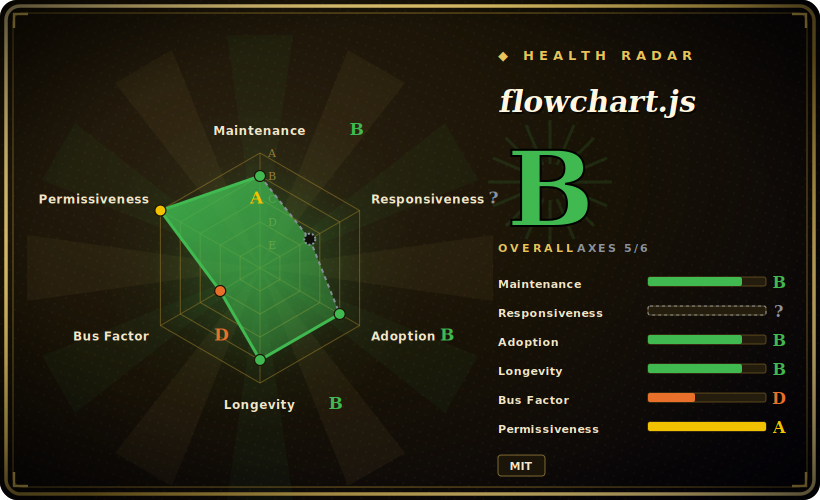

# flowchart.js

A tiny JavaScript library that turns a small textual DSL into an SVG flowchart in the browser — define nodes and connections as text, get a rendered diagram.

## When to use

You're a front-end developer adding a "process" view to an internal docs site or a wiki, and you want users (or yourself) to author flowcharts as plain text that lives next to the prose — diffable in git, editable without a drawing tool. You don't want to embed a heavyweight diagram editor or ship a canvas app; you just need a few decision boxes and arrows rendered cleanly. You drop in flowchart.js (plus Raphael.js), write a short block like `st=>start: Begin` / `op=>operation: Do work` / `cond=>condition: OK?` and the connection lines, call `flowchart.parse(text).drawSVG('diagram')`, and the library lays out and draws the SVG. Because nodes and connections are defined separately, you can reuse nodes and style them via `flowstate` modifiers, and link nodes to external URLs.

It's a good fit when the diagrams are *simple and few* — onboarding flows, a script's control flow, an approval process — and you value text-as-source-of-truth over visual fidelity or interactivity.

## When NOT to use

- **You want interactive editing, not just rendering.** flowchart.js *draws* a diagram from text; it is not a modeler — no drag-to-edit, no live canvas. For that, reach for a full editor library.
- **You need rich, modern diagram types or theming.** It's narrowly a flowchart renderer with a fixed node vocabulary (~9 element types) and Raphael-era styling. For sequence/class/gantt/state diagrams and Markdown-native embedding, Mermaid is the broader, more actively styled choice.
- **You'd rather not depend on Raphael.js.** Rendering requires Raphael, an older SVG library that is itself effectively in maintenance mode — a transitive longevity risk you inherit. [推断]
- **Complex or large diagrams.** Layout is basic; dense graphs, many crossings, or more than three parallel paths per node aren't its strength (3 parallel paths is the documented max).
- **You need DSL flexibility.** The syntax forbids several symbols (`=>`, `->`, `:>`, `|`, `@>`, `:$`) to avoid parser conflicts, which constrains labels and content.

## Comparison

| Alternative | In index | Our verdict | Tradeoff |
|---|---|---|---|
| [Mermaid](mermaid.md) | 未收录 | Use this page for its stated niche; choose Mermaid when you need far broader (flowchart, sequence, class, state, gantt, ER…), Markdown-native, actively developed and. | Far broader (flowchart, sequence, class, state, gantt, ER…), Markdown-native, actively developed and themed; heavier and its own syntax, but the de-facto standard for text-to-diagram today. |
| [bpmn-js](bpmn-js.md) | ✅ | Use this page for its stated niche; choose bpmn-js when you need full BPMN 2. | Full BPMN 2.0 modeling + interactive editing in-browser; a standards-based process modeler, not a lightweight text-to-SVG renderer — much larger scope and footprint. |
| Graphviz / Viz.js | 未收录 | Use this page for its stated niche; choose Graphviz / Viz.js when you need DOT language with strong automatic graph layout for arbitrary node-link graphs. | DOT language with strong automatic graph layout for arbitrary node-link graphs; better layout engine, less flowchart-shaped semantics and styling. |
| PlantUML | 未收录 | Use this page for its stated niche; choose PlantUML when you need text DSL covering many UML + flowchart types, usually server/Java-rendered. | Text DSL covering many UML + flowchart types, usually server/Java-rendered; richer diagram catalog but not a browser-native JS library. |

## Tech stack

- **Language:** JavaScript (browser-first; also usable via the `diagrams` CLI package).
- **Rendering:** Raphael.js — an SVG abstraction library — does the actual drawing; flowchart.js parses the DSL and computes a layout on top of it.
- **DSL:** a line-based text format separating node *definitions* (`id=>type: text`) from *connections* (`a->b`), with optional `flowstate` styling and URL links.
- **Distribution:** npm package and CDNJS builds for direct `<script>` inclusion.

## Dependencies

- **Runtime:** Raphael.js (required) plus a DOM/browser to render into. No backend, no datastore.
- **Build/install:** available via npm or a CDN `<script>` tag; no server-side rendering needed for the browser path.
- **No external services** — everything runs client-side.

## Ops difficulty

**Low.** This is a client-side rendering library: include two scripts (Raphael + flowchart.js), give it a container element and a text string, and it draws. There is nothing to deploy or operate beyond serving the JS. The only real "ops" concerns are pinning compatible versions of flowchart.js and Raphael, and accepting Raphael's own maintenance status as a transitive dependency.

## Health & viability

- **Maintenance (2026-06).** Last pushed 2026-01; latest tag v1.18.0. The repo still ships occasional releases and is **not archived**, but cadence is slow and the open-issue count (~104) is sizeable relative to activity — call it maintained-but-slow. [推断]
- **Governance / bus factor.** A **single-maintainer** project (adrai) with a contributor long tail; bus factor is effectively one. ~8.7k stars is strong adoption proof, not a guarantee of ongoing support. [推断]
- **Age & Lindy verdict.** Created 2013-07, ~13 years old and still occasionally updated — a **strong Lindy** signal: it has long outlived most contemporaries and remains a small, stable utility. Age here is a genuine plus. [推断]
- **Adoption.** Widely embedded in docs sites and tutorials (~8.7k stars, ~1.2k forks); the lightweight, text-first niche keeps it relevant even as Mermaid dominates the broader category. [未验证]
- **Risk flags.** MIT (clean). Main flags: single maintainer + slow cadence, and the transitive dependence on Raphael.js, an aging SVG library — both longevity considerations rather than immediate blockers. [推断]

## Caveats (unverified)

- [未验证] ~8.7k stars / ~1.2k forks and v1.18.0 as of 2026-06; counts are date-sensitive — indicative only.
- [推断] Raphael.js being "effectively in maintenance mode" is an inference about a transitive dependency, not a verified upstream status — check Raphael's current state if longevity matters.
- [推断] "Maintained-but-slow" is inferred from commit recency and the open-issue backlog, not from a stated support policy.
- [未验证] The exact node-type count (~9) and the 3-parallel-path limit are taken from the README — verify against the current syntax docs.
- [未验证] Comparison rows (Mermaid, Graphviz, PlantUML) describe general capabilities from public knowledge, not a feature-by-feature test against flowchart.js.
