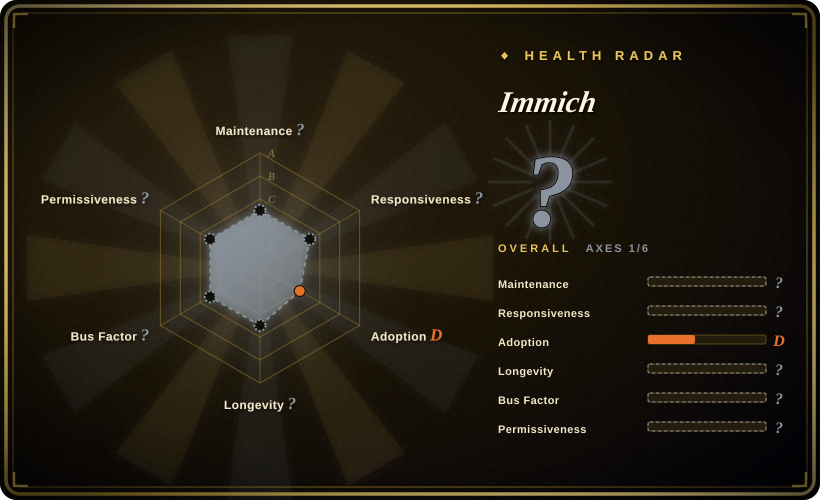

# Immich

High performance self-hosted photo and video management solution. A direct alternative to Google Photos that keeps your media on your own hardware.

## When to use

You're a privacy-conscious user with thousands of photos and videos scattered across phones, cameras, and cloud services. You want a single, searchable home for all your media that you control, not a Big Tech SaaS. You look at Google Photos, but you don't want your data mined for ad targeting or stored on someone else's servers. You look at PhotoPrism, but its mobile app and UI feel dated and its feature velocity is slower. You choose Immich because it gives you the modern Google Photos experience — auto-backup, timeline, memories, and ML search — with a polished mobile app, a slick web UI, and full ownership of the stack. You install it on a home server or NAS, set up the mobile app for automatic background backup, and watch your photos sync with face detection, EXIF-based maps, and AI-powered search. You share albums with family without sending data through a third party.

## When NOT to use

- **If you have fewer than a few thousand photos, use a simple NAS folder, iCloud, or a commercial cloud plan instead of Immich, because** the server overhead (Postgres, Redis, ~4GB RAM) may not be worth it for a small collection. A simple folder or managed service is lighter.
- **If you want zero operations and no server maintenance, use Google Photos, iCloud, or Amazon Photos instead of Immich, because** Immich requires Docker or a Linux server, database setup, and periodic updates. If you don't want to think about backups, disk space, or container restarts, a managed service is simpler.
- **If AGPL-3.0 is a compliance concern for your organization, use a commercial photo service or a differently licensed self-hosted tool instead of Immich, because** the AGPL-3.0 license requires sharing source code if you modify and network-serve the app. Verify this fits your organization's compliance posture before deployment.
- **If you need professional RAW development and darkroom tools, use darktable, Lightroom, or Capture One instead of Immich, because** while Immich supports RAW formats, it is primarily a photo/video management and sharing platform, not a RAW development tool.
- **If you need a multi-tenant public-facing photo service, use a custom-built platform or a commercial SaaS instead of Immich, because** Immich is designed for single-family or small-team self-hosting. The auth model and rate limits are not built for public multi-tenant scale.

## Comparison

| Alternative | In index | Our verdict | Tradeoff |
| --- | --- | --- | --- |
| Google Photos | 未收录 | The incumbent cloud photo service with unlimited storage (for compressed) and best-in-class ML search. | Google hosts your data and trains models on it; Immich keeps everything local but you run the hardware. |
| Nextcloud Photos | 未收录 | File-sync-first with a photo viewer; not a dedicated photo management app. | Nextcloud is a general file server with photo plugins; Immich is purpose-built for media with AI search and mobile auto-backup. |
| PhotoPrism | 未收录 | Self-hosted photo management with strong RAW support and a focus on privacy. | PhotoPrism has a more mature RAW pipeline and broader format support; Immich has a more modern mobile app and faster feature velocity. |
| LibrePhotos | 未收录 | Lightweight self-hosted photo manager with face recognition. | LibrePhotos is lighter on resources but has a smaller community and less polished mobile experience. |

## Tech stack

- **TypeScript** — primary server and web UI language
- **NestJS** — server-side framework for the REST API
- **Svelte / SvelteKit** — web frontend
- **Flutter** — cross-platform mobile app (iOS/Android)
- **PostgreSQL** — primary data store (metadata, users, albums)
- **Redis** — job queue, caching, and session store
- **TensorFlow / ONNX** — ML models for face detection, CLIP-based search, and object recognition
- **FFmpeg** — video transcoding and thumbnail generation
- **Typesense** — fast typo-tolerant search engine for metadata and tags
- **Docker** — official deployment method

## Dependencies

- **Server**: Linux server or NAS with Docker; minimum 4GB RAM recommended, 8GB+ for ML features
- **Storage**: Enough disk for originals + generated thumbnails + transcoded videos; Immich does not deduplicate across users by default
- **PostgreSQL**: Required for metadata; must be backed up regularly alongside media
- **Redis**: Required for job queuing; can be co-located on the same host
- **Reverse proxy**: Nginx or Traefik for TLS termination if exposing to the internet
- **Backup strategy**: The 3-2-1 rule applies — Immich is not a backup, it is a live photo manager

## Ops difficulty

**Medium**. Immich ships as Docker Compose, but running it in production means:
- Keeping Postgres, Redis, and Immich containers updated in sync
- Managing storage growth (photos accumulate fast; plan for tiered storage or pruning)
- Monitoring ML job queues (face detection and CLIP embedding can be CPU/GPU intensive)
- Running backups of both the database and the media library
- The mobile app auto-backup works well on WiFi but can be battery-heavy on cellular if not restricted

## Health & viability
- **Maintenance**: Grade A — 13/13 active weeks in trailing 13; last commit 1 days ago.
- **Responsiveness**: Grade A — median first-response time 10.4 hours across 9 qualifying issues/PRs.
- **Adoption**: Grade D — 6,496 monthly downloads via npmjs.org (package: @immich/cli).
- **Longevity**: Grade A — 1,611 days old.
- **Governance**: Grade A — top-3 contributor share 27.3% (?).
- **Risk / License**: Grade E — AGPL-3.0 license.
## Caveats (unverified)

- [未验证] The exact number of active production instances and the size of the largest known deployment have not been verified.
- [未验证] The project's exact funding model (donations, sponsorships, or commercial backing) has not been verified from primary sources.
- [推断] PhotoPrism may have broader RAW format support than Immich, but this has not been systematically compared.
- [推断] The ML model accuracy for face detection and CLIP search in non-English contexts may vary.
- [推断] The battery impact of mobile auto-backup on cellular networks compared to WiFi has not been independently measured.
- [推断] Immich is a live photo manager, not a backup solution; users must implement their own 3-2-1 backup strategy.
- [未验证] LibrePhotos has a smaller community and less polished mobile experience than Immich, but this has not been systematically benchmarked.
