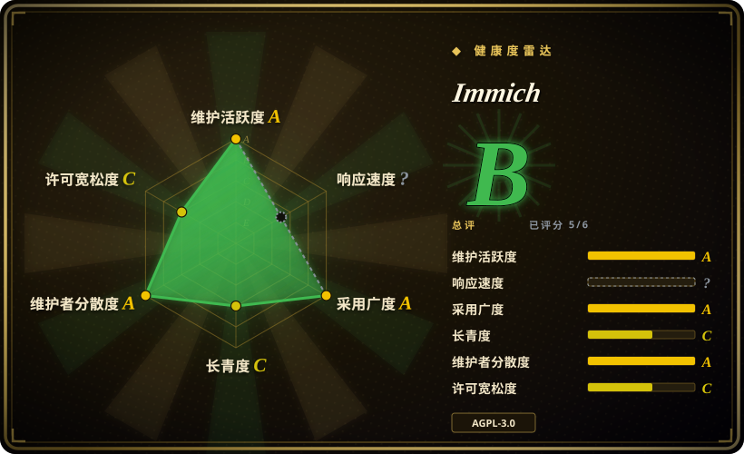

# Immich

高性能自托管照片与视频管理方案。Google Photos 的直接替代品，让你的媒体数据留在自有硬件上。

## 何时使用

你是一个注重隐私的用户，数千张照片和视频散落在手机、相机和各类云服务中。你想拥有一个完全由自己控制的统一、可搜索的媒体库，而不是把数据交给科技巨头。你看过 Google Photos，但不想让自己的数据被用于广告定向，也不想存在别人的服务器上。你看过 PhotoPrism，但它的移动应用和 UI 感觉过时，功能迭代速度也更慢。你选择 Immich，因为它给你现代的 Google Photos 体验——自动备份、时间线、回忆和 ML 搜索——同时拥有精致的移动应用、流畅的 Web UI，以及完整的技术栈所有权。你在家庭服务器或 NAS 上安装 Immich，通过手机 App 开启自动后台备份，看着照片带着人脸检测、EXIF 地图和 AI 搜索能力同步到服务端。你还能在不经过第三方的情况下与家人共享相册。

## 何时不用

- **如果你的照片不足数千张，请用简单的 NAS 文件夹、iCloud 或商业云盘方案，而不是 Immich，因为** 服务器开销（Postgres、Redis、约 4GB 内存）对小规模收藏可能不值得。简单的文件夹或托管服务更轻量。
- **如果你不想运维、不想管服务器，请用 Google Photos、iCloud 或 Amazon Photos，而不是 Immich，因为** Immich 需要 Docker 或 Linux 服务器、数据库配置和定期更新。如果你不想操心备份、磁盘空间或容器重启，托管服务更简单。
- **如果 AGPL-3.0 对组织的合规构成顾虑，请用商业照片服务或不同许可的自托管工具，而不是 Immich，因为** AGPL-3.0 许可要求：如果你修改并通过网络提供服务，就必须共享源码。部署前请确认这符合组织的合规要求。
- **如果你需要专业 RAW 开发和暗房工具，请用 darktable、Lightroom 或 Capture One，而不是 Immich，因为** 虽然支持 RAW 格式，但 Immich 主要是照片/视频管理与分享平台，不是 RAW 开发工具。
- **如果你需要公共多租户照片服务，请用自建平台或商业 SaaS，而不是 Immich，因为** Immich 面向家庭或小团队自托管设计。其认证模型和速率限制并非为公共多租户规模而构建。

## 横向对比

| 替代品 | 是否收录 | 我们的评价 | 取舍 |
| --- | --- | --- | --- |
| Google Photos | 未收录 |  incumbent 云照片服务，带无限容量（压缩后）和业界领先的 ML 搜索。 | Google 托管你的数据并用其训练模型；Immich 把一切留在本地，但你要自己跑硬件。 |
| Nextcloud Photos | 未收录 | 文件同步优先，附带照片浏览器；不是专用照片管理应用。 | Nextcloud 是通用文件服务器加照片插件；Immich 专为媒体而生，带 AI 搜索和移动端自动备份。 |
| PhotoPrism | 未收录 | 自托管照片管理，RAW 支持强，注重隐私。 | PhotoPrism 的 RAW 管线更成熟、格式支持更广；Immich 移动应用更现代、功能迭代更快。 |
| LibrePhotos | 未收录 | 轻量自托管照片管理器，带人脸识别。 | LibrePhotos 资源占用更小，但社区规模和移动体验打磨度不足。 |

## 技术栈

- **TypeScript** —— 服务端和 Web UI 的主要语言
- **NestJS** —— 服务端 REST API 框架
- **Svelte / SvelteKit** —— Web 前端
- **Flutter** —— 跨平台移动应用（iOS/Android）
- **PostgreSQL** —— 主数据存储（元数据、用户、相册）
- **Redis** —— 任务队列、缓存和会话存储
- **TensorFlow / ONNX** —— 人脸检测、CLIP 搜索和物体识别的 ML 模型
- **FFmpeg** —— 视频转码和缩略图生成
- **Typesense** —— 面向元数据和标签的快速容错搜索引擎
- **Docker** —— 官方部署方式

## 依赖

- **服务器**：带 Docker 的 Linux 服务器或 NAS；建议至少 4GB 内存，开启 ML 功能建议 8GB+
- **存储**：需足够磁盘容纳原图 + 生成缩略图 + 转码视频；Immich 默认不会跨用户去重
- **PostgreSQL**：元数据必需；需与媒体库一起定期备份
- **Redis**：任务队列必需；可与主机同机部署
- **反向代理**：如需暴露到公网，需 Nginx 或 Traefik 做 TLS 终止
- **备份策略**：适用 3-2-1 原则——Immich 是照片管理器，不是备份本身

## 运维难度

**中等**。Immich 以 Docker Compose 分发，但生产运行意味着：
- 同步更新 Postgres、Redis 和 Immich 容器
- 管理存储增长（照片积累很快；需规划分层存储或清理策略）
- 监控 ML 任务队列（人脸检测和 CLIP 嵌入可能消耗大量 CPU/GPU）
- 同时备份数据库和媒体库
- 移动端自动备份在 WiFi 下表现良好，但如不限定蜂窝网络可能较耗电

## 健康度与可持续性

- **维护**：非常活跃——截至 2026-07 仍有日常推送，发布节奏规律，社区庞大且活跃（104.8k stars，669 个 open issue）。
- **治理**：由 `immich-app` 组织开发，拥有多名核心维护者。项目有清晰的路线图和透明的 issue 追踪。Bus factor 中等。
- **背书**：未见大型商业背书；主要依靠社区贡献和可能的捐赠/赞助。这是独立性的优势，但对长期可持续性也是风险。
- **采用度**：采用度强，104.8k stars，2022 年创建（4 年记录）。在自托管和 homelab 社区中颇受欢迎。
- **风险旗标**：AGPL-3.0 是强 copyleft——商用或内部网络部署前请确认兼容性。未见 relicense 历史，但需关注未来是否变动。项目尚年轻，长期治理模式仍在验证中。

## 存疑（未验证）

- [未验证] 活跃生产实例的确切数量以及已知最大部署规模未经核实。
- [未验证] 项目的资金来源（捐赠、赞助或商业背书）未从一手来源核实。
- [推断] PhotoPrism 可能比 Immich 支持更广泛的 RAW 格式，但尚未做系统对比。
- [推断] 人脸检测和 CLIP 搜索在非英文语境下的 ML 模型准确率可能有所差异。
- [推断] 蜂窝网络下移动端自动备份的耗电影响相对于 WiFi 尚未经独立测量。
- [推断] Immich 是实时照片管理器，不是备份方案；用户必须自行实施 3-2-1 备份策略。
- [未验证] LibrePhotos 的社区规模和移动体验打磨度低于 Immich，但尚未做系统基准测试。
