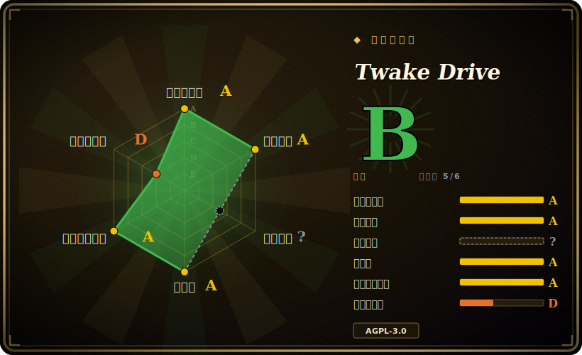

# Twake Drive

一个可自托管的“Google Drive 开源替代”——用于存储、浏览、链接分享和预览文件的 React Web 应用，作为 Cozy 应用运行在 cozy-stack 后端之上（隶属 Twake Workplace 套件）。它是个人/团队文件网盘，不是 OCR 文档归档系统。

## 何时使用

你在为一个小团队运行 Twake Workplace（或一台 Cozy 服务器），想要套件里的“文件存储”那一块——一个让大家把文档、照片、证件扫描件、工资单和税单丢进去的地方，用熟悉的文件树界面浏览，并通过链接把某个文件夹分享给同事。你不想再多养一台独立服务器，只想要一个能接入你已有的认证、分享和连接器模型的网盘。于是你从 cozy-stack 把 Twake Drive Web 应用 serve 出来，用户就得到一个干净的 React 界面：上传、按名称搜索、浏览器内 PDF/图片预览、以及“分享此链接”——再加上 Cozy 连接器，自动从水电/电信运营商把账单和对账单拉进网盘。它是你自托管栈的“Google-Drive 形态”门面，而不是一套记录管理系统。

当你的真实目标是 *在 Twake/Cozy 生态内做文件存储和链接分享*、且你的“文档”是人们保留下来、偶尔按名称或文件夹找回的东西（而不是一个需要 OCR、自动打标签和全文检索的归档语料库）时，它就是对的选择。

## 何时不用

- **你其实想要对扫描件做 OCR / 全文检索。** 这是 Twake Drive 在本类目里的反模式：它没有 OCR、没有内容提取、没有自动打标签、没有对文档*内容*的全文检索。搜索基于文件名/元数据。要索引扫描发票，请改用 [paperless-ngx](paperless-ngx.zh.md)。
- **你想要单个独立 DMS 二进制。** 本仓库只是前端 Web 应用，需要一个运行中的 **cozy-stack** 后端（独立的 Go 项目）以及周边的 Cozy/Twake 基础设施。它不是 `docker run` 一把的单容器文档服务器。
- **你不在 Cozy / Twake Workplace 栈上。** 它是 Cozy 应用（`manifest.webapp`，通过 `cozy-stack serve` 提供服务，`cozy/cozy-app-dev`）。采用它实际上意味着采用 cozy-stack 及其数据模型——这是实打实的平台锁定，而非可即插即用的 DMS。
- **你需要企业级 EDMS** —— 版本化记录、留存/生命周期策略、多步审批流、电子签名、细粒度的逐文档 ACL。这些都不是它的目标。
- **你只想要一个纯 WebDAV/HTTP 文件服务器来暴露某个目录。** 为此目的，Twake Drive 太重；单二进制文件服务器（如 [copyparty](copyparty.zh.md)）的面要小得多。
- **AGPL-3.0 是阻断项。** 如果你以服务形式提供它并做了修改，网络版 copyleft 义务即生效——这对某些商业/闭源部署是个问题。

## 横向对比

| 替代品 | 已收录 | 取舍 |
|---|---|---|
| [paperless-ngx](paperless-ngx.zh.md) | ✅ | 真正的 OCR/DMS：摄入、OCR、自动打标签并全文检索扫描件。当“文档”意味着可检索的扫描件时，它才是对的工具。Twake Drive 完全不做这些——它是文件网盘，不是归档器。 |
| [copyparty](copyparty.zh.md) | ✅ | 单二进制文件服务器，带上传 UI、WebDAV、分享和（可选）媒体索引；运行起来比依赖 cozy-stack 的 Twake Drive 轻得多，但没有套件/认证/连接器生态。 |
| Nextcloud | 未收录 | 主流的自托管网盘+协作平台——文件、分享、协同办公、庞大的应用生态；栈更重（PHP/DB），但独立运行、不绑定 cozy-stack。 |
| Seafile | 未收录 | 同步优先的自托管网盘，增量同步、版本化、（Pro 版）加密都很强；独立服务器，套件/协作集成弱于 Twake/Cozy。 |
| Cozy Drive（上游） | 未收录 | 这*就是*上游——Twake Drive 是 Linagora/Twake Workplace 对 `cozy/cozy-drive` 的 fork/换牌。架构相同；按你跑哪个生态（Cozy Cloud vs Twake Workplace）来选。 |

## 技术栈

- **前端：** React 18、Redux、React-Router、`react-dnd`，用 Rsbuild + Babel 构建；Jest 做测试。
- **Cozy 库：** `cozy-client`、`cozy-ui` / `cozy-ui-plus`、`cozy-bar`、`cozy-sharing`、`cozy-search`、`cozy-realtime`、`cozy-harvest-lib`（连接器）、`cozy-viewer`。
- **查看器：** EmbedPDF / `react-pdf`（PDF）、Excalidraw、Leaflet（地理标记项的地图）。
- **后端（独立仓库）：** **cozy-stack**（Go）提供存储、认证、分享和数据层——不在本仓库内。
- **语言：** JavaScript（约 77%）、TypeScript（约 21%）、Stylus。

## 依赖

- **cozy-stack** —— 强制后端；你通过 `cozy-stack serve --appdir drive:…` serve 这个应用。没有它，应用什么都做不了。
- **Node.js 20**（`.nvmrc`）+ **Yarn** 用于构建/开发 Web 应用。
- **CouchDB** 是 cozy-stack 的数据存储 `[推断]`（cozy-stack 的标准后端存储；本仓库不配置它）。
- **MailHog / 一个 SMTP 服务器** 用于开发环境下的邮件分享流程。
- **Docker** 镜像 `cozy/cozy-app-dev` 用于 VM 内开发工作流；`docker-compose.e2e.yml` 用于 E2E 测试。生产部署走 Cozy/Twake Workplace 平台，而非本仓库里的某个 compose 文件。

## 运维难度

**中到高——但大部分继承自 cozy-stack，而非这个应用本身。** 构建 Web 应用本身只是常规的 Node/Yarn 流程。真正的运维负担在于搭建和维护 **cozy-stack** 后端以及周边的 Twake Workplace/Cozy 平台（认证、分享、连接器、数据存储），而本仓库假定它已经存在。如果你只想要“一个放文件的地方”，这个平台要求让 Twake Drive 成为一个很重的选择；如果你已经在跑 Twake Workplace，那这个网盘只是又一个被 serve 出来的应用，运维很轻。

## 健康度与可持续性

- **维护（2026-06）。** 最后 push 于 2026-06，有近期 tag（1.103.0，2026-06-23），`main` 已领先到 1.105.0——处于**活跃**开发，未归档。[推断]
- **治理 / 背书。** 归属法国开源公司 **Linagora**，是其 Twake Workplace 套件的一部分——厂商背书的项目（不是单人维护），这对延续性是个安心信号，但也把路线图绑在一家公司的套件战略上。它是上游 `cozy/cozy-drive` 的 fork/换牌。[推断]
- **年龄与 Lindy 判断。** 仓库可追溯到约 2016 年（2016-12 创建），其所承袭的 Cozy Drive 谱系更老 ⇒ *代码库*有**中到强的 Lindy** 先验，但作为 **Linagora 换牌产物，其独立的存续记录更短**，采用度（约 960 star）也一般——应按套件的牵引力而非单纯年龄来判断。[推断]
- **采用度。** 较低的 star 数（约 960）显示独立社区不大；它真正的采用度被框定在已经在跑 Twake Workplace / Cozy 的团队，而非广泛的独立用户群。[未验证]
- **风险标记。** **AGPL-3.0** 是头号标记——若你以服务形式提供修改版，网络版 copyleft 义务即生效。此外有重度**平台锁定**：本仓库只是前端，需要独立的 cozy-stack 后端。[推断]

## 存疑（未验证）

- [未验证] `gh` 报告最新打标签的发布为 **1.103.0**（2026-06-23），而 `main` 上的 `package.json`/`manifest.webapp` 显示 **1.105.0**——main 领先于最新 tag；把确切的“当前版本”当作近似值。
- [未验证] 星标数约 960（gh，2026-06-26）。GitHub 星标不可靠且对日期敏感；仅供参考。
- [推断] cozy-stack 使用 CouchDB 作为数据存储，并提供实际的文件存储/认证/分享层——这是从 Cozy 架构推断的，而非来自本仓库的文件（本仓库只是前端）。
- [推断] “无 OCR / 无全文内容检索 / 无自动打标签”是从 README 功能列表（文件树、上传、URL 分享、名称搜索）以及缺少任何 OCR/索引依赖推断的；若内容检索关键，请对照当前 cozy-stack 能力核实。
- [未验证] 与上游 `cozy/cozy-drive` 的关系（fork 还是换牌）是从 `manifest.webapp` 的 `source`/`editor` 字段和 `cozy-drive` 包名推断的；确切治理关系本次未确认。
- [未验证] 生产部署拓扑（容器、数据存储、对象存储）未在本仓库定义；它只附带一个 E2E compose 文件和一个开发 Docker 镜像。
