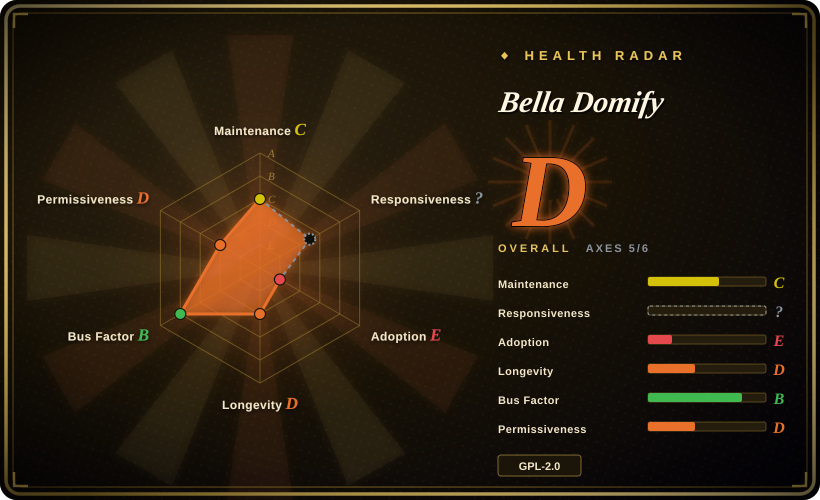

# Bella Domify

A Python document parser derived from pdf2docx that exposes layout and DOM-tree parsing for PDF and common Office formats, with optional vision-model OCR and a Kafka/S3-backed service mode.

> **License conflict:** the repository's actual `LICENSE` file contains GNU GPL version 2, while `setup.py` declares `license="GPL v3"`. The frontmatter follows the license file as `GPL-2.0-only`; legal review should treat the upstream declaration as unresolved.

## When to use

You're building a Chinese-language knowledge-base or RAG ingestion service and need more than flat text: the application wants PDF blocks, sections, tables, images, headers and footers represented as a detailed document tree, then converted to a standard DOM or Markdown. You are willing to implement the required image-storage provider and, if image OCR is enabled, supply an OpenAI-compatible vision model provider and user context. Bella Domify can run as an imported Python package for direct conversion or as a FastAPI service with asynchronous workers.

Choose it over MarkItDown when PDF layout, tables, DOM-tree structure, watermark/header/footer handling, and evaluation fixtures matter more than minimal installation. Choose it over a cloud-only parser wrapper when you want the born-digital PDF and Office parsing logic in your own process, while accepting that image understanding can still call an external vision model.

## When NOT to use

- **You need an unambiguous license for commercial redistribution.** Use [Docling](docling.md) or [Unstructured](unstructured.md) instead; Bella Domify's GPL v2 license file conflicts with the GPL v3 declaration in `setup.py`.
- **All document processing, including image OCR, must stay offline.** Use [Docling](docling.md), [Marker](marker.md), or self-hosted OCR instead; Bella Domify's image OCR code sends image URLs to an OpenAI-compatible vision endpoint when enabled.
- **You want a parser with tagged releases and a longer public stability record.** Use [Docling](docling.md) or [Unstructured](unstructured.md); Bella Domify has no GitHub releases or tags and its last observed default-branch push was in 2025-11.
- **You do not want to implement storage/model providers or operate service infrastructure.** Use [MarkItDown](markitdown.md) for simple conversion or [Docling](docling.md) for an in-process parser; Bella Domify's library configuration requires an image provider, while its service path wires S3, Kafka, and a File API.
- **You only need quick Office-to-Markdown conversion.** Use [MarkItDown](markitdown.md); Bella Domify installs PyMuPDF, OpenCV, database, Kafka, cloud SDK, and service dependencies that are unnecessary for that narrower job.
- **You need independently reproducible accuracy claims before selection.** Benchmark [Docling](docling.md), [Marker](marker.md), and Bella Domify on your own corpus; the repository's comparison graphic is based on a limited internal evaluation set and was not reproduced here.

## Comparison

| Alternative | In index | Our verdict | Tradeoff |
|---|---|---|---|
| [Docling](docling.md) | ✅ | Pick Docling when license clarity, release maturity, local model-backed parsing, and standard RAG integrations matter most; pick Bella Domify when its pdf2docx-derived DOM model and provider-based service integration match an existing Bella-style stack. | Docling is more established and MIT-licensed; Bella Domify exposes detailed PDF internals and service hooks but has a license conflict and younger public history. |
| [Unstructured](unstructured.md) | ✅ | Pick Unstructured for production document ETL, connectors, partitioning, and enrichment; pick Bella Domify for a narrower Python parser with a custom DOM tree and Beike-oriented service adapters. | Unstructured has a broader ingestion ecosystem; Bella Domify offers more application-specific provider and worker code at the cost of infrastructure coupling. |
| [MarkItDown](markitdown.md) | ✅ | Pick MarkItDown for a small conversion dependency and predictable Markdown output; pick Bella Domify when PDF layout, table objects, sections, and image handling justify a heavier stack. | MarkItDown is easy to install but less layout-aware; Bella Domify is structurally richer but operationally much heavier. |
| [Marker](marker.md) | ✅ | Pick Marker when local model-driven PDF-to-Markdown fidelity is the central requirement; pick Bella Domify when multiple Office formats and an explicit DOM-tree API matter more. | Marker concentrates on PDF conversion with ML dependencies; Bella Domify combines rule-based PDF internals, Office adapters, and optional remote vision OCR. |
| [olmOCR](olmocr.md) | ✅ | Pick olmOCR for GPU-backed processing of visually difficult PDFs; pick Bella Domify for service-integrated multi-format parsing where GPU VLM deployment is not the desired architecture. | olmOCR has a large GPU/model footprint but a clearer complex-PDF focus; Bella Domify spreads complexity across Python packages, providers, and infrastructure. |

## Tech stack

- **Language and packaging:** Python package `bella-domify`; Docker uses Python 3.9.19, the README requires Python `>=3.9`, while `setup.py` declares `>=3.6`.
- **PDF core:** a substantial pdf2docx-derived object model over PyMuPDF, representing pages, blocks, spans, paths, images, sections, columns, rows, cells, and tables.
- **Other formats:** adapters cover DOC/DOCX, XLS/XLSX, CSV, PPTX, text, Markdown, JSON-like text, HTML, and common image formats.
- **OCR path:** images are uploaded through an `ImageStorageProvider`; optional OCR calls an OpenAI-compatible chat-completions vision model and can emit text, Markdown tables, or Mermaid descriptions.
- **Service mode:** FastAPI/uvicorn endpoints, Kafka consumer workers, S3-compatible image/cache providers, File API integration, and configuration through INI files and environment variables.

## Dependencies

- **Python runtime:** PyMuPDF, OpenCV, Pillow, Shapely, python-docx, python-pptx, openpyxl, xlrd, FastAPI, uvicorn, Pydantic, SQLAlchemy/SQLModel, boto3, OpenAI, Kafka, and utility packages.
- **System tools:** the Dockerfile installs build tools, MySQL client headers, OpenGL/glib libraries, and `unoconv` for office conversion.
- **Library providers:** callers must supply an `ImageStorageProvider`; OCR additionally needs a vision model list/provider, model name, and user context.
- **Service infrastructure:** the included Compose stack uses LocalStack S3, Zookeeper, Kafka, a document-parser container, and external File API/OpenAI-compatible endpoints.
- **Network boundary:** born-digital parsing can run locally, but enabled image OCR and the default service integrations make outbound calls.

## Ops difficulty

**Medium as a carefully configured library; high as the included service.** Direct library use avoids Kafka and the bundled service workers, but still requires provider implementations and a large dependency set. The supplied service starts a Kafka consumer, uses S3-compatible storage and result caching, depends on external file and vision-model APIs, and includes environment-specific INI values that must be replaced rather than copied. Teams must also resolve the Python-version and license declarations, pin all dependencies, and decide which features are permitted to send document images outside the deployment boundary.

## Health & viability

- **Maintenance, 2026-07:** the repository was not archived, but the last observed default-branch push was 2025-11-27 and there were no GitHub releases or tags.
- **Governance:** the repository belongs to the LianjiaTech organization and recent commits came from several accounts. Contributor totals are partly inherited from the pdf2docx-derived history, so they are not a clean measure of current Bella Domify bus factor.
- **Age and Lindy:** created in 2025-08, the project is young and has less than a year of public history; its Lindy prior is weak even though the initial development period involved multiple contributors. [推断]
- **Adoption:** 86 stars indicate early interest, but there is not yet a broad release or dependent-project signal in the sources read here.
- **Risk flags:** the GPL v2/GPL v3 conflict is a selection blocker for license-sensitive use. The checked-in Compose and production INI also contain environment-specific endpoints and credential-like example values that must not be treated as production defaults.

## Caveats (unverified)

- [未验证] Upstream legal intent is unresolved: `LICENSE` contains GPL version 2, while `setup.py` declares GPL v3. The page records `GPL-2.0-only` from the actual license file but does not resolve the conflict.
- [未验证] The repository's limited-set accuracy graphic and comparisons were not reproduced or independently audited.
- [未验证] Library-only operation with OCR disabled was not executed end to end to prove which Bella-specific packages and network integrations can be removed.
- [推断] Organization ownership and multiple recent commit authors reduce the appearance of a pure solo project, but the short public history and inherited contributor data leave current bus factor uncertain.
- [未验证] The README, `setup.py`, and Dockerfile disagree on the effective Python floor; validate the published package against the intended runtime before adoption.
