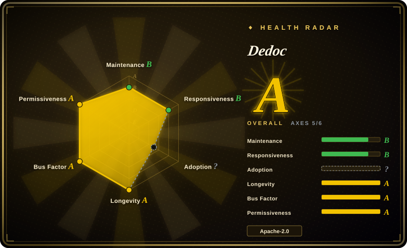

# Dedoc

A Python document-parsing library and REST service that normalizes PDF, Office, image, archive, email, and text inputs into a logical document tree with tables, annotations, attachments, and metadata.

## When to use

You're building an on-premises document-analysis pipeline for legal files, technical specifications, reports, and mixed office archives. Plain text extraction is not enough: downstream code needs headings and nested lists as a tree, table cells as structured objects, formatting annotations, document metadata, and recursively parsed attachments. You install Dedoc as a Python library or run its FastAPI-based REST service, then configure readers and structure extractors for the document families you actually receive.

Choose Dedoc over MarkItDown when logical hierarchy, table metadata, annotations, and extensible readers matter more than a lightweight Markdown conversion. Choose it over a GPU-first PDF-to-Markdown model when you prefer a traditional local stack built around PDF parsing, Tesseract OCR, image processing, and document-specific structure extractors, and you accept the heavier Linux and system-package footprint.

## When NOT to use

- **Your scans are color photos, perspective-distorted mobile captures, or handwriting.** Use PaddleOCR or a managed Vision service instead; Dedoc's README explicitly limits its scanned-document examples to black-and-white documents, and this research did not benchmark it on those harder inputs.
- **Your scanned tables lack explicit borders or have visually complex layouts.** Use [Docling](docling.md), [Marker](marker.md), or [olmOCR](olmocr.md) instead; Dedoc documents scanned-table recognition for tables with explicit boundaries.
- **You only need lightweight Office-to-Markdown conversion.** Use [MarkItDown](markitdown.md) instead; it avoids Dedoc's OCR, scientific-computing, conversion-tool, and service dependencies.
- **You only need raw image-to-text OCR.** Use [Tesseract](../ocr/tesseract.md) or PaddleOCR directly; Dedoc adds document readers, structure construction, attachments, annotations, and API machinery around OCR.
- **You need a searchable archive or document-management application.** Use [paperless-ngx](../document-management/paperless-ngx.md) instead; Dedoc parses documents but does not provide end-user filing, tagging, retention, or full-text-search workflows.
- **Your runtime cannot provide Linux-oriented system packages.** Use [MarkItDown](markitdown.md) for simpler conversion or [Docling](docling.md) after validating its platform support; Dedoc recommends Ubuntu and relies on tools such as Tesseract, LibreOffice, DjVu utilities, Poppler, and archive extractors for its full format surface.

## Comparison

| Alternative | In index | Our verdict | Tradeoff |
|---|---|---|---|
| [Docling](docling.md) | ✅ | Pick Docling for a modern local RAG parser with a unified document model and stronger emphasis on layout-aware Markdown/JSON; pick Dedoc when custom logical-structure extractors, annotations, attachments, and its traditional OCR/PDF stack fit the corpus better. | Docling brings model-driven layout and table processing; Dedoc exposes a broad reader/structure-extractor architecture but carries older and more numerous runtime constraints. |
| [Unstructured](unstructured.md) | ✅ | Pick Unstructured when connectors, partitioning, enrichment, and production ingestion workflows are the main requirement; pick Dedoc when parsing and logical-tree recovery are the primary job. | Unstructured is a broader document ETL surface; Dedoc is more narrowly centered on document content, structure, tables, metadata, and attachments. |
| [MarkItDown](markitdown.md) | ✅ | Pick MarkItDown for low-friction conversion of common files to Markdown; pick Dedoc when the downstream system needs structured hierarchy and detailed annotations rather than convenience-level conversion. | MarkItDown is lighter and easier to embed, while Dedoc offers deeper structure at substantially higher dependency and operational cost. |
| [Marker](marker.md) | ✅ | Pick Marker when high-fidelity PDF-to-Markdown is the narrow goal and a model-heavy local stack is acceptable; pick Dedoc for broader non-PDF formats and programmable document-type structure extractors. | Marker is PDF-focused and model-driven; Dedoc spans Office, archives, email, images, and text but has explicit limits on difficult scans and borderless tables. |
| [olmOCR](olmocr.md) | ✅ | Pick olmOCR for GPU-backed linearization of visually complex PDFs used in model-training or RAG corpora; pick Dedoc for CPU-oriented multi-format parsing and application-level logical trees. | olmOCR pays a large GPU/model cost for complex visual understanding; Dedoc pays in system dependencies and rule/configuration complexity instead. |

## Tech stack

- **Language and packaging:** Python package `dedoc`, Python `>=3.8`, with a `dedoc` CLI entry point and a FastAPI/uvicorn service entry point.
- **Document model:** readers produce lines, tables, metadata, annotations, attachments, and an unstructured document; structure extractors and constructors turn that into linear or tree output.
- **PDF paths:** pdfminer-based text-layer parsing, a bundled Java Tabby/PDFBox path, broken-encoding handling, and an image/OCR reader selected through PDF auto-detection.
- **OCR and image processing:** Tesseract through `pytesseract`, OpenCV, scikit-image, orientation and column classifiers, and table contour analysis.
- **Format adapters:** Python libraries plus converters for DOC/DOCX, ODT/RTF, XLS/XLSX, PPT/PPTX, HTML/MHTML, email, JSON, archives, DjVu, images, and text.

## Dependencies

- **Python dependencies:** FastAPI, uvicorn, numpy, pandas, SciPy, scikit-learn, XGBoost, OpenCV, pdfminer.six, pypdf, python-docx, BeautifulSoup, archive libraries, and related parsing packages.
- **Optional ML dependencies:** the `torch` extra pins `torch~=1.11.0`, `torchvision~=0.12.0`, and `transformers~=4.49.0` for model-backed classifiers.
- **System packages:** Tesseract OCR 5, Poppler-related tools, LibreOffice and `unoconv` for legacy Office conversion, DjVu tools, `unzip`/`unrar`, FontForge, and native libraries used by image and spatial packages.
- **Deployment:** the project publishes a Docker image and Docker Compose path; running from source requires more host preparation than installing a pure-Python converter.
- **No required external parsing SaaS:** the core documented parsing paths run locally, although optional integrations such as external GROBID can add a service dependency.

## Ops difficulty

**High for a full local installation; medium with the published container.** The parsing API itself is straightforward, but the environment is not: Python packages include compiled scientific and image-processing components, full format support depends on multiple OS binaries, OCR language packs must be installed, and optional Torch versions are old enough to constrain the Python/CUDA matrix. Docker contains much of that complexity, but teams still need to budget image size, model downloads, temporary-file handling, CPU/memory use, and concurrency for large documents. Extending a structure type is supported and documented, but it requires domain examples, labeling, feature extraction, and classifier maintenance rather than a single configuration switch.

## Health & viability

- **Maintenance, 2026-07:** the repository was not archived, the default branch was pushed on 2026-07-16, and v2.7 was released on 2026-06-25 after several releases during 2025.
- **Governance:** the repository is owned by the `ispras` organization; the manifest names a team and three maintainers, and GitHub's contributor list showed several substantial contributors rather than one account holding all visible history.
- **Age and Lindy:** created in 2020 and still releasing in 2026, Dedoc has a stronger age-times-activity signal than newly launched document parsers. [推断]
- **Adoption:** 715 GitHub stars and published PyPI/Docker artifacts indicate a real but comparatively specialized user base; stars alone do not establish parsing quality.
- **Risk flags:** the Apache-2.0 license is clear from the actual `LICENSE.txt`, but the tightly constrained and partly old dependency set raises upgrade, vulnerability-remediation, and platform-compatibility risk. [推断]

## Caveats (unverified)

- [未验证] No same-corpus accuracy or throughput benchmark was run against Docling, Marker, olmOCR, PaddleOCR, or cloud OCR; relative recommendations must be validated on the target documents.
- [未验证] The exact quality of non-Russian languages and document-specific structure extractors was not independently tested.
- [推断] Dedoc's long-active history and multi-contributor signals reduce abandonment risk, but they do not guarantee future dependency modernization or security response.
- [未验证] Optional external GROBID behavior, GPU throughput, and the resource requirements of downloaded classifiers were not exercised in this research pass.
