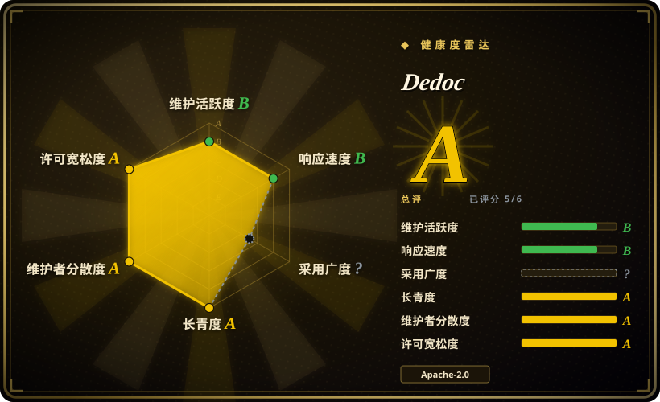

# Dedoc

一个 Python 文档解析库与 REST 服务，把 PDF、Office、图片、压缩包、邮件和文本输入归一成带逻辑树、表格、注解、附件与元数据的文档结构。

## 何时使用

你是搭建内网文档分析管线的工程师，输入包括法律文件、技术规范、报告和混合 Office 压缩包。纯文本抽取不够用：下游代码需要标题和嵌套列表组成的树、结构化表格单元格、格式注解、文档元数据，以及递归解析的附件。你可以把 Dedoc 作为 Python 库安装，也可以运行它基于 FastAPI 的 REST 服务，再针对实际文档类型配置 reader 和 structure extractor。

如果逻辑层级、表格元数据、注解和可扩展 reader 比轻量 Markdown 转换更重要，选 Dedoc 而不是 MarkItDown。如果你更偏好由 PDF 解析、Tesseract OCR、图像处理和文档类型结构抽取器组成的传统本地栈，并且能接受更重的 Linux 与系统包依赖，也可以选它而不是 GPU 优先的 PDF 转 Markdown 模型。

## 何时不用

- **输入主要是彩色照片、透视变形的手机拍照或手写体。** 请改用 PaddleOCR 或托管 Vision 服务；Dedoc README 明确把扫描文档示例限定为黑白文档，本次研究也没有对更困难的输入做实测。
- **扫描表格没有显式边框，或存在复杂视觉版式。** 请改用 [Docling](docling.zh.md)、[Marker](marker.zh.md) 或 [olmOCR](olmocr.zh.md)；Dedoc 文档描述的扫描表格识别对象是有明确边界的表格。
- **只需要轻量的 Office 转 Markdown。** 请改用 [MarkItDown](markitdown.zh.md)；它不需要 Dedoc 的 OCR、科学计算、格式转换工具和服务依赖。
- **只需要图片转纯文本 OCR。** 请直接使用 [Tesseract](../ocr/tesseract.zh.md) 或 PaddleOCR；Dedoc 在 OCR 之外还加入 reader、结构构造、附件、注解和 API 层。
- **需要的是可搜索的归档或文档管理应用。** 请改用 [paperless-ngx](../document-management/paperless-ngx.zh.md)；Dedoc 负责解析，不提供面向终端用户的归档、标签、保留策略或全文搜索工作流。
- **运行环境无法提供偏 Linux 的系统包。** 简单转换可改用 [MarkItDown](markitdown.zh.md)，也可以在核实平台支持后采用 [Docling](docling.zh.md)；Dedoc 推荐 Ubuntu，完整格式面依赖 Tesseract、LibreOffice、DjVu 工具、Poppler 和压缩包解包工具。

## 横向对比

| 替代品 | 是否收录 | 我们的评价 | 取舍 |
|---|---|---|---|
| [Docling](docling.zh.md) | ✅ | 需要现代本地 RAG 解析器、统一文档模型和更强的版面感知 Markdown/JSON 时选 Docling；需要自定义逻辑结构抽取器、注解、附件，以及传统 OCR/PDF 栈更适合语料时选 Dedoc。 | Docling 使用模型驱动的版面与表格处理；Dedoc 提供广泛的 reader/structure-extractor 架构，但运行约束更旧也更多。 |
| [Unstructured](unstructured.zh.md) | ✅ | 连接器、partition、enrichment 和生产摄取工作流是主需求时选 Unstructured；解析和逻辑树恢复是主任务时选 Dedoc。 | Unstructured 是更广的文档 ETL 表面；Dedoc 更集中于内容、结构、表格、元数据和附件。 |
| [MarkItDown](markitdown.zh.md) | ✅ | 需要低摩擦地把常见文件转成 Markdown 时选 MarkItDown；下游需要结构层级与详细注解时选 Dedoc。 | MarkItDown 更轻、更容易嵌入；Dedoc 结构更深，但依赖和运维成本明显更高。 |
| [Marker](marker.zh.md) | ✅ | 目标窄到高保真 PDF 转 Markdown，且能接受模型较重的本地栈时选 Marker；需要更广的非 PDF 格式和可编程文档类型抽取器时选 Dedoc。 | Marker 聚焦 PDF 且由模型驱动；Dedoc 覆盖 Office、压缩包、邮件、图片和文本，但对困难扫描件和无边框表格有明确限制。 |
| [olmOCR](olmocr.zh.md) | ✅ | 需要用 GPU 线性化视觉复杂 PDF，供模型训练或 RAG 语料使用时选 olmOCR；需要偏 CPU 的多格式解析和应用级逻辑树时选 Dedoc。 | olmOCR 用较大的 GPU/模型成本换复杂视觉理解；Dedoc 则承担系统依赖和规则配置复杂度。 |

## 技术栈

- **语言与打包：** Python 包 `dedoc`，要求 Python `>=3.8`，提供 `dedoc` CLI 入口和 FastAPI/uvicorn 服务入口。
- **文档模型：** reader 产出行、表格、元数据、注解、附件和非结构化文档，再由 structure extractor 与 constructor 转成线性或树形输出。
- **PDF 路径：** 包括基于 pdfminer 的文本层解析、内置 Java Tabby/PDFBox 路径、损坏编码处理，以及通过 PDF 自动检测选择图片/OCR reader。
- **OCR 与图像处理：** 通过 `pytesseract` 调用 Tesseract，配合 OpenCV、scikit-image、方向和分栏分类器，以及表格轮廓分析。
- **格式适配：** 结合 Python 库与转换器处理 DOC/DOCX、ODT/RTF、XLS/XLSX、PPT/PPTX、HTML/MHTML、邮件、JSON、压缩包、DjVu、图片和文本。

## 依赖

- **Python 依赖：** FastAPI、uvicorn、numpy、pandas、SciPy、scikit-learn、XGBoost、OpenCV、pdfminer.six、pypdf、python-docx、BeautifulSoup、压缩包库和相关解析包。
- **可选 ML 依赖：** `torch` extra 固定到 `torch~=1.11.0`、`torchvision~=0.12.0` 和 `transformers~=4.49.0`，用于模型分类器。
- **系统包：** Tesseract OCR 5、Poppler 相关工具、用于旧 Office 转换的 LibreOffice 与 `unoconv`、DjVu 工具、`unzip`/`unrar`、FontForge，以及图像与空间包使用的原生库。
- **部署：** 项目发布 Docker 镜像和 Docker Compose 路径；从源码运行需要比纯 Python 转换器更多的主机准备。
- **不强制依赖外部解析 SaaS：** 文档描述的核心解析路径可在本地运行，但外部 GROBID 等可选集成会增加服务依赖。

## 运维难度

**完整本地安装为高，使用官方容器为中。** 解析 API 本身直接，但环境并不轻：Python 包含编译型科学计算与图像处理组件，完整格式支持依赖多个操作系统二进制，OCR 语言包需要单独安装，而可选 Torch 版本较旧，会约束 Python/CUDA 组合。Docker 能封装相当一部分复杂度，但团队仍需规划镜像体积、模型下载、临时文件、CPU/内存占用和大文档并发。扩展结构类型有文档支持，不过通常需要领域样本、标注、特征提取和分类器维护，不是一个配置开关即可完成。

## 健康度与可持续性

- **维护，2026-07：** 仓库未归档，默认分支在 2026-07-16 仍有 push，v2.7 于 2026-06-25 发布，2025 年也有多次 release。
- **治理：** 仓库属于 `ispras` 组织；manifest 列出一个团队和三名 maintainer，GitHub contributor 列表也显示多名有显著贡献的账号，并非可见历史完全集中在一人。
- **年龄与 Lindy：** 2020 年创建且 2026 年仍在发布，相比新近出现的文档解析器，Dedoc 的年龄乘活跃度信号更强。[推断]
- **采用度：** 715 个 GitHub star，加上已发布的 PyPI 与 Docker 产物，说明它拥有真实但相对垂直的用户群；star 不能证明解析质量。
- **风险标记：** 实读 `LICENSE.txt` 可确认 Apache-2.0，但约束严格且部分较旧的依赖集合，会提高升级、漏洞修复和平台兼容风险。[推断]

## 存疑（未验证）

- [未验证] 本次没有在同一语料上对 Dedoc、Docling、Marker、olmOCR、PaddleOCR 或云 OCR 做准确率与吞吐对比；相对建议必须用目标文档验证。
- [未验证] 非俄语语种和文档类型专用 structure extractor 的实际质量没有独立测试。
- [推断] 长期活跃和多贡献者信号降低了弃坑风险，但不能保证未来的依赖现代化或安全响应。
- [未验证] 可选外部 GROBID、GPU 吞吐，以及下载分类器所需的实际资源没有在本次研究中运行验证。
