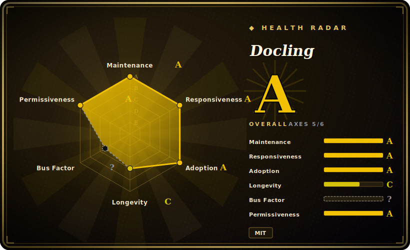

# Docling

A Python library that parses PDF, DOCX, PPTX, XLSX, HTML, images and more into one unified structured representation (`DoclingDocument`) — with page layout, reading order, and table structure recovered — then exports clean Markdown / HTML / lossless JSON for gen-AI and RAG ingestion.

## When to use

You're an engineer building a RAG pipeline and your corpus is a pile of messy real-world documents — scanned PDFs with multi-column layout, DOCX contracts, PPTX decks, the occasional spreadsheet and a few HTML exports. Naive text extraction wrecks you: columns interleave, tables collapse into word-soup, headings lose their level, and the chunks you feed the retriever are garbage in, garbage out. You import Docling, point its `DocumentConverter` at a file or URL, and get back a `DoclingDocument` that has reconstructed reading order, detected the layout, recovered table structure as actual rows/cells, and (when the page is a scan) run OCR. From there you call `.export_to_markdown()` or `.export_to_dict()`/JSON and hand structured text — headings, tables, lists intact — to your chunker and embedder. Because it's a plain `pip install docling` library with a Python API and a CLI, it drops into an existing ingestion job rather than forcing a service.

You also reach for it when you want one parser across heterogeneous formats instead of a different tool per type — PDF via PyMuPDF, DOCX via python-docx, PPTX via python-pptx, glued together by hand. Docling normalizes them all to the same `DoclingDocument`, so downstream chunking/serialization code is written once. It ships plug-and-play integrations for LangChain, LlamaIndex, Haystack and Crew AI, so the converter slots in as the document-loader stage of those frameworks.

## When NOT to use

- **You need an archive / search / DMS, not a parser.** Docling converts documents; it does not store, index, tag, or let users search them. For "scan, file, OCR, and full-text search my paperwork" you want a document-management app — [paperless-ngx](../document-management/paperless-ngx.md) — not a conversion library.
- **You just need plain text off a clean PDF or a quick OCR pass.** If layout/table fidelity doesn't matter, `pdftotext`/PyMuPDF text extraction or a direct Tesseract OCR call is far lighter than pulling in Docling's layout and table-structure models.
- **You're compute- or footprint-constrained.** Layout analysis and table-structure recovery run ML models; first use downloads model weights and inference is heavier (and much faster on a GPU) than regex/string extraction. On a tiny serverless function or a CPU-only box with hard latency limits, weigh the cost. [推断]
- **You expected a chunker or retriever.** Docling parses and serializes; it is *not* a chunking strategy, embedder, vector store, or retriever. Pair it with LlamaIndex or a retrieval layer like [PageIndex](../rag-retrieval/pageindex.md) — Docling produces the clean structured input those consume.
- **Your inputs are news articles or arbitrary web pages.** For boilerplate-stripping article/main-content extraction, readability/newspaper-style libraries are the better fit; Docling targets document files, not de-cluttering live web pages.

## Comparison

| Alternative | In index | Our verdict | Tradeoff |
|---|---|---|---|
| unstructured.io | 未收录 | Use this page for its stated niche; choose unstructured.io when you need broad multi-format document loader popular for RAG ingestion with many partitioners. | Broad multi-format document loader popular for RAG ingestion with many partitioners; open-source core plus a commercial API/service tier — capability split and licensing differ from Docling's single MIT library. |
| LlamaParse | 未收录 | Use this page for its stated niche; choose LlamaParse when you need hosted parsing service (LlamaIndex) strong on complex PDFs/tables. | Hosted parsing service (LlamaIndex) strong on complex PDFs/tables; SaaS with usage pricing and data leaving your boundary, vs Docling running fully local/in-process. |
| Marker | 未收录 | Use this page for its stated niche; choose Marker when you need PDF→Markdown converter also using deep-learning layout models. | PDF→Markdown converter also using deep-learning layout models; similar gen-AI target, narrower input-format range than Docling's PDF/Office/HTML/image spread. |
| PyMuPDF / pdfplumber | 未收录 | Use this page for its stated niche; choose PyMuPDF / pdfplumber when you need fast, lightweight low-level PDF text/geometry extraction with no heavy models. | Fast, lightweight low-level PDF text/geometry extraction with no heavy models; you build layout/table logic yourself — less fidelity out of the box, far lighter footprint. |
| [PageIndex](../rag-retrieval/pageindex.md) | ✅ | Use this page for its stated niche; choose PageIndex when you need a retrieval/reasoning layer over documents, not a parser. | A retrieval/reasoning layer over documents, not a parser — complementary, not a substitute; Docling produces the structured text it indexes. |

## Tech stack

- **Language:** Python (`pip install docling`), exposing a `DocumentConverter` API and a CLI.
- **Core model:** every input is normalized to a unified `DoclingDocument` (layout, reading order, tables, figures, lists, headings), then serialized to Markdown / HTML / lossless JSON / DocTags.
- **ML models:** layout analysis and table-structure recovery run vision/DL models; optional Visual Language Model path (e.g. IBM's GraniteDocling) and ASR models for audio inputs. [未验证]
- **Inputs/outputs:** parses PDF, DOCX, PPTX, XLSX, HTML, EPUB, images (PNG/TIFF/JPEG), and more; exports Markdown, HTML, JSON, DocTags.
- **Integrations:** plug-and-play with LangChain, LlamaIndex, Haystack, Crew AI; MCP server and API-server deployment options exist.

## Dependencies

- **Runtime:** a Python environment (a recent Python 3.x); install via pip/uv.
- **ML model weights:** layout and table-structure models are downloaded on first use and cached locally; this is a one-time network fetch and meaningful disk footprint.
- **OCR engines (for scanned input):** pluggable OCR backends — e.g. EasyOCR (default-ish) and Tesseract — are used when pages are images/scans; the exact set and defaults vary by version. [未验证]
- **Hardware:** runs CPU-only, but layout/table/VLM inference is materially faster on a GPU; throughput on large corpora is dominated by model inference.

## Ops difficulty

**Low-to-medium as a library.** There's no service to deploy or datastore to run — it's `pip install docling` inside your existing ingestion job, and the happy path is a few lines (`DocumentConverter().convert(source)` → `.export_to_markdown()`). The medium part is environment and compute: the first run downloads model weights (size and offline/air-gapped setup need planning), OCR backends bring their own system-level dependencies, and batch-converting a large corpus is a GPU-vs-CPU and parallelism question, not a config flag. If you also run the optional API/MCP server, that's a service to operate on top of the library.

## Health & viability

- **Maintenance (2026-06).** Last pushed 2026-06 with very frequent releases (v2.107.0, 2026-06-24) — **highly active**, not archived. [推断]
- **Governance / backing.** The strongest signal here: **IBM-originated and hosted under the LF AI & Data Foundation** — foundation governance plus a major-vendor origin is a much safer footing than a lone-maintainer repo, lowering bus-factor and abandonment risk. [推断]
- **Age & Lindy verdict.** Only ~2 years old (created 2024-07) ⇒ **young**, so the Lindy prior is weak *on age alone* — but the rapid-fire release cadence, foundation backing, and ~62k stars are the offsetting signals. Treat it as a fast-rising, well-backed project rather than a battle-tested veteran. [推断]
- **Adoption & ecosystem.** Strong and growing: ~62k stars and plug-and-play integrations with LangChain, LlamaIndex, Haystack, Crew AI make it a de-facto RAG document-loader. The ~937 open issues are consistent with rapid growth and a large surface, not a stall. [未验证]
- **Risk flags.** MIT, no relicense or open-core split found. The practical caveat is **version churn** — formats, OCR backends, and defaults shift release-to-release, so pin and re-verify the features you depend on. [推断]

## Caveats (unverified)

- [未验证] ~62.3k stars and v2.x as of 2026-06 (latest release observed v2.107.0, 2026-06-24); star counts and version numbers are date-sensitive — treat as indicative and re-verify against the repo.
- [未验证] License is MIT and the project is hosted under the LF AI & Data Foundation, originated by IBM Research Zurich — confirm current governance/license against the repo before relying on it.
- [未验证] The exact set of supported input formats, export formats, OCR backends, and their version-specific defaults shift release-to-release; verify the formats and engines you depend on against the installed version.
- [推断] Compute/footprint claims (model-weight download size, GPU speedup, CPU latency) are inferred from the use of layout/table/VLM models, not measured here — benchmark on your hardware and corpus.
- [未验证] VLM (GraniteDocling) and ASR/audio paths are README-described features whose availability and quality vary by version and configuration; do not assume they're enabled by default.
