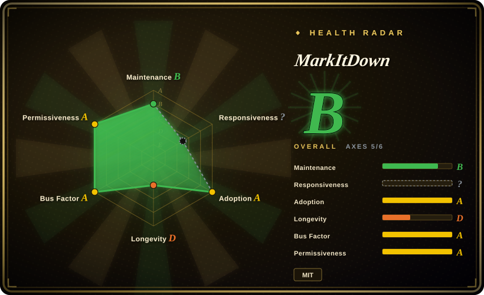

# MarkItDown

A lightweight Python library for converting various files and office documents to Markdown, designed for LLM ingestion and text-analysis pipelines rather than high-fidelity human consumption.

## When to use

You're building a RAG pipeline, a document QA system, or an agent that needs to consume PDFs, Word documents, PowerPoint slides, Excel sheets, images, audio files, and HTML pages as structured text. You pick MarkItDown over [Docling](docling.md) when you want a lightweight, pip-installable library with zero ML model dependencies and a simple `convert()` API, whereas Docling pulls in heavier dependencies for structured layout analysis. You pick it over unstructured.io when you need a local, free, MIT-licensed solution without enterprise licensing tiers or cloud dependencies. You pick it over Marker or LlamaParse when you need breadth across formats — not just PDF, but Office, audio, images, and HTML — in a single library. You install via pip, call `convert()` on a file path, and get back clean Markdown with headings, lists, tables, and links preserved so your LLM can process them without being overwhelmed by binary noise or proprietary formatting.

## When NOT to use

- **If you need high-fidelity document conversion for human reading** — use [Docling](docling.md) or a dedicated PDF-to-Word converter instead of MarkItDown, because MarkItDown flattens complex layouts and optimizes output for LLM consumption, which can make results less presentable for human readers.
- **If you need document editing or round-tripping** — use python-docx, PyMuPDF, or a document manipulation library directly instead of MarkItDown, because MarkItDown is one-way conversion (file → Markdown) and cannot write back to the original format.
- **If you need precise layout, merged cells, and nested table preservation** — use Docling instead of MarkItDown, because Docling models document structure and layout with higher fidelity, whereas MarkItDown simplifies tables and flattens layouts for Markdown output. [未验证]
- **If you process untrusted inputs in a multi-tenant environment** — use a sandboxed conversion service or an LLM parsing API instead of MarkItDown, because MarkItDown performs I/O with the privileges of the current process and can access any resource the process can reach. [未验证]
- **If OCR is your primary use case** — use Tesseract, PaddleOCR, or a dedicated OCR pipeline instead of MarkItDown, because MarkItDown's image OCR is convenience-level and not as mature or configurable as specialized OCR libraries.

## Comparison

| Alternative | In index | Our verdict | Tradeoff |
|---|---|---|---|
| [Docling](docling.md) | ✅ | Rich-document parsing with layout + tables to structured Markdown/JSON. | Docling is heavier with model dependencies and focuses on structured output; MarkItDown is lighter and simpler, built for LLM ingestion. |
| unstructured.io | 未收录 | Enterprise-grade document parsing with chunking and embedding pipelines. | More mature ecosystem and cloud offerings; heavier dependencies and potential licensing costs for enterprise features. |
| LlamaParse | 未收录 | Parsing service from LlamaIndex with a hosted API. | Cloud-based, API-key required, good for complex PDFs; MarkItDown is local, free, and open-source. |
| Marker | 未收录 | Fast PDF-to-Markdown converter optimized for academic papers. | Specializes in PDF and claims high accuracy on research papers; MarkItDown covers more formats (Office, audio, HTML, etc.). |
| PyMuPDF | 未收录 | Low-level Python PDF library for extraction and manipulation. | A library for direct PDF page manipulation, not a high-level Markdown converter; more powerful but requires more code. |
| textract | 未收录 | Python library for extracting text from many formats. | Older project with broader format support but less focus on Markdown structure preservation for LLMs. |

## Tech stack

- **Python** — primary implementation language
- **Modular converter architecture** — separate converters per format (PDF, DOCX, PPTX, XLSX, images, audio, HTML, etc.)
- **Markdown output** — unified target format for all conversions

## Dependencies

- **Python 3.9+** — runtime environment
- **Optional format-specific dependencies** — some converters require additional packages (e.g., for OCR, audio transcription, or advanced PDF parsing)
- **No service or database** — pure library; runs in-process

## Ops difficulty

**Low.** `pip install markitdown` and import. The library is stateless and runs in-process; there is no service to deploy, no database to manage, and no persistent infrastructure. The main operational concern is keeping the Python environment and optional dependencies current, plus the input-sanitization discipline mentioned in the security notes.

## Health & viability
- **Maintenance**: Grade B — 3/13 active weeks in trailing 13; last commit 37 days ago.
- **Responsiveness**: Grade A — median first-response time 37.3 hours across 32 qualifying issues/PRs.
- **Adoption**: Grade A — 10,869,537 monthly downloads via pypi.org (package: markitdown).
- **Longevity**: Grade C — 597 days old.
- **Governance**: Grade A — top-3 contributor share 53.6% (?).
- **Risk / License**: Grade A — MIT license.
## Caveats (unverified)

- [未验证] The Microsoft AutoGen team authorship is stated in the README badge; the exact team structure and long-term maintenance commitment are not publicly documented.
- [未验证] Output quality varies significantly by format and document complexity; the "Markdown is optimized for LLMs" disclaimer means human readability is explicitly a secondary goal.
- [未验证] The security note about I/O privileges and input sanitization should be treated as a real operational concern in multi-tenant or untrusted-input environments.
- [推断] The 162k star count on an 8-month-old project is likely amplified by the Microsoft brand and the 2024–2025 LLM-tooling hype cycle.
- [未验证] Support for audio transcription and image OCR may require additional external dependencies (e.g., Whisper, Tesseract) that are not bundled by default.
