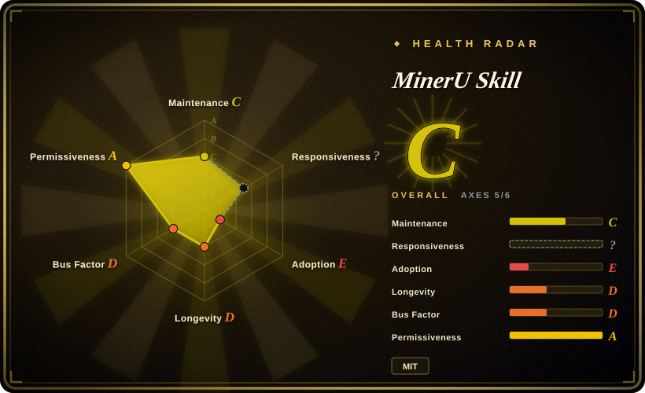

# MinerU Skill

A Python CLI, agent skill, and MCP wrapper around MinerU's cloud APIs, with token-free small-document parsing, token-backed batch/export paths, optional born-digital PDF fallback, and delivery to content tools.

## When to use

You're operating an AI coding agent that needs to turn a PDF, Office file, image, or URL into Markdown during a task, and you want stdout or machine-readable JSON rather than a bespoke API integration. For a small document, the agent can invoke the standard-library-only script against MinerU's token-free Agent API; for larger files, batches, page ranges, or DOCX/HTML/LaTeX exports, you provide `MINERU_TOKEN` and let the CLI route to the Standard API. The same repository can be installed as an agent skill or exposed through a zero-dependency stdio MCP server.

Choose MinerU Skill over a self-hosted parser when zero-install agent ergonomics, automatic API selection, resume, batch orchestration, and direct delivery to note/wiki/chat tools matter more than data locality and control of the parsing engine. Its differentiator is the wrapper and delivery workflow, not a new OCR or layout model; parsed quality follows the MinerU backend.

## When NOT to use

- **Confidential, regulated, or air-gapped scans and Office files must not leave your environment.** Use [Docling](docling.md), [Marker](marker.md), [olmOCR](olmocr.md), or self-hosted MinerU instead; the default cloud engine uploads inputs to MinerU.
- **You cannot accept cloud quotas, file caps, API changes, or service outages.** Use self-hosted MinerU or [Docling](docling.md); repository constants cap the Agent path at 10 MB/20 pages and the Standard path at 200 MB/200 pages.
- **Your corpus is mostly clean born-digital PDF and speed is more important than visual recovery.** Use [PyMuPDF](../pdf-tools/pymupdf.md) or PyMuPDF4LLM directly; MinerU Skill's optional local engine is itself a thin PyMuPDF4LLM path for that case.
- **You need a complete ingestion platform with connectors, partition strategies, enrichment, and schema extraction.** Use [Unstructured](unstructured.md) instead; MinerU Skill adds Markdown chunking and delivery sinks but is not a full document ETL platform.
- **You require first-party MinerU compatibility and release synchronization.** Use the official MinerU API/MCP tooling instead; MinerU Skill is a third-party wrapper and can lag upstream changes.
- **Your normal input exceeds the Standard API limits even after accounting for splitting.** Use self-hosted MinerU, [Marker](marker.md), or [Docling](docling.md); `--split` adds client-side part/merge logic but does not remove the cloud dependency or quota exposure.

## Comparison

| Alternative | In index | Our verdict | Tradeoff |
|---|---|---|---|
| Self-hosted MinerU | not indexed | Pick self-hosted MinerU when privacy, engine-version control, and freedom from cloud file limits justify GPU/model operations; pick MinerU Skill for immediate agent-facing cloud use with no model deployment. | Both can use MinerU parsing quality, but one owns the inference stack while the other owns only client orchestration and delivery. |
| [Docling](docling.md) | ✅ | Pick Docling for local, in-process document parsing and standard RAG integrations; pick MinerU Skill when a thin CLI/MCP, token-free start, and direct content-tool delivery are the deciding factors. | Docling carries local model and package dependencies; MinerU Skill carries network, quota, privacy, and upstream-service risk. |
| [Marker](marker.md) | ✅ | Pick Marker for self-hosted PDF-to-Markdown where local models and hardware are acceptable; pick MinerU Skill when avoiding model installation matters more than keeping files local. | Marker consumes local compute and storage; MinerU Skill consumes cloud API capacity and sends documents across a service boundary. |
| [PyMuPDF](../pdf-tools/pymupdf.md) | ✅ | Pick PyMuPDF for fast deterministic extraction from born-digital PDFs; pick MinerU Skill when scans, tables, formulas, Office formats, batch routing, and agent output ergonomics justify the remote parser. | PyMuPDF is light and local but lower-level; MinerU Skill is broader and easier for agents but less controllable. |
| [Unstructured](unstructured.md) | ✅ | Pick Unstructured for production document ETL and connector-heavy ingestion; pick MinerU Skill for one-command parsing and delivery during agent workflows. | Unstructured has a larger processing platform and operational surface; MinerU Skill is a smaller client whose core quality and availability depend on MinerU. |

## Tech stack

- **Language and packaging:** Python `>=3.8`, packaged as `mineru-skill` with `mineru-parse` and `mineru-mcp` console entries; the core declares no Python runtime dependencies.
- **Cloud backends:** MinerU Agent API at `/api/v1/agent` and Standard API at `/api/v4`, with automatic selection based on token presence, file size, batch mode, requested format, and error escalation.
- **Pipeline:** submit, upload, adaptive polling, streamed download, safe ZIP extraction, atomic Markdown writes, parallel batches, resume, splitting, and merge logic.
- **Agent surfaces:** repository-level `SKILL.md`, packaged skill copy, CLI stdout/JSON, and a stdio JSON-RPC MCP server.
- **Delivery:** sink modules target local note tools and external wiki/chat/task systems, reading each integration's credentials from environment variables.

## Dependencies

- **Core runtime:** Python 3.8+ and network access to MinerU; the main script uses the Python standard library.
- **Credentials:** the Agent API path is documented as token-free; Standard API features require `MINERU_TOKEN`.
- **Optional local/split dependencies:** `pymupdf4llm` for `--engine local`, `pypdf` for oversized-PDF splitting, plus optional packages for WPS and Roam sinks.
- **External integrations:** delivery sinks require the destination service's credentials and network access; local sinks such as Obsidian avoid that external API boundary.
- **No local parsing model by default:** model weights, GPU drivers, and inference servers are operated by MinerU rather than this repository.

## Ops difficulty

**Low for occasional parsing; medium for production automation.** A small document can be tried with one Python script and no installed package or token. Production use must handle cloud data boundaries, API quotas and changing response contracts, token rotation, polling timeouts, partial batch failures, output retention, sink credentials, and cost/latency monitoring. The code includes atomic writes, safe ZIP checks, per-job failure isolation, resume, and environment diagnostics, which reduces client-side failure risk; it cannot remove upstream service risk. The optional local engine lowers the privacy burden only for born-digital PDFs and should not be mistaken for a general offline replacement.

## Health & viability

- **Maintenance, 2026-07:** the repository was not archived, the default branch was pushed on 2026-06-19, and releases v3.0.0 through v3.3.1 were published in rapid succession from 2026-05-30 to 2026-06-02.
- **Governance:** the repository belongs to the Nebutra organization, but GitHub's contributor list showed one primary human contributor plus Dependabot, leaving a high practical bus factor.
- **Age and Lindy:** created in 2026-02, the project has only months of public history. Fast release activity is encouraging, but the age-based prior is weak. [推断]
- **Adoption:** 79 stars and listings/install instructions across agent skill ecosystems show early interest, not yet durable ecosystem proof.
- **Risk flags:** the MIT license was confirmed from the actual file. The dominant risks are third-party API dependence, privacy and retention terms, quota/limit drift, and a wrapper that must track an upstream service it does not control.

## Caveats (unverified)

- [未验证] The live MinerU service was not called in this research pass; repository constants and documentation for 10 MB/20-page, 200 MB/200-page, batch, and daily quota limits may drift from production.
- [未验证] MinerU's current privacy policy, data retention, processing region, compliance posture, pricing, and service-level commitments were not reviewed.
- [未验证] Accuracy and latency benchmark numbers quoted by the README were not independently reproduced or normalized across competing hardware and datasets.
- [未验证] The 17 delivery sinks were not individually exercised for authentication, image fidelity, rate limits, retries, or partial-failure behavior.
- [推断] Organization ownership does not remove the high bus factor visible in the contributor data, and future synchronization with MinerU API changes is not guaranteed.
