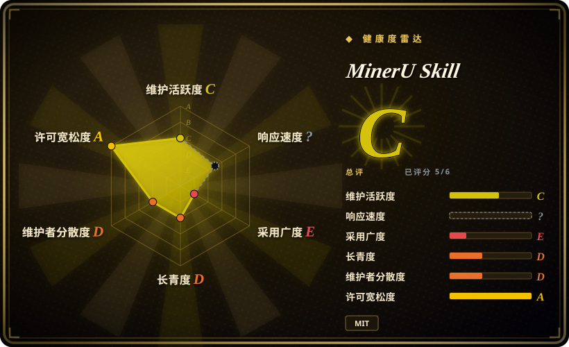

# MinerU Skill

一个围绕 MinerU 云 API 的 Python CLI、agent skill 与 MCP wrapper，支持小文档免 token 解析、带 token 的批处理/额外格式路径、可选 born-digital PDF fallback，以及投递到内容工具。

## 何时使用

你在运行 AI coding agent，任务中需要把 PDF、Office 文件、图片或 URL 转成 Markdown，希望直接拿 stdout 或机器可读 JSON，而不是手写一套 API 集成。小文档可以让 agent 直接用纯标准库脚本调用 MinerU 的免 token Agent API；较大文件、batch、page range 或 DOCX/HTML/LaTeX 导出则提供 `MINERU_TOKEN`，由 CLI 路由到 Standard API。同一仓库还可以安装为 agent skill，或通过零依赖 stdio MCP server 暴露。

如果零安装 agent 体验、自动 API 选择、resume、batch 编排，以及直接投递到笔记/wiki/chat 工具，比数据本地性和解析引擎控制权更重要，选 MinerU Skill 而不是自托管 parser。它的差异点是 wrapper 与投递工作流，不是新的 OCR 或版面模型；解析质量跟随 MinerU backend。

## 何时不用

- **机密、受监管或隔离网环境中的扫描件与 Office 文件不能离开本地。** 请改用 [Docling](docling.zh.md)、[Marker](marker.zh.md)、[olmOCR](olmocr.zh.md) 或自托管 MinerU；默认 cloud engine 会把输入上传到 MinerU。
- **不能接受云端 quota、文件上限、API 变化或服务不可用。** 请改用自托管 MinerU 或 [Docling](docling.zh.md)；仓库常量把 Agent 路径限制为 10 MB/20 页，把 Standard 路径限制为 200 MB/200 页。
- **语料主要是干净的 born-digital PDF，而且速度比视觉恢复更重要。** 请直接用 [PyMuPDF](../pdf-tools/pymupdf.zh.md) 或 PyMuPDF4LLM；MinerU Skill 的可选 local engine 在这个场景本身就是薄 PyMuPDF4LLM 路径。
- **需要完整 ingestion platform，包括 connector、partition strategy、enrichment 和 schema extraction。** 请改用 [Unstructured](unstructured.zh.md)；MinerU Skill 增加了 Markdown chunking 和 delivery sink，但不是完整文档 ETL 平台。
- **要求第一方 MinerU 兼容与 release 同步。** 请使用官方 MinerU API/MCP 工具；MinerU Skill 是第三方 wrapper，可能滞后上游变化。
- **常规输入即使考虑 split 仍超过 Standard API 限制。** 请改用自托管 MinerU、[Marker](marker.zh.md) 或 [Docling](docling.zh.md)；`--split` 只增加客户端分片/合并，不能移除云依赖或 quota 暴露。

## 横向对比

| 替代品 | 是否收录 | 我们的评价 | 取舍 |
|---|---|---|---|
| Self-hosted MinerU | 未收录 | 隐私、引擎版本控制和摆脱云文件上限值得承担 GPU/模型运维时选自托管 MinerU；需要立即给 agent 使用、又不想部署模型时选 MinerU Skill。 | 两者可以使用 MinerU 解析能力，但前者拥有推理栈，后者只拥有客户端编排和投递层。 |
| [Docling](docling.zh.md) | ✅ | 需要本地、进程内文档解析和标准 RAG 集成时选 Docling；薄 CLI/MCP、免 token 起步和直接投递内容工具是决定因素时选 MinerU Skill。 | Docling 承担本地模型和包依赖；MinerU Skill 承担网络、quota、隐私和上游服务风险。 |
| [Marker](marker.zh.md) | ✅ | 需要自托管 PDF 转 Markdown，且能接受本地模型与硬件时选 Marker；不安装模型比文件留在本地更重要时选 MinerU Skill。 | Marker 消耗本地计算与存储；MinerU Skill 消耗云 API 容量，并跨服务边界发送文档。 |
| [PyMuPDF](../pdf-tools/pymupdf.zh.md) | ✅ | born-digital PDF 需要快速确定性抽取时选 PyMuPDF；扫描、表格、公式、Office 格式、batch 路由和 agent 输出体验值得调用远程 parser 时选 MinerU Skill。 | PyMuPDF 轻且本地，但更底层；MinerU Skill 更广、更适合 agent，也更难控制。 |
| [Unstructured](unstructured.zh.md) | ✅ | 生产文档 ETL 和 connector-heavy ingestion 选 Unstructured；agent 工作流中的单命令解析与投递选 MinerU Skill。 | Unstructured 是更大的处理平台，运维表面也更大；MinerU Skill 是更小的 client，但核心质量和可用性依赖 MinerU。 |

## 技术栈

- **语言与打包：** Python `>=3.8`，包名 `mineru-skill`，提供 `mineru-parse` 和 `mineru-mcp` console entry；core 不声明 Python runtime dependency。
- **云 backend：** MinerU Agent API 位于 `/api/v1/agent`，Standard API 位于 `/api/v4`，根据 token、文件大小、batch mode、请求格式和 error escalation 自动选择。
- **处理管线：** submit、upload、自适应 polling、stream download、安全 ZIP 解包、atomic Markdown 写入、并行 batch、resume、split 和 merge。
- **Agent 表面：** 仓库级 `SKILL.md`、打包 skill 副本、CLI stdout/JSON，以及 stdio JSON-RPC MCP server。
- **投递：** sink module 面向本地笔记和外部 wiki/chat/task 系统，每个集成从环境变量读取凭据。

## 依赖

- **Core runtime：** Python 3.8+ 和到 MinerU 的网络；主脚本使用 Python 标准库。
- **凭据：** Agent API 路径按文档不需要 token；Standard API 功能要求 `MINERU_TOKEN`。
- **可选本地/split 依赖：** `--engine local` 使用 `pymupdf4llm`，超大 PDF split 使用 `pypdf`，WPS 和 Roam sink 另有可选包。
- **外部集成：** delivery sink 需要目标服务凭据与网络；Obsidian 等本地 sink 不经过该外部 API 边界。
- **默认没有本地解析模型：** 模型权重、GPU driver 和 inference server 由 MinerU 运维，而不是本仓库。

## 运维难度

**偶发解析为低，生产自动化为中。** 小文档可以只用一个 Python 脚本尝试，不装包也不设 token。生产使用则必须处理云数据边界、API quota 与响应契约变化、token rotation、polling timeout、部分 batch 失败、输出保留、sink credential 和成本/延迟监控。代码包含 atomic write、安全 ZIP 检查、逐 job 失败隔离、resume 和环境诊断，可以降低客户端失败风险，但不能移除上游服务风险。可选 local engine 只降低 born-digital PDF 的隐私负担，不能当作通用离线替代品。

## 健康度与可持续性

- **维护，2026-07：** 仓库未归档，默认分支在 2026-06-19 有 push，v3.0.0 至 v3.3.1 在 2026-05-30 至 2026-06-02 之间快速连续发布。
- **治理：** 仓库属于 Nebutra 组织，但 GitHub contributor 列表只显示一名主要人类贡献者和 Dependabot，实际 bus factor 仍然很高。
- **年龄与 Lindy：** 2026-02 创建，公开历史只有数月。快速 release 活动是正面信号，但年龄先验仍弱。[推断]
- **采用度：** 79 个 star，加上多个 agent skill 生态的 listing/安装说明，代表早期兴趣，还不是持久生态证据。
- **风险标记：** 实读许可证可确认 MIT。主风险是第三方 API 依赖、隐私与保留条款、quota/limit 漂移，以及 wrapper 必须跟随不受自己控制的上游服务。

## 存疑（未验证）

- [未验证] 本次没有调用线上 MinerU 服务；仓库常量和文档中的 10 MB/20 页、200 MB/200 页、batch 与每日 quota 可能和生产规则发生漂移。
- [未验证] 没有审阅 MinerU 当前隐私政策、数据保留、处理地域、合规状态、定价和服务承诺。
- [未验证] README 引用的准确率和延迟 benchmark 没有独立复现，也没有在相同硬件与数据集上归一化。
- [未验证] 17 个 delivery sink 没有逐一运行鉴权、图片保真、rate limit、retry 和部分失败测试。
- [推断] 组织所有权不能消除 contributor 数据显示的高 bus factor，未来与 MinerU API 变化同步也不受保证。
