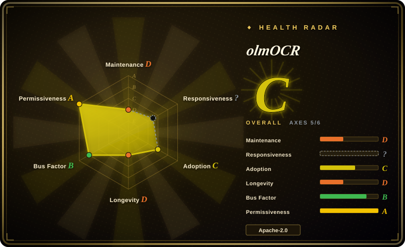

# olmOCR

A toolkit for converting PDFs and other image-based documents into clean, readable Markdown using a 7B parameter VLM — designed for LLM dataset preparation and training, with support for equations, tables, handwriting, and complex layouts.

## When to use

You're a machine learning researcher or data engineer preparing a large-scale corpus of academic papers, technical manuals, and scanned documents for pre-training or fine-tuning an LLM. Your existing pipeline extracts raw text from PDFs but drops equations, garbles tables, loses multi-column reading order, and embeds headers and footers as if they were body text. You need clean, natural-reading Markdown that preserves the semantic structure of equations, tables, and complex layouts without the noise. You choose olmOCR over Docling because its VLM-based approach provides deeper semantic understanding of complex documents than Docling's layout-aware heuristics; you pick it over MarkItDown because MarkItDown handles basic office documents but cannot reconstruct equations, tables, or handwritten content; you prefer it over Marker because Marker specializes in academic papers with rule-based heuristics while olmOCR's VLM covers broader document types. You install olmOCR, point it at a directory of PDFs, and it outputs structured Markdown files with headers and footers removed, equations in LaTeX, and tables reconstructed — ready for tokenization and training. It is purpose-built for dataset construction, not one-off document reading.

## When NOT to use

- **No GPU available.** If you only have CPU-only infrastructure, use [Docling](docling.md) or [MarkItDown](markitdown.md) instead of olmOCR, because olmOCR is based on a 7B parameter VLM and requires a GPU for inference.
- **Cost-sensitive at massive scale.** If you need high-volume batch processing where layout fidelity is not critical, use PyMuPDF or Tesseract instead of olmOCR, because pure rule-based or traditional OCR extraction is still cheaper than VLM inference even though the README claims less than $200 USD per million pages.
- **Simple, clean text PDFs.** If your PDFs are already well-structured digital text with no equations, tables, or multi-column layouts, use [MarkItDown](markitdown.md) or PyMuPDF instead of olmOCR, because lighter tools will be faster and cheaper for basic extraction.
- **Real-time or streaming parsing.** If you need low-latency, on-demand document conversion, use [Docling](docling.md) or [MarkItDown](markitdown.md) instead of olmOCR, because the VLM inference pipeline is designed for batch dataset preparation, not real-time streaming.
- **Proprietary or sensitive documents without audit.** If your documents require strict data residency or no neural model processing, use self-hosted Docling or on-premise Tesseract instead of olmOCR, because sending documents through a VLM pipeline means they are processed by a neural model and you must verify the offline deployment path before use.
- **Document editing or round-tripping.** If you need to edit, modify, or write back to the original PDF format, use Adobe Acrobat or a dedicated PDF editor instead of olmOCR, because this is one-way PDF-to-Markdown conversion with no write-back capability.
- **Layout-perfect reproduction for human publishing.** If you need pixel-perfect or print-quality reproduction of complex visual layouts, use Adobe Acrobat or professional typesetting tools instead of olmOCR, because the output is optimized for machine-readable Markdown (training data, RAG) and may simplify visual layouts.

## Comparison

| Alternative | In index | Our verdict | Tradeoff |
|---|---|---|---|
| [Docling](docling.md) | ✅ | Rich-document parsing with layout + tables to structured Markdown/JSON. | Docling is a layout-aware parser using local models and heuristics; olmOCR is explicitly VLM-based for higher semantic understanding of complex documents. |
| [MarkItDown](markitdown.md) | ✅ | Lightweight Python library converting office documents to Markdown. | MarkItDown is simpler, faster, and cheaper for basic documents; olmOCR handles complex layouts, equations, and handwriting that MarkItDown cannot. |
| Marker | 未收录 | Fast PDF-to-Markdown converter optimized for academic papers. | Marker specializes in academic papers with rule-based heuristics; olmOCR uses a VLM for broader document types but at higher compute cost. |
| LlamaParse | 未收录 | Hosted document parsing API from LlamaIndex. | Cloud-based, API-key required, no GPU needed; olmOCR is self-hosted and open-source but requires GPU infrastructure. |
| Tesseract / OCRmyPDF | 未收录 | Traditional OCR engines for text extraction. | Pure OCR tools extract text but don't understand layout, tables, or reading order; olmOCR's VLM provides semantic understanding. |
| PyMuPDF | 未收录 | Low-level Python PDF library for extraction and manipulation. | A library for direct PDF page manipulation, not a high-level Markdown converter; more powerful but requires more code and does not understand semantics. |

## Tech stack

- **Python** — primary implementation language and scripting interface
- **7B parameter VLM** — olmOCR-2-7B model (based on Qwen2-VL architecture), fine-tuned for document linearization [未验证]
- **PyTorch / transformers** — inference engine for model serving
- **Markdown output pipeline** — unified target format with structural annotations (equations, tables, reading order)

## Dependencies

- **GPU with sufficient VRAM** — 7B VLM inference requires a GPU (the README notes "requires a GPU" without specifying minimum VRAM) [未验证]
- **Python 3.9+** — runtime environment
- **PyTorch and transformers** — deep learning framework dependencies
- **Model weights** — downloadable from HuggingFace (allenai/olmOCR-2-7B-1025-FP8 and related variants) [未验证]
- **No persistent database or service** — batch processing tool; runs as a script or CLI pipeline

## Ops difficulty

**Medium.** Requires GPU setup and model weight management. The inference pipeline is more complex than a pure Python library. Batch processing is straightforward once the model is loaded, but you need to manage GPU memory, model download/caching, and potentially queue documents for throughput. The claimed cost of less than $200 per million pages suggests efficient batching, but achieving that efficiency requires tuning batch size and GPU utilization.

## Health & viability

- **Maintenance:** Active — last push 2026-03-25, v0.4.0 released 2025-10 with a new model release. The Allen Institute for AI (AI2) has a strong track record in open-source ML research. [未验证]
- **Governance:** Organization-owned (`allenai`), a well-known research nonprofit with substantial funding and a history of maintaining open-source projects (OLMo, etc.). [推断]
- **Backing:** AI2 (Allen Institute for AI) — a nonprofit research institute with consistent funding and a strong commitment to open science. [推断]
- **Age & Lindy:** Created 2024-09 (~10 months old as of 2026-07). Young but backed by an established institution. The VLM approach to document parsing is a growing trend, but the project's youth means APIs and model versions may shift. [推断]
- **Adoption:** 18.3k stars is solid for a specialized research tool, indicating genuine interest in the ML dataset-preparation community. [推断]
- **Risk flags:** Apache-2.0 is clean and permissive. The main risk is the model dependency — the quality and availability of the olmOCR-2-7B model weights are tied to AI2's HuggingFace presence. Also, the project is pre-1.0 and the VLM inference cost may not scale for all use cases. The GPU requirement is a hardware barrier that excludes CPU-only environments.

## Caveats (unverified)

- [未验证] The exact GPU VRAM requirements and throughput numbers per GPU are not independently verified here; the README only states "requires a GPU" without specifying VRAM.
- [未验证] The "less than $200 USD per million pages" claim is from the README; actual cost depends on GPU type, region, cloud provider pricing, and batching efficiency.
- [未验证] Support for handwriting, equations, and complex formatting quality varies by document type; the VLM may hallucinate or misinterpret rare or highly stylized layouts.
- [未验证] The olmOCR-2-7B model architecture is described as based on Qwen2-VL in the README; this is unverified here and the specific model weights must be downloaded from HuggingFace.
- [推断] AI2's long-term maintenance commitment to this specific tool versus their broader OLMo ecosystem is plausible but not guaranteed; the project could be deprioritized if it no longer serves strategic research goals.
- [推断] The 18.3k star count on a ~10-month-old project reflects the AI2 brand and the 2024–2025 LLM dataset tooling hype cycle, not just organic adoption.
