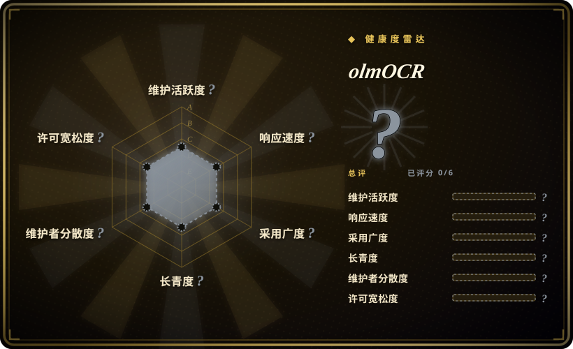

# olmOCR

基于 7B 参数 VLM 的 PDF 与其他图像文档转 Markdown 工具包，专为 LLM 数据集准备与训练设计，支持公式、表格、手写体与复杂版面。

## 何时使用

你是一名机器学习研究员或数据工程师，正在为预训练或微调 LLM 准备大规模语料库，涵盖学术论文、技术手册和扫描文档。现有流水线从 PDF 提取原始文本时，会丢弃公式、搞乱表格、丢失多栏阅读顺序，还把页眉页脚混进正文。你需要干净、自然阅读的 Markdown，保留公式、表格和复杂版面的语义结构，同时去除噪声。你安装 olmOCR，指向一个 PDF 目录，它输出结构化 Markdown 文件——页眉页脚已移除、公式以 LaTeX 保留、表格被重建——可直接用于 tokenization 和训练。它是为数据集构建而设计的，而非一次性文档阅读。

## 何时不用

- **没有 GPU**——olmOCR 基于 7B 参数 VLM，推理需要 GPU。如果你只有纯 CPU 基础设施，则不可用。
- **大规模成本敏感场景**——虽然 README 声称每百万页不到 200 美元，但对于纯规则式或传统 OCR 提取（如 PyMuPDF、Tesseract）已足够的高批量处理，VLM 方案仍更昂贵。[未验证]
- **简单、干净的纯文本 PDF**——如果你的 PDF 已是结构良好的数字文本，不含公式、表格或多栏布局，那么 MarkItDown 或 PyMuPDF 等更轻量的工具会更快、更便宜。
- **实时或流式解析**——VLM 推理流水线并非为低延迟、按需文档转换而设计。它是面向数据集准备的批处理工具。
- **专有或敏感文档未经审计**——将文档送入 VLM 流水线意味着由神经网络模型处理。如果你的文档要求严格的数据驻留或不接受第三方模型处理，请在使用前验证离线自托管部署路径。[未验证]
- **文档编辑或往返转换**——这是单向 PDF 转 Markdown 转换，不编辑、修改或回写原始格式。
- **面向人类出版的版面完美复现**——输出针对机器可读的 Markdown（训练数据、RAG）优化，而非像素级或印刷级复现。复杂视觉版面可能被简化。

## 横向对比

| 替代品 | 是否收录 | 我们的评价 | 取舍 |
|---|---|---|---|
| [Docling](docling.zh.md) | ✅ | 富文档解析，将版面 + 表格解析成结构化 Markdown/JSON。 | Docling 是依赖本地模型与启发式的版面感知解析器；olmOCR 明确基于 VLM，对复杂文档的语义理解更深。 |
| [MarkItDown](markitdown.zh.md) | ✅ | 轻量级 Python 库，将办公文档转为 Markdown。 | MarkItDown 更简单、更快、更便宜，适合基础文档；olmOCR 能处理 MarkItDown 无法应对的复杂版面、公式和手写体。 |
| Marker | 未收录 | 面向学术论文优化的快速 PDF 转 Markdown 工具。 | Marker 专攻学术论文，使用规则式启发式；olmOCR 用 VLM 覆盖更广文档类型，但计算成本更高。 |
| LlamaParse | 未收录 | LlamaIndex 出品的解析服务，托管 API。 | 基于云端，需 API key，无需 GPU；olmOCR 是自托管开源方案，但需要 GPU 基础设施。 |
| Tesseract / OCRmyPDF | 未收录 | 传统 OCR 引擎，用于文本提取。 | 纯 OCR 工具只提取文本，不理解版面、表格或阅读顺序；olmOCR 的 VLM 提供语义理解。 |
| PyMuPDF | 未收录 | 底层 Python PDF 库，用于提取和操控。 | 直接 PDF 页面操控库，非高级 Markdown 转换器；更强大但需要更多代码，且不理解语义。 |

## 技术栈

- **Python**——主要实现语言与脚本接口
- **7B 参数 VLM**——olmOCR-2-7B 模型（基于 Qwen2-VL 架构），针对文档线性化微调 [未验证]
- **PyTorch / transformers**——模型服务的推理引擎
- **Markdown 输出管线**——统一目标格式，带结构注解（公式、表格、阅读顺序）

## 依赖

- **充足显存的 GPU**——7B VLM 推理需要 GPU（README 仅注明 "requires a GPU"，未给出最低显存） [未验证]
- **Python 3.9+**——运行时环境
- **PyTorch 和 transformers**——深度学习框架依赖
- **模型权重**——可从 HuggingFace 下载（allenai/olmOCR-2-7B-1025-FP8 及相关变体） [未验证]
- **无持久数据库或服务**——批处理工具，以脚本或 CLI 流水线运行

## 运维难度

**中。**需要 GPU 配置与模型权重管理。推理流水线比纯 Python 库更复杂。模型加载后批处理较直接，但你需要管理 GPU 内存、模型下载/缓存，并可能需要为吞吐量对文档排队。README 声称每百万页不到 200 美元，暗示批量效率较高，但达到该效率需要调优 batch size 和 GPU 利用率。[未验证]

## 健康度与可持续性

- **维护**：活跃——末次提交 2026-03-25，2025-10 发布 v0.4.0 并带新模型。Allen Institute for AI（AI2）在开源 ML 研究方面有良好记录。[未验证]
- **治理**：机构所有（`allenai`），知名非营利研究机构，资金充足，有维护开源项目的历史（如 OLMo 等）。[推断]
- **背书**：AI2（Allen Institute for AI）——非营利研究机构，资金稳定，对开放科学有坚定承诺。[推断]
- **年龄与 Lindy**：2024-09 创建（截至 2026-07 约 10 个月）。年轻，但有成熟机构背书。VLM 文档解析是增长趋势，但项目尚年轻，API 和模型版本可能变动。[推断]
- **采用度**：18.3k star 对专业研究工具而言表现不错，表明 ML 数据集准备社区确有需求。[推断]
- **风险旗标**：Apache-2.0 干净且宽松。主要风险在于模型依赖——olmOCR-2-7B 模型权重的质量与可用性取决于 AI2 在 HuggingFace 上的持续维护。此外，项目尚未到 1.0，VLM 推理成本可能无法覆盖所有用例。GPU 要求是将 CPU-only 环境排除在外的硬件门槛。

## 存疑（未验证）

- [未验证] 具体 GPU 显存需求与每块 GPU 的吞吐量数据未在此独立验证；README 仅说明 "requires a GPU"，未指定显存。
- [未验证] “每百万页不到 200 美元” 的说法来自 README；实际成本取决于 GPU 型号、区域、云厂商定价和批处理效率。
- [未验证] 对手写体、公式和复杂版面的支持质量因文档类型而异；VLM 可能对罕见或高度风格化版面产生幻觉或误读。
- [未验证] olmOCR-2-7B 模型架构在 README 中被描述为基于 Qwen2-VL；此处未独立验证，具体模型权重需从 HuggingFace 下载。
- [推断] AI2 对该特定工具的长期维护承诺，相对于其更广泛的 OLMo 生态，是合理但无保障的；若不再服务于战略研究目标，项目可能被降级。
- [推断] 18.3k star 在约 10 个月的项目上，反映了 AI2 品牌和 2024–2025 LLM 数据集工具 hype 周期，不只是有机采用。
