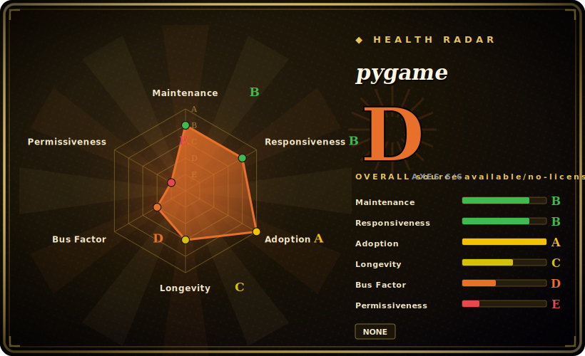

# pygame

A free, cross-platform Python library for writing 2D games and multimedia apps — a Pythonic wrapper over SDL that gives you a display surface, an event loop, image/sound/font loading, and sprite/collision helpers.

## When to use

You're teaching yourself (or a class) to program and you want the payoff of putting pixels on a screen, not just printing to a terminal. You `pip install pygame`, and in a couple dozen lines you have a window, a game loop polling `pygame.event.get()`, a player rectangle you move with the arrow keys, and a sound that plays on collision. There's no engine GUI, no project format, no asset pipeline to learn — it's just Python, and you can read every line of your game. For learning game loops, sprites, collision, and basic graphics/audio, pygame is the canonical low-friction starting point in Python.

You also reach for it when you want a *small* 2D game or interactive multimedia toy and you already think in Python: a game-jam entry, a visualization with keyboard/mouse interaction, a teaching demo, or a prototype. You get blitting to surfaces, image and font loading, mixer-based audio, sprite groups with collision detection, and a clock for frame-rate control — enough to ship a complete small 2D game without leaving the Python ecosystem or adopting a heavyweight engine.

## When NOT to use

- **You're building a 3D game or anything performance-critical.** pygame is a 2D, CPU-blitting library; it has no scene graph, no built-in 3D, and the Python game loop will bottleneck on anything demanding. For 3D or AAA-style work, that's Godot/Unity/Unreal territory.
- **You want an editor, scene system, or asset pipeline.** It's a *library*, not an engine — no visual editor, no scene format, no animation timeline. If you want "open a project and drag entities around," look at Godot.
- **You need a polished, full-featured 2D engine.** For more structure (built-in physics, tilemaps, GUI, deployment to consoles) consider pyglet, Arcade, or a real engine; pygame stays deliberately low-level.
- **You're targeting the web or mobile as a first-class platform.** pygame is desktop-first (Windows/macOS/Linux); web (via pygbag/WASM) and mobile are possible but are not the primary, well-paved path.
- **You're sensitive to the SDL2-vs-SDL3 / pygame-vs-pygame-ce split.** There is a community fork (**pygame-ce**) that ships faster and is what some tutorials now target; verify which one your dependencies and tutorials assume. [未验证]

## Comparison

| Alternative | In index | Our verdict | Tradeoff |
|---|---|---|---|
| pygame-ce (community edition) | 未收录 | Use this page for its stated niche; choose pygame-ce (community edition) when you need a community fork of this same library with a faster release cadence and newer SDL support. | A community fork of this same library with a faster release cadence and newer SDL support; API-compatible enough that the choice is mostly about maintenance velocity and which one your tutorials target. [未验证] |
| pyglet | 未收录 | Use this page for its stated niche; choose pyglet when you need pure-Python, OpenGL-based windowing/multimedia library. | Pure-Python, OpenGL-based windowing/multimedia library; no SDL dependency, supports 3D via OpenGL, but a smaller teaching community than pygame. |
| Arcade | 未收录 | Use this page for its stated niche; choose Arcade when you need modern Python 2D game library built on OpenGL with a cleaner OO API and built-in tilemap/physics hel. | Modern Python 2D game library built on OpenGL with a cleaner OO API and built-in tilemap/physics helpers; younger and smaller ecosystem. |
| Godot | 未收录 | Use this page for its stated niche; choose Godot when you need a full open-source game *engine* (editor, scenes, 2D+3D, GDScript/C#). | A full open-source game *engine* (editor, scenes, 2D+3D, GDScript/C#); vastly more capable but a whole different tool to learn — overkill for "draw a rect and move it." |
| Raylib (+ python bindings) | 未收录 | Use this page for its stated niche; choose Raylib (+ python bindings) when you need simple C game library with bindings for many languages. | Simple C game library with bindings for many languages; very approachable, but a different ecosystem and less Python-tutorial gravity than pygame. |

## Tech stack

- **Core language:** C (the extension modules) wrapping **SDL** for windowing, input, and rendering, with a Python API on top. [推断]
- **Backends/libraries:** SDL plus its companion libs for image (SDL_image), audio mixing (SDL_mixer), and fonts (SDL_ttf/freetype); the repo bundles licenses for FLAC, Ogg/Vorbis, Opus, PNG, JPEG, freetype, portmidi, and more.
- **Distribution:** prebuilt wheels on PyPI for common platforms (so `pip install pygame` needs no compiler in the usual case), plus source builds.
- **API surface:** display/surface blitting, event queue, image/font/mixer modules, `sprite` groups + collision helpers, `time.Clock` for frame pacing.

## Dependencies

- **Runtime:** a CPython interpreter; on most platforms the PyPI wheel bundles the SDL stack so there's no separate system install.
- **System libs (source builds):** SDL2 and its companion dev libraries (image/mixer/ttf) when compiling from source rather than installing a wheel.
- **Build:** a C toolchain + the SDL dev headers to build from source; not needed when a matching wheel exists.

## Ops difficulty

**Low — it's a client-side library, nothing to operate.** For users, `pip install pygame` is the whole setup on supported platforms thanks to wheels; you run your game as a normal Python script. "Difficulty" only shows up at the edges: building from source against the right SDL versions, packaging a game for distribution (PyInstaller and friends), or targeting web/mobile, which are off the well-paved path. There is no server, datastore, or deployment surface.

## Health & viability

- **Maintenance (2026-06).** This repo's last *release* tags are 2.6.1 (2024-09) and 2.6.0 (2024-06), with the repo last pushed 2025-11 — **maintained but with a notably slower release cadence** than its community fork. Not archived. [推断]
- **Governance / bus factor.** Organization-owned (`pygame`) with a multi-person contributor history (illume/René Dudfield, MyreMylar, Starbuck5, ankith26, and the original authors PeterShinners/llindstrom) — a real community, though much of the recent momentum has shifted to the **pygame-ce** fork. [推断]
- **Age & Lindy verdict.** This GitHub repo dates to 2017-03, but **pygame the project is ~25 years old** (early 2000s) and still in use ⇒ **very strong Lindy** — it is one of the most enduring Python game libraries. (Repo age understates true age. [未验证])
- **Adoption.** ~8.8k stars, 4k+ forks, and an enormous install base as the default "learn game programming in Python" library; ubiquitous in tutorials and courses. [未验证]
- **Risk flags.** The **pygame-ce community fork** is the main thing to weigh — it ships faster and many tutorials now target it; a governance/relicense dispute history exists around the project name. Confirm which distribution your code and tutorials depend on. [未验证]

## Caveats (unverified)

- [未验证] License: README states GNU **LGPL v2.1** (file `docs/LGPL.txt`) and explicitly reserves the right to relicense future versions; GitHub's API reported no SPDX id, so LGPL-2.1 is taken from the README/LICENSE file, not the API badge.
- [未验证] ~8.8k stars, 4126 forks, 777 open issues as of 2026-06 — volatile, date-sensitive.
- [未验证] The existence, relationship, and relative momentum of the **pygame-ce** fork (faster cadence, newer SDL) are based on community knowledge; verify the current state of both projects before choosing.
- [未验证] True project age (~25 years, early-2000s origin) far exceeds the GitHub repo's 2017 `created_at`; the Lindy verdict relies on the older origin, which is not asserted from this repo's metadata alone.
- [推断] The SDL/SDL_image/SDL_mixer backend split and bundled dependency licenses are inferred from the repo's `docs/licenses` tree and standard pygame architecture, not a code audit.
- [未验证] Web (pygbag/WASM) and mobile support exist but are not the primary supported path; status changes over time.
