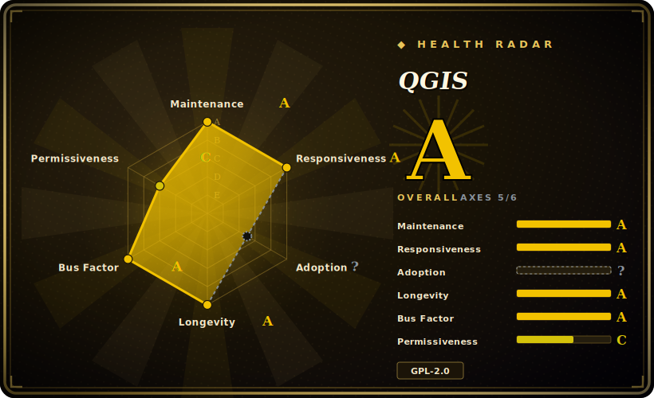

# QGIS

A full-featured, cross-platform desktop GIS for viewing, editing, analyzing, and publishing geospatial data — vector, raster, mesh, and point cloud — built on Qt/C++ with a Python (PyQGIS) plugin ecosystem and a headless server (QGIS Server) for OGC web services.

## When to use

You're an analyst, planner, or researcher who just received a pile of geospatial data — shapefiles, GeoTIFFs, a PostGIS connection, maybe a GeoPackage someone exported — and you need to actually *look at* it, fix the geometry, run a buffer/overlay/zonal-statistics workflow, and produce a print-quality map for a report. You don't want to buy an ArcGIS Pro license, and you don't want to hand-roll the whole thing in a notebook from GeoPandas + matplotlib just to get a legend, scale bar, and atlas of per-feature pages. QGIS gives you a single desktop application: drag the layers in, style them with a deep symbology engine, run any of the 200+ native Processing algorithms (plus ~1000 more wrapped from GDAL, GRASS, SAGA, and OrfeoToolbox), and lay it all out in the print composer.

It also fits when you need to *script and operationalize* GIS work, not just click. The PyQGIS API lets you automate the same Processing toolbox from Python — in the built-in console, as a plugin, or headless via `qgis_process` — and QGIS Server can publish your styled project as WMS/WFS/WCS/OGC-API endpoints, so the cartography you designed interactively becomes a live web service without re-implementing the rendering stack.

## When NOT to use

- **You want a pure-code, reproducible pipeline with no desktop app.** If your workflow is "read geometries, transform, write," a library like GeoPandas/Shapely or raw GDAL/OGR is leaner and CI-friendly; QGIS's GUI and project model are overhead you don't need.
- **You're building a web mapping front-end.** QGIS renders maps, but for an interactive in-browser map you want a JS mapping library (Leaflet, OpenLayers, MapLibre) fed by a tile/feature service — QGIS Server can be the backend, but it is not the client.
- **You need a managed, multi-user enterprise SDI out of the box.** QGIS Server is a renderer/OGC endpoint; a full spatial data infrastructure (catalog, auth, user management, tiling at scale) typically pairs it with GeoServer/MapServer + a catalog and is a real ops project.
- **Headless geoprocessing at scale / serverless.** Spinning up the full QGIS stack (Qt, GUI libs) for batch jobs is heavy; for pure ETL, GDAL CLI or a Python geo-stack in a container is far lighter.
- **You depend on a specific proprietary format or an ArcGIS-only extension.** Some Esri-native formats and toolboxes have only partial or no open equivalents; format coverage comes via GDAL and may lag for niche/proprietary types.
- **You need rock-stable plugin behavior.** The third-party plugin ecosystem is large but uneven in quality and maintenance; a plugin you rely on can break across QGIS releases.

## Comparison

| Alternative | In index | Tradeoff |
|---|---|---|
| GRASS GIS | 未收录 | Deep raster/geospatial-analysis engine and topology model; steeper UI, often used *through* QGIS as a Processing provider rather than standalone. |
| SAGA GIS | 未收录 | Strong terrain/raster analysis library and modules; weaker cartography and general-purpose editing; also wrapped inside QGIS Processing. |
| GDAL/OGR | 未收录 | The underlying I/O + raster/vector translation library QGIS itself depends on; a CLI/library, not a desktop app — choose it for scripted ETL, not interactive mapping. |
| GeoServer | 未收录 | Java OGC server focused on publishing (WMS/WFS/WCS); overlaps QGIS Server on the publishing side but has no desktop authoring/analysis GUI. |
| MapServer | 未收录 | Fast, mature C OGC map server; publishing-only, mapfile-configured; comparable to QGIS Server, not to the desktop. |
| GeoPandas / Shapely | 未收录 | Python-native vector analysis for code-first/reproducible pipelines; no GUI, no cartographic print layout, no raster-first workflow. |
| ArcGIS Pro (Esri) | 未收录 | Proprietary commercial desktop GIS; broader vendor support/ecosystem and licensing cost — the main commercial alternative QGIS substitutes for. |

## Tech stack

- **Language:** C++ (≈78% of the repo), with substantial Python (≈20%) for PyQGIS, plugins, and tooling; some QML, C, GLSL, Yacc/Perl in the build.
- **UI toolkit:** Qt (desktop GUI, rendering, expression/symbology engine).
- **Geospatial core:** GDAL/OGR (vector + raster I/O and translation), PROJ (coordinate reference systems / reprojection), GEOS (geometry operations). [推断] These are the standard QGIS geo-stack dependencies; exact required versions vary by QGIS release.
- **Processing providers:** native QGIS algorithms (200+) plus wrapped GDAL, GRASS, SAGA, and OrfeoToolbox toolboxes.
- **Server:** QGIS Server — headless renderer exposing WMS, WFS, WFS3 / OGC API for Features, and WCS.
- **Scripting:** PyQGIS Python API; built-in Python console; `qgis_process` CLI for headless runs.
- **Build:** CMake.

## Dependencies

- **Runtime / install:** prebuilt installers for Windows, macOS, and Linux (official repos, OSGeo4W on Windows, Flatpak/Conda options); no separate runtime to provision for desktop use beyond the OS.
- **Core libraries bundled/required:** Qt, GDAL/OGR, PROJ, GEOS — pulled in by the installers; building from source requires these plus their dev headers and CMake.
- **Optional data backends:** PostgreSQL/PostGIS, SpatiaLite/SQLite, GeoPackage, and any GDAL-supported format/driver; no database is required for file-based work.
- **Server deployment:** QGIS Server runs behind a web server (e.g. via FCGI/Apache/Nginx) and needs the same geo-stack libraries; this is a separate, heavier deployment than the desktop app.

## Ops difficulty

**Low for the desktop, medium-to-high for the server.** As a desktop application QGIS is install-and-run: the official installers handle the Qt/GDAL/PROJ/GEOS stack, and a single user needs no infrastructure. Friction rises with reproducibility (pinning a QGIS version + plugin set across a team), and with building from source or matching GDAL/PROJ versions on Linux. QGIS Server is a real ops surface — you deploy it behind a web server, manage the same native libraries, and tune it for concurrency — which is closer to running GeoServer/MapServer than to running the desktop.

## Health & viability

- **Maintenance — active (as of 2026-06).** Last push 2026-06; a 4.0.x stable line is shipping (4.0.3 reported 2026-05). Not archived; the high open-issue count (~5.4k) reads as a large, busy tracker for a 15-year desktop application, not as neglect. [推断]
- **Governance & backing — foundation/community, low bus factor.** QGIS is an OSGeo project run by the QGIS.org association with a steering committee, a core-developer team, and sustaining/commercial-support members [推断] — a genuine multi-maintainer, multi-vendor structure rather than one person's repo. The GitHub repo is Organization-owned, consistent with that.
- **Age & Lindy — strong.** Created 2011-05, ~15 years old and *still actively developed* (age × still-active). A long-lived, foundation-backed desktop GIS that keeps shipping LTR releases is about as safe a Lindy bet as open-source GIS offers; the only "fails Lindy" risk here is in third-party plugins, not the core.
- **Adoption & ecosystem.** Widely used in government, academia, and as the open substitute for ArcGIS; large plugin repository and the PyQGIS/Processing ecosystem (GDAL/GRASS/SAGA providers). Plugin quality is uneven and can break across releases — the ecosystem risk, not a core-maintenance one (see When NOT to use).
- **Risk flags — few.** GPL-2.0-or-later, no relicense or open-core history for the core app. The realistic risks are plugin churn and GDAL/PROJ version coupling, both already covered above and in Caveats.

## Caveats (unverified)

- [未验证] Star count ~14.0k as of 2026-06; GitHub stars are unreliable and date-sensitive — treat as indicative only.
- [未验证] Latest release reported as 4.0.3, published 2026-05-29 (per the repo's release metadata); verify the current stable/LTR line before standardizing on a version.
- [未验证] Algorithm/provider counts ("200+ native", "~1000 via GDAL/SAGA/GRASS/OrfeoToolbox") and "1000+ plugins" come from QGIS project messaging and shift over time; confirm against the current build for any specific algorithm or plugin.
- [推断] GDAL, PROJ, and GEOS are the standard underlying geo libraries, but the exact minimum/required versions are release-specific and were not pinned here — check the build docs for the version you target.
- [未验证] Format and CRS coverage is inherited from GDAL/PROJ; support for any specific proprietary or niche format depends on the installed GDAL driver set and may differ across installers.
