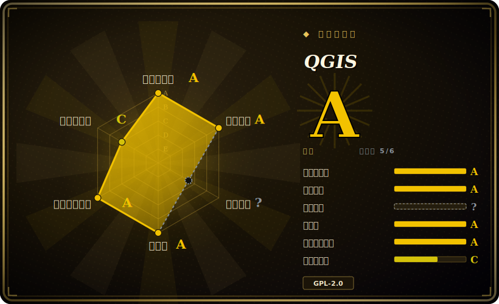

# QGIS

一款功能完整、跨平台的桌面 GIS，用于浏览、编辑、分析和发布地理空间数据（矢量、栅格、网格、点云）。基于 Qt/C++ 构建，带有 Python（PyQGIS）插件生态，以及用于 OGC 网络服务的无界面服务端（QGIS Server）。

## 何时使用

你是一名分析师、规划人员或研究者，刚拿到一堆地理空间数据——shapefile、GeoTIFF、一个 PostGIS 连接，也许还有别人导出的 GeoPackage——你需要真正把它们**看一眼**、修正几何错误、跑一套缓冲区/叠加/分区统计的处理流程，并产出一张能放进报告的印刷级地图。你不想买 ArcGIS Pro 授权，也不想为了一个图例、比例尺和按要素分页的地图册，就在 notebook 里用 GeoPandas + matplotlib 从零拼一整套出图逻辑。QGIS 给你一个统一的桌面应用：把图层拖进来，用强大的符号化引擎做样式，跑 200 多个原生 Processing 算法（再加上从 GDAL、GRASS、SAGA、OrfeoToolbox 封装来的约 1000 个），然后在打印排版器里把它排成版。

当你需要**脚本化、工程化**地做 GIS 工作而不只是点击操作时，它同样合适。PyQGIS API 让你能用 Python 自动化同一套 Processing 工具箱——在内置控制台里、作为插件、或通过 `qgis_process` 无界面运行。而 QGIS Server 能把你做好样式的工程发布成 WMS/WFS/WCS/OGC-API 端点，于是你交互式设计的地图制图无需重写渲染栈就变成在线服务。

## 何时不用

- **你想要纯代码、可复现、不要桌面应用的流水线。** 如果你的工作流是「读几何、变换、写出」，那么 GeoPandas/Shapely 或裸 GDAL/OGR 这类库更精简、更适合 CI；QGIS 的 GUI 和工程模型在这里是多余的开销。
- **你要做的是 Web 地图前端。** QGIS 渲染地图，但要做浏览器里的交互式地图，你需要的是 JS 地图库（Leaflet、OpenLayers、MapLibre）+ 瓦片/要素服务——QGIS Server 可以做后端，但它不是客户端。
- **你需要开箱即用的托管式多用户企业级 SDI。** QGIS Server 是渲染器 / OGC 端点；一套完整的空间数据基础设施（目录、鉴权、用户管理、大规模切片）通常要把它和 GeoServer/MapServer + 目录服务搭配，本身就是个真正的运维工程。
- **大规模无界面地理处理 / serverless。** 为批处理拉起整个 QGIS 栈（Qt、GUI 库）很重；纯 ETL 用 GDAL CLI 或容器里的 Python 地理栈要轻得多。
- **你依赖某个专有格式或仅 ArcGIS 才有的扩展。** 部分 Esri 原生格式和工具箱只有部分开源等价物，甚至没有；格式支持来自 GDAL，对小众/专有类型可能滞后。
- **你需要插件行为绝对稳定。** 第三方插件生态庞大但质量与维护参差不齐；你依赖的某个插件可能在 QGIS 版本升级时失效。

## 横向对比

| 替代品 | 是否收录 | 我们的评价 | 取舍 |
|---|---|---|---|
| GRASS GIS | 未收录 | 当前页用于它的主场景；如果更看重“强大的栅格/地理分析引擎和拓扑模型”，再选 GRASS GIS。 | 强大的栅格/地理分析引擎和拓扑模型；UI 更陡峭，常作为 Processing provider 在 QGIS 里**被调用**而非独立使用。 |
| SAGA GIS | 未收录 | 当前页用于它的主场景；如果更看重“地形/栅格分析库和模块很强”，再选 SAGA GIS。 | 地形/栅格分析库和模块很强；制图与通用编辑较弱；同样被封装进 QGIS Processing。 |
| GDAL/OGR | 未收录 | 当前页用于它的主场景；如果更看重“QGIS 自身依赖的底层 I/O + 栅格/矢量转换库”，再选 GDAL/OGR。 | QGIS 自身依赖的底层 I/O + 栅格/矢量转换库；是 CLI/库而非桌面应用——脚本化 ETL 选它，交互式制图不选它。 |
| GeoServer | 未收录 | 当前页用于它的主场景；如果更看重“面向发布的 Java OGC 服务端（WMS/WFS/WCS）”，再选 GeoServer。 | 面向发布的 Java OGC 服务端（WMS/WFS/WCS）；在发布侧与 QGIS Server 重叠，但没有桌面端的制作/分析 GUI。 |
| MapServer | 未收录 | 当前页用于它的主场景；如果更看重“快速、成熟的 C 语言 OGC 地图服务端”，再选 MapServer。 | 快速、成熟的 C 语言 OGC 地图服务端；仅做发布、用 mapfile 配置；对标 QGIS Server，而非桌面端。 |
| GeoPandas / Shapely | 未收录 | 当前页用于它的主场景；如果更看重“面向代码优先/可复现流水线的 Python 原生矢量分析”，再选 GeoPandas / Shapely。 | 面向代码优先/可复现流水线的 Python 原生矢量分析；没有 GUI、没有制图打印排版、不以栅格为先。 |
| ArcGIS Pro (Esri) | 未收录 | 当前页用于它的主场景；如果更看重“专有商业桌面 GIS”，再选 ArcGIS Pro (Esri)。 | 专有商业桌面 GIS；厂商支持/生态更广但有授权成本——QGIS 主要替代的就是这个商业方案。 |

## 技术栈

- **语言：** C++（约占仓库 78%），加上大量 Python（约 20%）用于 PyQGIS、插件和工具链；构建中还有少量 QML、C、GLSL、Yacc/Perl。
- **UI 工具包：** Qt（桌面 GUI、渲染、表达式/符号化引擎）。
- **地理核心：** GDAL/OGR（矢量 + 栅格 I/O 与转换）、PROJ（坐标参考系 / 重投影）、GEOS（几何运算）。[推断] 这些是 QGIS 标准的地理栈依赖；确切所需版本随 QGIS 发行版而变。
- **Processing provider：** QGIS 原生算法（200+），加上封装的 GDAL、GRASS、SAGA、OrfeoToolbox 工具箱。
- **服务端：** QGIS Server——无界面渲染器，暴露 WMS、WFS、WFS3 / OGC API for Features 和 WCS。
- **脚本：** PyQGIS Python API；内置 Python 控制台；用于无界面运行的 `qgis_process` CLI。
- **构建：** CMake。

## 依赖

- **运行 / 安装：** 提供 Windows、macOS、Linux 的预编译安装包（官方源、Windows 上的 OSGeo4W、Flatpak/Conda 等）；桌面使用除操作系统外无需另行准备运行时。
- **核心库（捆绑/必需）：** Qt、GDAL/OGR、PROJ、GEOS——由安装包带入；从源码构建则还需要它们的 dev 头文件和 CMake。
- **可选数据后端：** PostgreSQL/PostGIS、SpatiaLite/SQLite、GeoPackage，以及任意 GDAL 支持的格式/驱动；基于文件的工作不需要数据库。
- **服务端部署：** QGIS Server 跑在 Web 服务器之后（如经 FCGI/Apache/Nginx），需要同一套地理栈库；这是比桌面应用更重、相互独立的一套部署。

## 运维难度

**桌面端低，服务端中到高。** 作为桌面应用，QGIS 是装好即用：官方安装包搞定 Qt/GDAL/PROJ/GEOS 栈，单用户无需任何基础设施。当涉及可复现性（在团队里固定 QGIS 版本 + 插件集）、从源码构建、或在 Linux 上对齐 GDAL/PROJ 版本时，摩擦上升。QGIS Server 则是一块真正的运维面——你要把它部署在 Web 服务器之后、管理同一套原生库、并为并发做调优——这更接近运行 GeoServer/MapServer，而非运行桌面端。

## 健康度与可持续性

- **维护——活跃（截至 2026-06）。** 最近一次推送在 2026-06；正在发布 4.0.x 稳定线（据称 4.0.3 发布于 2026-05）。未归档；约 5.4k 的高未决 issue 数，对一个 15 年的桌面应用而言读作一个庞大、繁忙的 tracker，而非疏于维护。[推断]
- **治理与背书——基金会/社区，bus factor 低。** QGIS 是 OSGeo 旗下项目，由 QGIS.org 协会运作，设有指导委员会、核心开发者团队以及赞助/商业支持成员 [推断]——这是真正的多维护者、多厂商结构，而非某一个人的仓库。GitHub 仓库由 Organization 持有，与此一致。
- **年龄与 Lindy——强。** 创建于 2011-05，约 15 年历史，且*仍在活跃开发*（年龄 × 仍活跃）。一个长寿、有基金会背书、持续发布 LTR 版本的桌面 GIS，几乎是开源 GIS 里最稳的 Lindy 选择；这里唯一「不符合 Lindy」的风险在第三方插件，而非内核。
- **采用与生态。** 在政府、学术界被广泛使用，也是 ArcGIS 的开源替代；插件仓库庞大，PyQGIS/Processing 生态（GDAL/GRASS/SAGA provider）成熟。插件质量参差，可能在版本升级时失效——这是生态风险，而非内核维护风险（见「何时不用」）。
- **风险标记——少。** GPL-2.0-or-later，内核应用没有重新授权或 open-core 历史。现实风险是插件 churn 与 GDAL/PROJ 版本耦合，两者前文与存疑账本均已覆盖。

## 存疑（未验证）

- [未验证] Star 数约 14.0k（截至 2026-06）；GitHub star 不可靠且时效敏感，仅作参考。
- [未验证] 最新版本据称为 4.0.3，发布于 2026-05-29（来自仓库 release 元数据）；在以某版本为标准前请核对当前稳定版/LTR 线。
- [未验证] 算法/provider 数量（「200+ 原生」「经 GDAL/SAGA/GRASS/OrfeoToolbox 约 1000 个」）以及「1000+ 插件」均来自 QGIS 项目宣传口径并随时间变化；针对某个具体算法或插件请对照当前构建确认。
- [推断] GDAL、PROJ、GEOS 是标准底层地理库，但确切的最低/必需版本随发行版而定，此处未做版本固定——请查目标版本的构建文档。
- [未验证] 格式与 CRS 覆盖继承自 GDAL/PROJ；对任何特定专有或小众格式的支持取决于已安装的 GDAL 驱动集，且在不同安装包之间可能不同。
