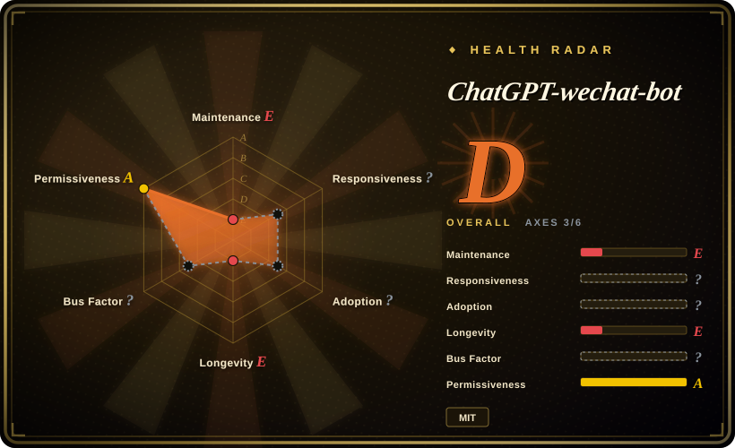

# ChatGPT-wechat-bot

A compact TypeScript demo that connects a personal WeChat account to ChatGPT through Wechaty; useful as 2022–2023 reference code, but its default branch has not changed since 2023-07 and should not anchor a current production bot.

## When to use

You're maintaining an old Wechaty/ChatGPT experiment or studying how the early wave of WeChat LLM bots worked. You want a small codebase that shows QR login, group mentions, private-message triggers, a reset keyword, and per-contact ChatGPT continuation metadata without first learning a full bot platform.

Choose ChatGPT-wechat-bot over a larger control plane such as OpeniLink Hub only for code archaeology or a disposable, isolated proof of concept. Choose raw Wechaty when you intend to modernize the model client, session storage, protocol adapter, and error handling yourself; the repository's ready-made integration is now the liability, not the deciding benefit.

## When NOT to use

- **You need a maintained production assistant.** Use [WeChat Bot](wechat-bot.md), AstrBot, or a new Wechaty application instead; this repository's default branch last changed on 2023-07-04, has no releases, and still hard-codes `gpt-3.5-turbo`.
- **You need a Tencent-supported messaging surface.** Use WeCom or WeChat Official Account/Mini Program APIs instead; this app logs a personal account in through the unofficial `wechaty-puppet-wechat` Web/UOS path.
- **Your API key cannot pass through an unknown intermediary.** Call the official OpenAI endpoint directly or operate a proxy you control; the checked-in default `reverseProxyUrl` points to `ai.devtool.tech`, and the client code warns that a reverse proxy receives the OpenAI API key.
- **Several contacts need independent, durable conversation state.** Use a current framework with a per-user Redis or database session store instead; each successful reply replaces the entire in-memory `chatOption` object with only the latest contact, so another contact's continuation metadata is discarded.
- **You cannot risk a personal WeChat account or depend on browser automation.** Move the workflow to WeCom, Lark, Telegram Bot API, or another official bot channel; the Wechaty puppet brings Chromium, login fragility, and platform-enforcement exposure that application code cannot control.
- **You need current model controls, tool calling, moderation, or observability.** Use an actively maintained bot framework or a small service built on a current provider SDK; this project exposes a fixed early ChatGPT request path, console logging, and narrow timeout handling.

## Comparison

| Alternative | In index | Our verdict | Tradeoff |
|---|---|---|---|
| [WeChat Bot](wechat-bot.md) | ✅ | For a currently maintained, multi-channel CLI with several model backends, choose WeChat Bot; keep ChatGPT-wechat-bot only when the small historical example is itself the artifact you need. | WeChat Bot has a much wider dependency and privacy surface, but it has current provider and channel work; ChatGPT-wechat-bot is easier to read and much harder to justify running. |
| [OpeniLink Hub](openilink-hub.md) | ✅ | When you need multi-bot management, message tracing, App distribution, and persistent storage, choose OpeniLink Hub; choose ChatGPT-wechat-bot only for a throwaway single-process demonstration. | OpeniLink Hub adds a database, web control plane, auth, and registry trust boundary; ChatGPT-wechat-bot has fewer moving parts but is stale and tied to an old personal-WeChat puppet. |
| Wechaty | not indexed | When you are building a new personal-account bot and accept unofficial puppet risk, choose Wechaty directly so you can select current adapters and state management; do not inherit this stale wrapper for convenience. | Wechaty requires you to build the model and application layer, but avoids this project's frozen model choice, proxy default, and context-state bug. |
| WeCom / Official WeChat APIs | not indexed | When account safety, vendor support, and a production contract matter, choose an official Tencent API; use ChatGPT-wechat-bot only when personal-account behavior is worth an unsupported experiment. | Official APIs expose different enterprise or public-account surfaces and cannot reproduce arbitrary personal-account automation, but they remove the unofficial Web-puppet dependency. |

## Tech stack

- **Runtime:** Node.js 16.8+ with TypeScript 4.9, ESM, and `ts-node`; the app runs source files directly in development mode.
- **WeChat adapter:** Wechaty 1.20.2 with `wechaty-puppet-wechat` 1.18.4 in UOS mode, plus Puppeteer/Chromium through the puppet dependency tree.
- **Model client:** `@waylaidwanderer/chatgpt-api` 1.33.1 with `gpt-3.5-turbo`, temperature `0`, and an optional completions reverse proxy.
- **Interaction surface:** terminal QR rendering, group `@mention` matching, private trigger keywords, and a reset command.
- **State:** the model library defaults to an in-memory conversation cache; the app separately keeps continuation IDs in a process-local JavaScript object.

## Dependencies

- Node.js 16.8 or newer, npm or pnpm, and a working TypeScript/ESM dependency installation.
- A personal WeChat account that can complete QR login through the selected Wechaty puppet, plus Chromium and its system libraries.
- An OpenAI API key and network access to either the official API or the configured reverse proxy.
- Source-level configuration in `src/config.ts`; secrets are not loaded from an environment file by the application itself.
- No database or external state store is included, so restarts lose conversation-continuation state and multi-instance operation has no coordination mechanism.

## Ops difficulty

**Low for reading, high for operating in 2026.** The repository is small and the nominal start path is only dependency installation plus `npm run dev`. Real operation depends on an old browser-based WeChat puppet, Chromium libraries, a personal-account QR session, a model endpoint, a source-embedded API key, and process memory for context. The package's `test` script points to an absent `src/auth.ts`, so there is no working regression gate to support dependency upgrades. A production fork would need enough replacement work that starting from current Wechaty or an official channel is usually the smaller risk.

## Health & viability

- **Maintenance, as of 2026-07:** the default branch head is dated 2023-07-04. GitHub's later repository `pushed_at` value does not change the fact that the shipped default-branch code has been stale for roughly three years.
- **Release and test discipline:** the repository has no GitHub releases, and its configured test entry references a file absent from the reviewed tree. Dependency modernization therefore has no visible automated safety net.
- **Governance:** the repository belongs to an individual account, and GitHub contributor counts are dominated by the owner. There is no foundation, vendor commitment, or published governance model to offset the maintenance gap.
- **Age and Lindy:** the project dates to late 2022, but age without continued maintenance is not a positive durability signal. Its 4.7k stars record historical interest rather than current operational fitness.
- **Selection verdict:** treat it as a readable artifact from the first ChatGPT bot wave. The stale branch, old model, license metadata conflict, third-party proxy default, context overwrite, and unofficial puppet jointly block a production recommendation.

## Caveats (unverified)

- [未验证] No live 2026 login test was performed against current personal WeChat behavior, so current QR-login success and session lifetime are unknown.
- [未验证] No measured account-warning or ban rate is published for the bundled Web/UOS puppet path.
- [未验证] The current ownership, retention policy, and availability of the default `ai.devtool.tech` reverse proxy were not established; the verified risk is that the configured proxy can receive the API key.
- [推断] The old dependency set may contain additional compatibility or security problems; no vulnerability scan or full transitive-dependency audit was performed.
- [推断] MIT is used in frontmatter because the repository `LICENSE` file is MIT, while `package.json` and the README badge say ISC. Redistributors should resolve that contradiction with upstream rather than assuming both declarations are interchangeable.
