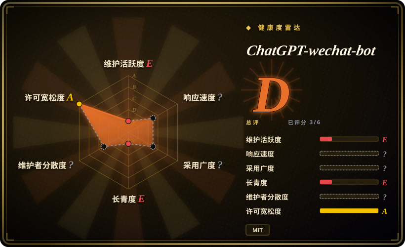

# ChatGPT-wechat-bot

一个通过 Wechaty 把个人微信号接到 ChatGPT 的小型 TypeScript 示例；适合阅读 2022 至 2023 年的实现思路，但默认分支自 2023-07 后未再更新，不应作为当前生产机器人的基础。

## 何时使用

你在维护旧的 Wechaty／ChatGPT 实验，或想研究早期微信 LLM 机器人的实现方式。你需要一个小代码库，快速看懂扫码登录、群聊提及、私聊触发词、重置关键词，以及按联系人保存 ChatGPT continuation metadata 的基本链路，而不是先学习完整机器人平台。

只有在代码考古或隔离的一次性概念验证里，才应舍弃 OpeniLink Hub 这类完整控制面而选择 ChatGPT-wechat-bot。如果准备真正更新模型客户端、会话存储、协议 adapter 和错误处理，直接从 Wechaty 开始更合适；这个仓库现成的集成已经从优势变成了负担。

## 何时不用

- **你需要仍在维护的生产助手。** 改用 [WeChat Bot](wechat-bot.zh.md)、AstrBot，或基于当前 Wechaty 新建应用；本仓库默认分支最后更新于 2023-07-04，没有 release，并且仍硬编码 `gpt-3.5-turbo`。
- **你需要腾讯支持的消息入口。** 改用企业微信、微信公众号或小程序 API；本应用通过非官方 `wechaty-puppet-wechat` Web/UOS 路径登录个人账号。
- **API key 不能经过未知中间方。** 直接调用 OpenAI 官方 endpoint，或运行自己控制的 proxy；代码中默认 `reverseProxyUrl` 指向 `ai.devtool.tech`，model client 也明确警告 reverse proxy 会接触 OpenAI API key。
- **多个联系人需要互相独立且持久的上下文。** 改用带逐用户 Redis 或数据库 session store 的当前框架；每次成功回复都会把整个内存 `chatOption` 对象替换为最新联系人一项，其他联系人的 continuation metadata 会被丢弃。
- **你不能承担个人微信号或浏览器自动化风险。** 把流程迁到企业微信、飞书、Telegram Bot API 或其他官方 bot 通道；Wechaty puppet 引入 Chromium、登录脆弱性和平台处置风险，应用代码无法控制这些外部条件。
- **你需要当前模型参数、tool calling、内容治理或可观测性。** 改用活跃维护的 bot framework，或基于当前 provider SDK 写一个小服务；本项目只有固定的早期 ChatGPT 请求路径、console logging 和很窄的 timeout 处理。

## 横向对比

| 替代品 | 是否收录 | 我们的评价 | 取舍 |
|---|---|---|---|
| [WeChat Bot](wechat-bot.zh.md) | 已收录 | 如果要仍在维护的多通道 CLI 和多个模型后端，选 WeChat Bot；只有当小型历史示例本身就是研究对象时，才保留 ChatGPT-wechat-bot。 | WeChat Bot 的依赖面与隐私面更大，但仍有当前 provider 和通道工作；ChatGPT-wechat-bot 更容易读，却很难再证明运行价值。 |
| [OpeniLink Hub](openilink-hub.zh.md) | 已收录 | 如果需要多 Bot 管理、消息追踪、App 分发与持久化存储，选 OpeniLink Hub；只有一次性单进程演示才选 ChatGPT-wechat-bot。 | OpeniLink Hub 增加数据库、Web 控制面、认证和 Registry 信任边界；ChatGPT-wechat-bot 组件更少，但已经停更，并绑定旧个人微信 puppet。 |
| Wechaty | 未收录 | 如果正在新建个人号机器人，并接受非官方 puppet 风险，直接选 Wechaty，以便自行选择当前 adapter 和状态管理；不要为了省事继承这个停更 wrapper。 | Wechaty 要求自己完成模型与应用层，但能避开本项目冻结的模型选择、proxy 默认值和上下文状态缺陷。 |
| 企业微信／微信官方 API | 未收录 | 如果账号安全、厂商支持与生产契约更重要，选腾讯官方 API；只有个人号行为值得一次不受支持的实验时，才使用 ChatGPT-wechat-bot。 | 官方 API 面向企业或公众账号，无法复刻任意个人号自动化，但能移除非官方 Web puppet 依赖。 |

## 技术栈

- **运行时：** Node.js 16.8+、TypeScript 4.9、ESM 与 `ts-node`；开发模式直接运行源文件。
- **微信 adapter：** Wechaty 1.20.2，加 UOS 模式的 `wechaty-puppet-wechat` 1.18.4，并通过 puppet 依赖树使用 Puppeteer／Chromium。
- **模型客户端：** `@waylaidwanderer/chatgpt-api` 1.33.1，模型固定为 `gpt-3.5-turbo`，temperature 为 `0`，并支持 completions reverse proxy。
- **交互面：** 终端二维码、群聊 `@mention` 匹配、私聊触发词和 reset 命令。
- **状态：** 模型库默认使用内存 conversation cache；应用另外在进程内 JavaScript 对象里保存 continuation ID。

## 依赖

- Node.js 16.8 或更新版本、npm 或 pnpm，以及可用的 TypeScript／ESM 依赖安装。
- 一个能够通过所选 Wechaty puppet 扫码登录的个人微信号，以及 Chromium 和对应系统库。
- OpenAI API key，并能访问官方 API 或配置的 reverse proxy。
- 在 `src/config.ts` 里直接配置；应用本身没有从环境文件加载 secret。
- 项目不包含数据库或外部状态存储，因此重启会丢失 conversation continuation state，多实例之间也没有协调机制。

## 运维难度

**阅读难度低，2026 年运行难度高。** 仓库很小，名义启动路径只有安装依赖和执行 `npm run dev`。实际运行却依赖旧浏览器式微信 puppet、Chromium 系统库、个人号二维码 session、模型 endpoint、写在源码配置里的 API key，以及进程内上下文。`package.json` 的 `test` 脚本还指向仓库里不存在的 `src/auth.ts`，无法为依赖升级提供有效回归闸门。生产分叉需要替换的部分已经多到通常不如从当前 Wechaty 或官方通道重新开始。

## 健康度与可持续性

- **维护，截至 2026-07：** 默认分支 head 日期为 2023-07-04。GitHub 更晚的仓库 `pushed_at` 不能改变默认分支代码已经停更约三年的事实。
- **发布与测试纪律：** 仓库没有 GitHub release，配置的 test entry 又引用实读文件树中不存在的文件，因此依赖现代化没有可见的自动化安全网。
- **治理：** 仓库属于个人账号，GitHub contributor 计数也由 owner 主导。没有基金会、厂商承诺或公开治理模型来抵消维护空档。
- **年龄与 Lindy：** 项目始于 2022 年末，但只有年龄、没有持续维护，并不构成正向耐久信号。4.7k star 记录的是历史关注度，不是当前运转能力。
- **选型结论：** 把它当作第一波 ChatGPT bot 的可读样本。停更分支、旧模型、license metadata 冲突、第三方 proxy 默认值、上下文覆盖和非官方 puppet 共同阻断生产推荐。

## 存疑（未验证）

- [未验证] 本次没有用当前个人微信环境做 2026 年登录实测，因此二维码登录成功率与 session 寿命未知。
- [未验证] 项目没有公布所捆绑 Web/UOS puppet 路径的账号提示率或封禁率。
- [未验证] 本次没有确认默认 `ai.devtool.tech` reverse proxy 当前的所有者、保留政策与可用性；已经确认的风险是配置的 proxy 可以接触 API key。
- [推断] 旧依赖集合可能还有其他兼容性或安全问题；本次没有执行漏洞扫描或完整传递依赖审计。
- [推断] Frontmatter 采用 MIT，因为仓库 `LICENSE` 文件是 MIT，但 `package.json` 与 README badge 写的是 ISC。再分发者应让上游澄清冲突，不应假定两份声明可以互换。
