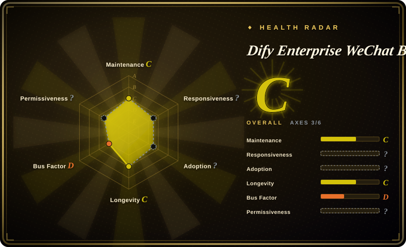

# Dify Enterprise WeChat Bot

A stale Windows application that binds a fixed Enterprise WeChat desktop-client version to the Dify API through a closed `dify_helper.exe`, with unfinished Workflow support and a custom license.

## When to use

You're maintaining a Windows-only internal prototype whose Enterprise WeChat client can remain pinned to the project's documented version. Your organization already has a Dify application, the basic Dify API path is sufficient, and you can isolate the bot on a test account and dedicated machine while accepting the closed `dify_helper.exe` as part of the trust boundary.

You choose this project over a Wechaty framework or an official WeCom API workflow only when reproducing its exact desktop-client integration is more important than cross-platform operation, source auditability, client upgrades, or completed Dify Workflow support. It is a compatibility-bound application for a narrow legacy-style setup, not a general Enterprise WeChat integration layer.

## When NOT to use

- **You need a Tencent-supported production integration that survives desktop-client upgrades.** Use [n8n](../workflow-orchestration/n8n.md) or a small service against the official WeCom API instead; this project depends on Windows and a fixed Enterprise WeChat client version.
- **Every executable in the message path must be source-reviewable.** Evaluate Dify-on-WeChat instead; this project's `dify_helper.exe` is closed, so the repository cannot provide a complete implementation audit.
- **You need completed Dify Workflow support.** Use [Dify](../agent-frameworks/workflow-builders/dify.md) behind an official WeCom adapter, or orchestrate the API call with n8n; this repository marks its Workflow path as unfinished.
- **You need macOS, Linux, containers, or a reusable bot framework.** Use Wechaty instead; this project is coupled to a Windows desktop client and helper executable.
- **Your redistribution or commercial-use policy requires a standard, clearly scoped open-source license.** Choose Dify-on-WeChat or Wechaty only after confirming their current licenses; this repository uses a custom license and GitHub reports `NOASSERTION`.
- **The repository itself must be free of environment, database, CSV, and log artifacts before entering your supply chain.** Use a minimal official WeCom adapter around Dify or an n8n workflow; this repository requires an explicit sensitive-file review before cloning it into a trusted build context.

## Comparison

| Alternative | In index | Our verdict | Tradeoff |
|---|---|---|---|
| Dify-on-WeChat | not indexed | For a Dify-to-WeChat bridge where source inspection matters, evaluate Dify-on-WeChat first; choose this project only when its exact Windows Enterprise WeChat helper workflow is required. | Dify-on-WeChat has a different channel and deployment surface that still needs platform-risk review; this project is more specific to the desktop client but includes a closed helper. |
| Wechaty | not indexed | For a reusable, cross-platform messaging-bot framework, choose Wechaty; choose this project only for its pinned Windows Enterprise WeChat and Dify integration. | Wechaty requires you to build the Dify adapter and manage its puppet risks, while this app provides a narrower ready-made flow tied to a fixed client version. |
| [n8n](../workflow-orchestration/n8n.md) | ✅ | For an auditable workflow around official WeCom events and Dify API calls, choose n8n; choose this project only when desktop-client automation is an unavoidable compatibility requirement. | n8n adds a workflow service and explicit adapter work but avoids dependence on a closed desktop helper; this project starts narrower and inherits client-version fragility. |
| [Dify](../agent-frameworks/workflow-builders/dify.md) | ✅ | For the maintained AI application and Workflow backend, choose Dify and connect it through a supported messaging adapter; choose this project only as a Windows-specific client bridge. | Dify is the backend rather than an Enterprise WeChat bot, so integration work remains; this repository supplies that bridge but leaves Workflow incomplete and adds binary trust. |

## Tech stack

- **Implementation language:** `Unknown`; the repository does not expose enough of the current application implementation to assign a reliable primary source language.
- **Desktop integration:** Windows plus a fixed Enterprise WeChat desktop-client version.
- **Closed component:** `dify_helper.exe` participates in the integration but is not auditable from source in the repository.
- **AI backend:** Dify API integration is the functional path; Dify Workflow support is unfinished.
- **Repository contents:** environment, database, CSV, and log material are present and must be reviewed as potentially sensitive artifacts before use.

## Dependencies

- A compatible Windows machine and the exact Enterprise WeChat desktop-client version expected by the project.
- The distributed `dify_helper.exe` and any surrounding application files needed to control the client.
- A reachable Dify deployment, application endpoint, and API credentials.
- A dedicated test or automation account; client upgrades and account behavior are external dependencies the repository does not control.
- A pre-use review and cleanup process for environment, database, CSV, and log artifacts contained in or produced around the repository.

## Ops difficulty

**High for anything beyond an isolated prototype.** Initial setup requires matching Windows, the expected Enterprise WeChat version, the closed helper, and Dify credentials. Ongoing operation must freeze or revalidate client updates, protect local data and logs, reconcile conflicting version documentation, and diagnose failures across the desktop client, helper executable, and Dify API. The stale release posture makes that compatibility burden more important, not less.

## Health & viability

- **Maintenance, as of 2026-07:** the stated version is `v2.3.4`, the repository is stale, and GitHub reports about 637 stars. Treat the project as compatibility-bound rather than actively evolving infrastructure.
- **Release discipline:** repository documentation conflicts on versions, so neither the application version nor the required Enterprise WeChat version should be inferred from a single document without a clean-room compatibility test.
- **Risk posture:** the closed helper, custom license, unfinished Workflow path, and repository data artifacts all increase the cost of due diligence before production use.
- **Lindy and governance:** maintainer redundancy and a sustained maintenance record are not established here. [推断] Staleness plus fixed-client coupling outweigh the weak adoption signal for long-term selection.

## Caveats (unverified)

- [未验证] Repository documents conflict on version requirements; the exact Enterprise WeChat build compatible with `v2.3.4` must be tested in an isolated environment.
- [未验证] `dify_helper.exe` is closed, so its behavior, embedded dependencies, update provenance, credential access, and data handling cannot be verified from repository source.
- [未验证] The custom license does not map cleanly to a standard SPDX identifier; redistribution, modification, and commercial-use permissions require direct review.
- [未验证] Dify Workflow support is described as unfinished, but the exact unsupported nodes, payload modes, and failure behavior are not fully specified.
- [未验证] The repository contains environment, database, CSV, and log material. This is a sensitive-data warning, not a claim that every such file currently contains live secrets or personal data; inspect before use.
