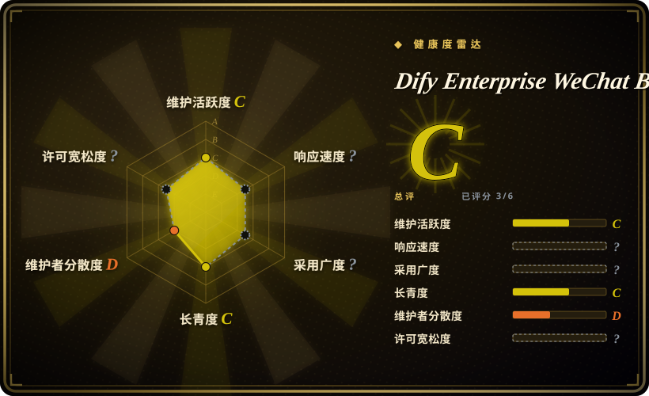

# Dify Enterprise WeChat Bot

一个已停滞的 Windows 应用，通过闭源 `dify_helper.exe` 把固定版本的企业微信桌面客户端接到 Dify API；Workflow 支持尚未完成，并使用自定义许可证。

## 何时使用

你在维护一个仅限 Windows 的内部原型，企业微信客户端可以固定在项目文档要求的版本。组织已经有 Dify 应用，基础 Dify API 通道足以完成任务，而且你能把机器人限制在测试账号和专用机器上，同时接受闭源 `dify_helper.exe` 进入信任边界。

只有复现这套精确桌面客户端集成，比跨平台运行、源码审计、客户端升级或完整 Dify Workflow 支持更重要时，才在 Wechaty 框架或官方企业微信 API 工作流之上选择本项目。它是绑定兼容性的窄场景应用，不是通用企业微信集成层。

## 何时不用

- **你需要腾讯支持、能承受桌面客户端升级的生产接入。** 改用 [n8n](../workflow-orchestration/n8n.zh.md) 或一个调用官方企业微信 API 的小型服务；本项目依赖 Windows 和固定企业微信客户端版本。
- **消息链路中的每个可执行文件都必须可源码审查。** 优先评估 Dify-on-WeChat；本项目的 `dify_helper.exe` 闭源，仓库无法提供完整实现审计。
- **你需要已经完成的 Dify Workflow 支持。** 使用 [Dify](../agent-frameworks/workflow-builders/dify.zh.md) 配合官方企业微信 adapter，或用 n8n 编排 API 调用；本仓库明确尚未完成 Workflow 通道。
- **你需要 macOS、Linux、容器或可复用 bot framework。** 改用 Wechaty；本项目耦合 Windows 桌面客户端和 helper 可执行文件。
- **再分发或商业使用策略要求标准、边界清楚的开源许可证。** 在确认当前许可证后选择 Dify-on-WeChat 或 Wechaty；本仓库使用自定义许可证，GitHub 返回 `NOASSERTION`。
- **仓库进入供应链前必须不存在环境、数据库、CSV 和日志产物。** 改用围绕 Dify 编写的最小官方企业微信 adapter，或使用 n8n workflow；把本仓库克隆进可信构建环境前，必须先做敏感文件检查。

## 横向对比

| 替代品 | 是否收录 | 我们的评价 | 取舍 |
|---|---|---|---|
| Dify-on-WeChat | 未收录 | 需要源码可检查的 Dify 到微信桥接时，先评估 Dify-on-WeChat；只有必须复用本项目精确的 Windows 企业微信 helper 流程时，才选本项目。 | Dify-on-WeChat 使用不同的通道和部署面，仍需审查平台风险；本项目更贴近桌面客户端，却包含闭源 helper。 |
| Wechaty | 未收录 | 需要可复用、跨平台的消息 bot framework 时，选 Wechaty；只有固定 Windows 企业微信与 Dify 集成命中任务时，才选本项目。 | Wechaty 要自行实现 Dify adapter，并承担 puppet 风险；本应用提供更窄的现成流程，代价是绑定固定客户端版本。 |
| [n8n](../workflow-orchestration/n8n.zh.md) | 已收录 | 需要围绕官方企业微信事件和 Dify API 建立可审查 workflow 时，选 n8n；只有桌面客户端自动化是不可回避的兼容需求时，才选本项目。 | n8n 增加 workflow 服务和显式 adapter 工作，但不依赖闭源桌面 helper；本项目起步更窄，也继承客户端版本脆弱性。 |
| [Dify](../agent-frameworks/workflow-builders/dify.zh.md) | 已收录 | 需要仍维护的 AI 应用和 Workflow 后端时，选 Dify 并连接受支持的消息 adapter；本项目只适合作为 Windows 特定客户端桥。 | Dify 是后端，不是企业微信机器人，仍需集成工作；本仓库提供桥接，却留下未完成 Workflow 和二进制信任问题。 |

## 技术栈

- **实现语言：** `Unknown`；仓库没有公开足够的当前应用实现，无法可靠指定主要源码语言。
- **桌面集成：** Windows 加固定版本的企业微信桌面客户端。
- **闭源组件：** `dify_helper.exe` 参与集成，但无法从仓库源码审计。
- **AI 后端：** Dify API 是可用通道；Dify Workflow 支持尚未完成。
- **仓库内容：** 存在环境、数据库、CSV 和日志材料，使用前必须按潜在敏感产物检查。

## 依赖

- 一台兼容 Windows 机器，以及项目预期的精确企业微信桌面客户端版本。
- 所分发的 `dify_helper.exe`，以及控制客户端所需的外围应用文件。
- 可访问的 Dify 部署、应用端点和 API 凭据。
- 专用测试或自动化账号；客户端升级和账号行为都是仓库无法控制的外部依赖。
- 对仓库内或运行中产生的环境、数据库、CSV 和日志产物执行使用前检查与清理。

## 运维难度

**隔离原型之外均为高。** 首次配置要同时匹配 Windows、预期企业微信版本、闭源 helper 和 Dify 凭据。持续运行还要冻结或重新验证客户端升级，保护本地数据与日志，处理互相冲突的版本文档，并跨桌面客户端、helper 可执行文件和 Dify API 三层定位故障。仓库已经停滞，使这项兼容负担更重要，而不是更轻。

## 健康度与可持续性

- **维护，截至 2026-07：** 标称版本为 `v2.3.4`，仓库已停滞，GitHub 约有 637 个 star。应把它视为兼容性绑定项目，而不是持续演进的基础设施。
- **发布纪律：** 仓库文档存在版本冲突，因此不能只看一份说明就推断应用版本或所需企业微信版本，必须在隔离环境做兼容性测试。
- **风险姿态：** 闭源 helper、自定义许可证、未完成 Workflow 通道和仓库数据产物，都提高了生产使用前的尽调成本。
- **Lindy 与治理：** 本页无法确认维护者冗余和持续维护记录。[推断] 对长期选型而言，停滞状态与固定客户端耦合的负面信号强于有限的采用信号。

## 存疑（未验证）

- [未验证] 仓库文档对版本要求的表述冲突；`v2.3.4` 对应的精确企业微信版本必须在隔离环境实测。
- [未验证] `dify_helper.exe` 闭源，因此无法从仓库源码核验其行为、内置依赖、更新来源、凭据访问和数据处理。
- [未验证] 自定义许可证无法直接映射到标准 SPDX 标识；再分发、修改和商业使用权限需要逐条审阅。
- [未验证] Dify Workflow 支持被描述为尚未完成，但未完整说明具体不支持的节点、payload 模式和失败行为。
- [未验证] 仓库包含环境、数据库、CSV 和日志材料。这是敏感数据风险提示，并不表示每个文件当前都含真实 secret 或个人数据；使用前必须检查。
