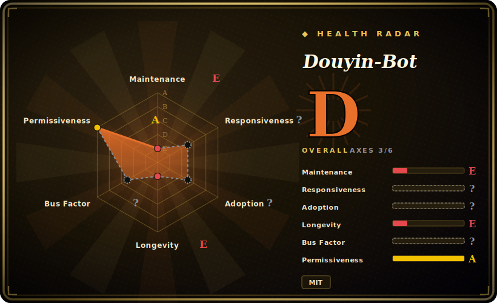

# Douyin-Bot

A 2018 Python toy/demo that drives a physical Android phone over ADB to auto-swipe Douyin (抖音), scores faces with a cloud API, and auto-likes "pretty" videos. Famous, ~9.6k stars — and effectively dead since 2020.

## When to use

You're a developer who wants a concrete, readable example of *screen-coordinate phone automation* — how to drive a real Android device from Python via ADB: take a `screencap`, compress it, send it somewhere for analysis, then issue `input swipe` / `input tap` based on the result. Douyin-Bot is a compact, well-known reference for exactly that loop: it screenshots the Douyin app, POSTs the frame to a cloud face-recognition API, reads back a "beauty" score, and taps like/follow when the score crosses a threshold before swiping to the next video.

Realistically that is the *only* defensible use today: reading it as a historical ADB-automation sample. As a working tool it is not — see below. Do not deploy it.

## When NOT to use

- **It is almost certainly broken against today's Douyin.** The approach is hardcoded pixel coordinates against a 2018 Douyin UI (the README adapts only to a OnePlus 5 at 1920×1080, a 2017 phone). Douyin has been redesigned many times since; no code maintenance since 2020-05. Working behavior on the 2026 app is not verified and not expected. [推断]
- **Its cloud dependency is dead.** Face scoring is done by the old Tencent AI open API at `ai.qq.com` — a platform Tencent has since reorganized/retired — using the author's hardcoded (now stale) AppID/AppKey. Without a live face backend the core feature is inert. [推断]
- **It's a demo, not a product.** `VERSION = "0.0.1"`, zero releases, zero tags, no tests, no CI; the "homepage" is a Zhihu blog post. It was a "look what ADB can do" article companion.
- **High setup cost for nothing that works.** Requires a physical Android phone, USB, ADB, a specific 2017 device resolution, and hand-edited coordinate JSON for any other screen. 2018-pinned `requirements.txt` (numpy 1.14, pandas 0.22, Pillow 5.1, scikit-learn 0.19) is effectively uninstallable on modern Python without compilation pain. [推断]
- **ToS / ban risk.** Automating likes/follows/comments violates Douyin's terms; the code even ships a "random anti-ban" hack, acknowledging the account-ban exposure.
- **Objectifying-by-design framing.** Its stated purpose is scoring women by "颜值" to auto-like "漂亮小姐姐", and the source contains a `GIRL_MIN_AGE = 14` constant — independently a red flag. Not appropriate to recommend or build on.

## Comparison

| Alternative | In index | Tradeoff |
|---|---|---|
| Appium | 未收录 | A maintained, general mobile-UI automation framework (Android/iOS) with element selectors instead of hardcoded pixels — the right tool if you actually need robust device automation. |
| Plain ADB + a script | 未收录 | The underlying mechanism Douyin-Bot demonstrates; if you only want screencap + input events, raw `adb` is more transparent and isn't tied to a dead cloud API. |
| airtest / Poco (NetEase) | 未收录 | Image-recognition-based game/app UI automation with an IDE; a maintained Chinese-ecosystem alternative for coordinate/image-driven device automation. |

## Tech stack

- **Language:** Python (entry `douyin-bot.py`; `common/` holds adb, config, screenshot, apiutil, compression helpers).
- **Driver:** ADB — `adb screencap` for frames, `adb shell input swipe/tap` for actions, against a USB-connected Android phone.
- **Face/beauty scoring:** the remote Tencent AI face API at `ai.qq.com` (not local OpenCV — there is no cv2 dependency). Pillow is used only for image resize.
- **Config:** per-resolution coordinate JSON under `config/` (OnePlus 5 1920×1080 primary; a 720p config added in 2020).

## Dependencies

- **Hard external:** ADB installed and on PATH, plus a physical Android phone connected over USB. ADB is **not** in `requirements.txt` — it's a separate install.
- **External service:** a working Tencent AI face API account (AppID/AppKey) — the committed keys are the author's and stale (see Caveats).
- **Python libs (`requirements.txt`, 2018-pinned):** matplotlib 2.2, xlrd 1.1, pandas 0.22, numpy 1.14, Pillow 5.1, scikit-learn 0.19 — these pins predate wheels for current interpreters and are painful to install today (see Caveats).
- **Hardware coupling:** a specific 2017 phone resolution; other devices need hand-edited coordinate JSON.

## Ops difficulty

**Medium-to-high for something that probably won't work.** There's no server to run, but the setup is fiddly: install ADB, root/connect a physical phone over USB, install a 2018 Python dependency set, obtain (now-defunct) Tencent AI credentials, and calibrate screen coordinates to your exact device. After all that, the hardcoded coordinates won't match the current Douyin UI and the cloud API is gone — so the realistic outcome is "set it all up, then it doesn't function." The effort is in the device/cred/coordinate plumbing, and the payoff is near zero.

## Health & viability

- **Maintenance (2026-06).** Abandoned — the last real code commit was 2020-05-06; the 2023-10 `pushed_at` is metadata churn, not activity. Not archived, but no releases, tags, tests, or CI ever. **Dead demo.** [推断]
- **Governance / bus factor.** Bus factor **1**: a personal User repo (`wangshub`), 4 contributors with the author the only substantive one. The ~9.6k stars on a personal, unmaintained demo are the classic "viral 2018 blog post, not maintenance" anomaly — distrust them as a health signal.
- **Age × Lindy.** ~8 years old but dead ~6 years — fails the Lindy test, which requires old **and** still-active. Age here is age of a fossil, not durability. [推断]
- **Adoption.** Stars/forks reflect a famous 2018 Zhihu article, not production use. 65 open issues, none being worked.
- **Risk flags.** Dead cloud dependency, ToS/ban exposure (it self-admits with an anti-ban hack), hardcoded plaintext credentials in source, and an objectifying purpose with a `GIRL_MIN_AGE = 14` constant. [推断]

## Caveats (unverified)

- [推断] The 2023 `pushed_at` vs the 2020 last-commit gap is repo metadata churn, not real development.
- [未验证] Whether the bot functions against the 2026 Douyin UI — would need a live phone + current app to test; the strong prior is that it does not.
- [未验证] Current status of the `ai.qq.com` face API and the hardcoded keys; both are presumed defunct but not confirmed this session.
- [推断] The 2018-pinned `requirements.txt` is effectively uninstallable on modern Python, inferred from the version pins, not tested.
- [未验证] ~9.6k stars as of 2026-06; star counts are date-sensitive and indicative only.
