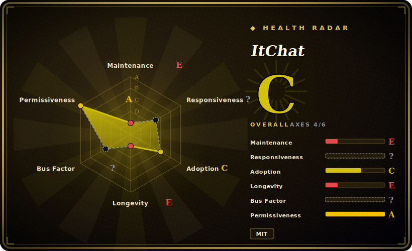

# ItChat

A graceful Python API for WeChat **personal** accounts — historically used to build chatbots and IM automation on top of the web (`wx.qq.com`) WeChat protocol. **Read this plainly: the project is effectively abandoned (last pushed ~2023-09) and the WeChat web protocol it depends on has been largely shut down, so for most accounts ItChat no longer logs in or works at all.** It remains interesting mainly as reference code, not as a tool you can ship today.

## When to use

You're a developer or researcher digging through an older generation of WeChat-bot projects — a half-decade of blog posts, course material, and GitHub repos were built on ItChat's API, and you've inherited or are studying one of them. You want to understand how the classic web-WeChat scraping flow worked: scan a QR code, hold a session, long-poll `synccheck`, decode the message stream, and register `@itchat.msg_register` handlers to auto-reply. For *reading and learning from that body of code*, ItChat is the canonical, cleanly-written reference — its API shaped how a whole ecosystem of WeChat automation was written.

That is realistically the only safe reason to reach for it in 2026. If your actual goal is to *run* new WeChat automation, ItChat is the wrong starting point (see below) — treat it as a museum piece that explains the lineage, not as a dependency for a new build.

## When NOT to use

- **You want WeChat automation that actually works today.** This is the dominant reason. WeChat (Tencent) progressively disabled the **web/`wx.qq.com` login protocol** ItChat relies on; **most accounts — especially newer ones — simply cannot log in through it anymore.** [未验证] The library is not broken in its own code so much as the platform pulled the rug out from under it.
- **It is abandoned.** Last pushed ~2023-09, ~3 years dormant, single-maintainer, ~284 open issues with no triage. No one is going to fix the protocol breakage for you.
- **Account-ban / ToS risk.** Driving a *personal* WeChat account through an unofficial reverse-engineered protocol is **against WeChat's Terms of Service** and carries a real risk of the account being **rate-limited, frozen, or permanently banned.** Don't point it at an account you care about.
- **You need a supported path for IM automation.** Use **official** channels instead: the **WeCom (企业微信 / WeChat Work) API** and **WeChat Official Account / Mini-Program** server APIs are the sanctioned, maintained surfaces. For personal-account-style automation, **wechaty** is the more actively maintained successor abstraction (though it inherits the same upstream-platform and ToS risk, so adopt it with caution).
- **Production or anything customer-facing.** An unmaintained library on a defunct protocol is not a foundation you can build a product or a business commitment on.

## Comparison

| Alternative | In index | Our verdict | Tradeoff |
|---|---|---|---|
| wechaty | 未收录 | Use this page for its stated niche; choose wechaty when you need actively-maintained multi-language (TS/Python/Go/Java) conversational-bot framework with pluggable ". | Actively-maintained multi-language (TS/Python/Go/Java) conversational-bot framework with pluggable "puppets"; the de-facto successor for personal-account-style WeChat bots, but still rides on unofficial/3rd-party access channels and the same ToS/ban exposure — pick a puppet carefully. |
| WeCom / Official WeChat Work API | 未收录 | Use this page for its stated niche; choose WeCom / Official WeChat Work API when you need tencent's **official, sanctioned** enterprise messaging API. | Tencent's **official, sanctioned** enterprise messaging API; stable and supported, but it automates *WeCom* accounts/contacts, not arbitrary personal WeChat accounts — a different (legitimate) surface, not a drop-in replacement. |
| itchat-uos (community fork) | 未收录 | Use this page for its stated niche; choose itchat-uos (community fork) when you need fork patched against the "UOS" web-WeChat endpoint to coax logins past some of the blocks. | Fork patched against the "UOS" web-WeChat endpoint to coax logins past some of the blocks; buys partial, fragile functionality on some accounts but is itself lightly maintained and fights the same platform that keeps closing the door. |
| WeChat Official Account / Mini-Program server APIs | 未收录 | Use this page for its stated niche; choose WeChat Official Account / Mini-Program server APIs when you need official server-side APIs for *public accounts* and mini-programs. | Official server-side APIs for *public accounts* and mini-programs; fully supported but a different product surface (broadcast/service accounts), not personal 1:1 IM automation. |

## Tech stack

- **Language:** Python (supports both Python 2 and 3 in its era; pure-Python, no native extensions).
- **Core mechanism:** the **web WeChat** flow — QR-code login against `wx.qq.com`, session/cookie management, and a long-polling `synccheck` loop that decodes the incoming message stream.
- **HTTP:** built on `requests` for the underlying calls; messages dispatched to user-registered handlers via the `@itchat.msg_register(...)` decorator.
- **Surface:** send/receive text, images, files, and friend/group (chatroom) management — all scoped to a single logged-in personal account.

## Dependencies

- **Runtime:** a Python interpreter plus `requests` (and `pyqrcode`/`pypng` for terminal QR rendering in its typical setup). Minimal, pip-installable. [未验证]
- **The real dependency is a working web-WeChat session** — and *that* is the broken link: it needs Tencent's web-login endpoint to accept your account, which for most accounts it no longer does. No amount of local dependency management fixes a server-side block.
- **A scannable WeChat account** on a phone to complete QR login each session; sessions are not durable and re-login is frequent.

## Ops difficulty

**Low to run, but that's beside the point — viability, not ops, is the blocker.** The library install and "hello world" QR-login bot are genuinely simple (a few lines, `itchat.auto_login()` + a registered handler). The hard part is entirely external: getting the login to succeed at all on the defunct web protocol, keeping a flaky session alive, and accepting that the account doing the logging-in is exposed to throttling or banning. There is no server, datastore, or cluster to operate — the difficulty is that the thing it talks to has mostly been turned off, and no operator effort on your side restores it.

## Health & viability

- **Maintenance (2026-06): abandoned.** Last pushed ~2023-09 → roughly **3 years dormant**; ~284 open issues, single maintainer (owner `littlecodersh`), no recent releases or triage. This is a coasting-to-dead project, not an active one. [未验证]
- **Platform pulled the rug — the decisive signal.** Independent of the repo going quiet, **WeChat largely disabled the web-login protocol ItChat is built on**, so the library is *non-functional for most accounts* regardless of maintenance. Abandoned **and** structurally obsolete. [未验证]
- **Lindy verdict: FAILS, hard.** Created **2016-01** (~10 years old), so on age alone it looks Lindy — but Lindy is **age × still-active**, never age alone. Here it is **long-lived *and* dead *and* running on a protocol the platform removed**, which is the textbook case where the age signal is *negated*, not earned. Do not read its longevity as durability. [推断]
- **Governance / bus factor.** Single-maintainer hobby project with no foundation, vendor, or successor stewardship — bus factor of one, and that one has moved on. [推断]
- **Risk flags.** Against WeChat ToS; account-ban exposure; unofficial reverse-engineered protocol that the vendor actively closes off; MIT license is the only un-encumbered part of the picture. [推断]

## Caveats (unverified)

- [未验证] "~26.5k stars" and "~284 open issues" are from the GitHub repo page as of 2026-06; star/issue counts are date-sensitive and unreliable — treat as indicative only.
- [未验证] "Last pushed ~2023-09" is the load-bearing maintenance fact used throughout this page; the repo's most visible *release* tags are older still (mid-2017), so the project has been effectively dormant for years either way — confirm the exact last-commit date against the live repo.
- [未验证] The claim that WeChat **disabled the web-login protocol** so ItChat "mostly doesn't work for new accounts" is widely reported by the community and consistent with the dormancy, but the repo README carries **no explicit deprecation notice** — this is inferred from platform behavior, not quoted from an official Tencent or ItChat statement.
- [未验证] Comparison rows (wechaty's current activity, the `itchat-uos` fork's degree of maintenance, exact WeCom/Official-Account API scope) describe the general landscape and were not freshly re-verified against each project's current state.
- [推断] Account-ban / ToS-violation risk is an inference from the unofficial-protocol nature of the tool, not a measured ban rate; severity varies by account and usage.
- [未验证] Dependency details (`requests`, `pyqrcode`/`pypng`, the `@itchat.msg_register` decorator, Py2/Py3 support) are from general knowledge of the library and were not re-checked against the current `setup.py`/source.
