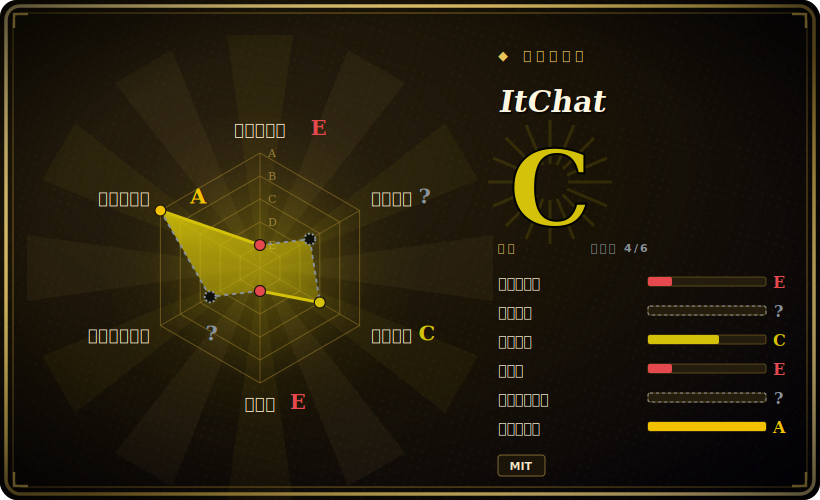

# ItChat

面向微信**个人号**的优雅 Python API——历史上用来在网页版（`wx.qq.com`）微信协议之上搭聊天机器人和 IM 自动化。**话说白了：这个项目已基本废弃（最后 push 约 2023-09），而它依赖的微信网页协议早已被大面积关停，所以对绝大多数账号而言，ItChat 已经登不上、跑不起来了。** 它如今主要还有意义的地方在于作为参考代码，而不是你今天能拿来交付的工具。

## 何时使用

你是开发者或研究者，正在翻一代更早的微信机器人项目——有整整五六年的博客、课程和 GitHub 仓库都建立在 ItChat 的 API 之上，而你接手或正在研究其中之一。你想搞清楚经典的网页版微信抓取流程是怎么跑的：扫码登录、维持会话、长轮询 `synccheck`、解码消息流、再用 `@itchat.msg_register` 注册处理器来自动回复。就*读懂并从那批代码里学习*而言，ItChat 是写得规整的范本——它的 API 塑造了一整个微信自动化生态的写法。

这基本上是 2026 年还去碰它的唯一稳妥理由。如果你的真实目标是*运行*新的微信自动化，ItChat 是错误的起点（见下文）；把它当成解释这条技术脉络的博物馆藏品，而不是新项目的依赖。

## 何时不用

- **你想要今天还能真正跑起来的微信自动化。** 这是最主要的理由。微信（腾讯）逐步关停了 ItChat 依赖的**网页版 / `wx.qq.com` 登录协议**；**绝大多数账号——尤其是较新的账号——已经根本无法通过它登录。**[未验证] 与其说库本身坏了，不如说平台把它脚下的地抽走了。
- **它已废弃。** 最后 push 约 2023-09，已沉寂约 3 年，单一维护者，约 284 个 open issue 无人 triage。没有人会替你去修这套协议层面的失效。
- **封号 / 违反 ToS 的风险。** 用非官方逆向出来的协议去驱动*个人*微信号，是**违反微信服务条款**的，并带有真实的账号**被限流、冻结或永久封禁**风险。别拿你在乎的账号去试。
- **你需要受支持的 IM 自动化路径。** 改用**官方**通道：**企业微信（WeCom / WeChat Work）API**，以及**微信公众号 / 小程序**服务端 API，才是受支持、有维护的正规面。若想要接近个人号风格的自动化，**wechaty** 是维护更活跃的后继抽象（但它继承了同样的上游平台风险和 ToS 风险，需谨慎采用）。
- **生产环境或任何面向客户的场景。** 一个跑在已失效协议上的无人维护库，撑不起一款产品或一项业务承诺。

## 横向对比

| 替代品 | 是否收录 | 我们的评价 | 取舍 |
|---|---|---|---|
| wechaty | 未收录 | 当前页用于它的主场景；如果更看重“维护活跃的多语言（TS/Python/Go/Java）对话机器人框架，采用可插拔的 "puppet"”，再选 wechaty。 | 维护活跃的多语言（TS/Python/Go/Java）对话机器人框架，采用可插拔的 "puppet"；是个人号风格微信机器人事实上的后继者，但仍依赖非官方 / 第三方接入通道，承担同样的 ToS / 封号风险——选 puppet 要谨慎。 |
| 企业微信 / WeChat Work 官方 API | 未收录 | 当前页用于它的主场景；如果更看重“腾讯**官方、受认可**的企业消息 API”，再选 企业微信 / WeChat Work 官方 API。 | 腾讯**官方、受认可**的企业消息 API；稳定且有支持，但它自动化的是*企业微信*账号 / 通讯录，而非任意个人微信号——是另一套（合规的）面，并非平替。 |
| itchat-uos（社区分叉） | 未收录 | 当前页用于它的主场景；如果更看重“针对 "UOS" 网页版微信端点打了补丁、试图绕过部分封堵的分叉”，再选 itchat-uos（社区分叉）。 | 针对 "UOS" 网页版微信端点打了补丁、试图绕过部分封堵的分叉；能在部分账号上换来局部、脆弱的可用性，但它自身维护也很轻，且仍在和那个不断关门的平台缠斗。 |
| 微信公众号 / 小程序服务端 API | 未收录 | 当前页用于它的主场景；如果更看重“面向*公众号*和小程序的官方服务端 API”，再选 微信公众号 / 小程序服务端 API。 | 面向*公众号*和小程序的官方服务端 API；完全受支持，但属于另一种产品面（广播 / 服务号），不是个人号的 1:1 IM 自动化。 |

## 技术栈

- **语言：** Python（在其活跃年代同时支持 Python 2 和 3；纯 Python，无原生扩展）。
- **核心机制：** **网页版微信**流程——对着 `wx.qq.com` 扫码登录、管理会话 / cookie，再跑一个长轮询的 `synccheck` 循环来解码进来的消息流。
- **HTTP：** 底层调用基于 `requests`；消息通过 `@itchat.msg_register(...)` 装饰器派发给用户注册的处理器。
- **能力面：** 收发文本、图片、文件，以及好友 / 群（chatroom）管理——全部局限在单个已登录的个人号范围内。

## 依赖

- **运行时：** 一个 Python 解释器加上 `requests`（以及在典型配置里用于终端渲染二维码的 `pyqrcode`/`pypng`）。很少，pip 即可装。[未验证]
- **真正的依赖是一个可用的网页版微信会话**——而*那*正是断掉的一环：它需要腾讯的网页登录端点接受你的账号，而对大多数账号它已不再接受。再怎么管理本地依赖，也修不好服务端的封堵。
- **一个可扫码的微信账号**（在手机上）来完成每次会话的二维码登录；会话不持久，需要频繁重新登录。

## 运维难度

**跑起来很低，但这不是重点——卡点是可持续性，不是运维。** 库的安装和 "hello world" 扫码登录机器人确实简单（几行代码，`itchat.auto_login()` 加一个注册的处理器）。难的部分完全在外部：让登录在这套失效的网页协议上*根本能成功*、维持一个抽风的会话存活，以及接受那个用来登录的账号正暴露在限流或封禁之下。没有服务、数据存储或集群要运维——难点在于它要对话的那个东西已基本被关停，而你这边再多的运维投入也无法把它恢复。

## 健康度与可持续性

- **维护（2026-06）：已废弃。** 最后 push 约 2023-09 → 大约**沉寂 3 年**；约 284 个 open issue，单一维护者（owner `littlecodersh`），无新发布、无 triage。这是一个滑向死亡、而非活跃的项目。[未验证]
- **平台抽走了地基——决定性信号。** 与仓库变冷无关，**微信已大面积关停 ItChat 所依赖的网页登录协议**，所以无论维护与否，这个库对大多数账号都是*不可用*的。既废弃**又**在结构上过时。[未验证]
- **Lindy 判断：硬性不通过。** 创建于 **2016-01**（约 10 年），单看年龄像是 Lindy——但 Lindy 是**年龄 × 仍然活跃**，绝不是单看年龄。这里是**长寿*且*已死*且*跑在平台已移除的协议上**，正是年龄信号被*抵消*而非*兑现*的教科书案例。别把它的长寿读成耐久。[推断]
- **治理 / bus factor。** 单一维护者的爱好项目，没有基金会、厂商或后继接管——bus factor 为一，而这个一已经离场。[推断]
- **风险标记。** 违反微信 ToS；封号风险；非官方逆向协议且被厂商持续封堵；MIT 许可是整幅图景里唯一没有负担的部分。[推断]

## 存疑（未验证）

- [未验证] “约 26.5k star” 与 “约 284 个 open issue” 取自 2026-06 的 GitHub 仓库页；star / issue 数对时间敏感且不可靠，仅供参考。
- [未验证] “最后 push 约 2023-09” 是本页通篇承重的维护事实；仓库最显眼的*发布*标签更早（2017 年中），无论按哪个口径，项目都已实质沉寂多年——确切的最后提交日期请对照线上仓库核实。
- [未验证] “微信**关停网页登录协议**导致 ItChat 对新账号'基本不可用'” 这一说法被社区广泛报道，也与其沉寂状态相符，但仓库 README **并无显式弃用声明**——这是从平台行为推断而来，并非引自腾讯或 ItChat 的官方声明。
- [未验证] 对比表各行（wechaty 当前活跃度、`itchat-uos` 分叉的维护程度、企业微信 / 公众号 API 的确切范围）描述的是大致格局，未对各项目当前状态做新一轮核实。
- [推断] 封号 / 违反 ToS 风险是从工具的非官方协议性质做出的推断，而非实测封禁率；严重程度因账号和用法而异。
- [未验证] 依赖细节（`requests`、`pyqrcode`/`pypng`、`@itchat.msg_register` 装饰器、Py2/Py3 支持）来自对该库的一般了解，未对照当前 `setup.py`/源码重新核对。
